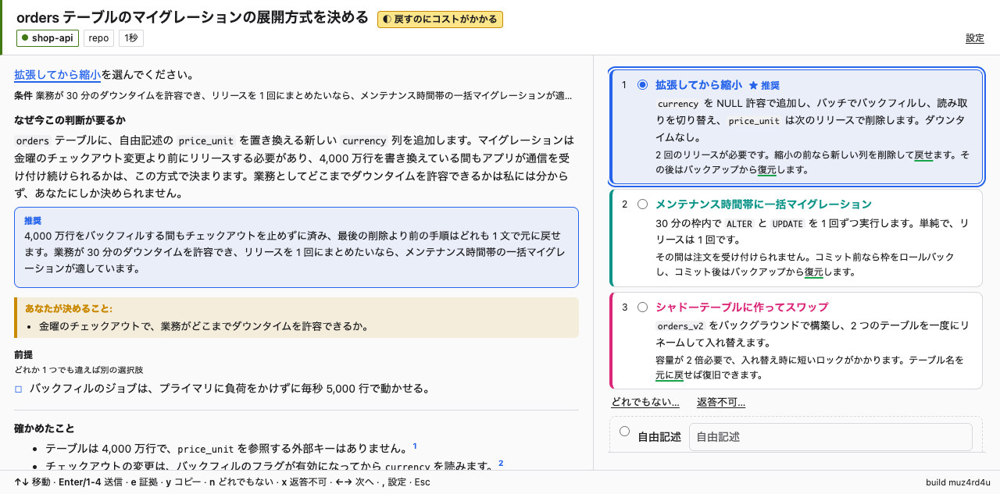
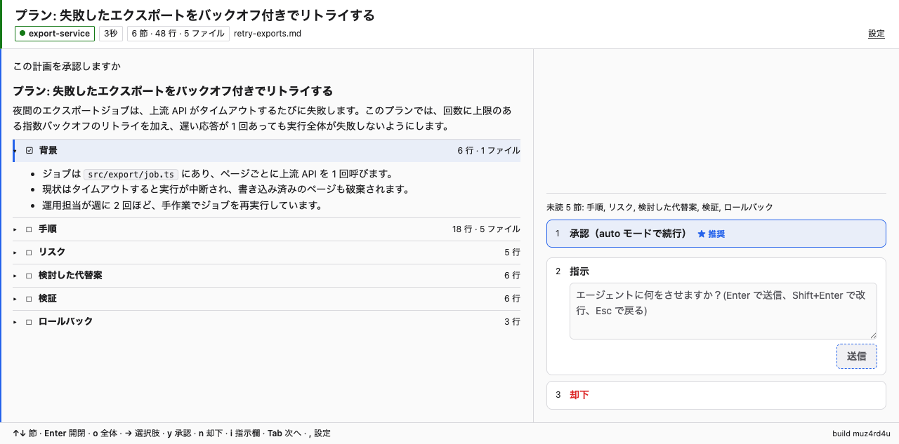
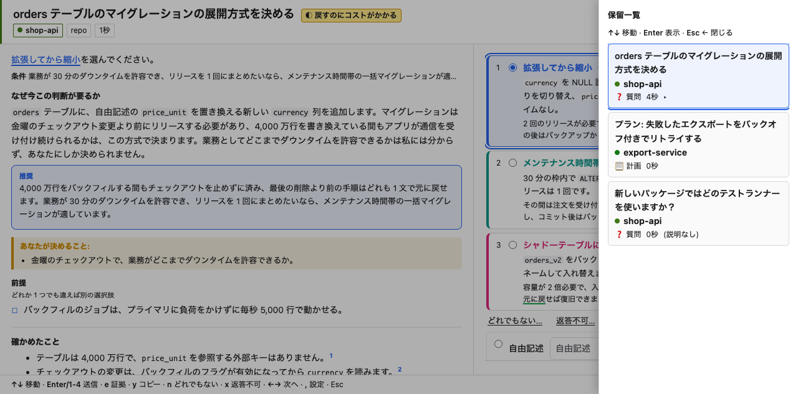

<p align="center"></p>

<h1 align="center">ukagai</h1>

<p align="center"><b>Agents ask. Humans decide.</b><br>Claude Code と Codex CLI の質問・プラン承認を 1 か所に集め、答えるための文脈も一緒に届けます。</p>

[English](README.md) | 日本語



## ukagai とは

ukagai は、コーディングエージェントが人間に求める判断（Claude Code の `AskUserQuestion` とプラン承認）を hooks で横取りし、localhost の GUI（またはターミナル UI）に集めます。各判断には、エージェント自身が書いた説明（なぜ今なのか、推奨、選択肢の表、Mermaid 図、関連する diff）が付きます。MCP は使いません。hooks + スキル + GUI だけで動きます。

## なぜ必要か

コーディングエージェントは作業の途中で質問をしてきます。その質問は複数のターミナルやタブに散らばり、答える人に文脈が足りないことがよくあります。ukagai はすべての質問を 1 か所に集め、エージェントが質問する理由を書いた説明のすぐ隣に置きます。

## クイックスタート

必要なもの: Node.js 22 以上、macOS または Linux（Windows は非対応）、Claude Code と Codex CLI のどちらか（または両方）。

```sh
curl -fsSL https://raw.githubusercontent.com/Asugawara/ukagai/main/install.sh | sh -s -- --lang ja
```

そのあと `claude` を起動してください。サーバーは自動で起動し、その日の最初のセッションで GUI が開きます。以降は `AskUserQuestion` とプラン承認がすべてそこに届きます。GUI を英語にするには `--lang en`、Codex CLI も使うなら `--codex` を追加します。



## できること

- **判断画面**: エージェントの推奨付きの選択肢、すべてキーで操作可能、保留中の判断の一覧（`b`）。[ガイド](docs/guide.md#the-decision-screen)
- **プラン承認**: 承認（auto モードで続行）、指示（「先にこれをして」）、却下。[ガイド](docs/guide.md#plan-approval)
- **進捗チェックポイント**: エージェントのセッション要約に、指示または停止で返答できます。[ガイド](docs/guide.md#progress-checkpoints)
- **TUI**: 同じ画面をターミナルで。`ukagai tui`。[ガイド](docs/guide.md#the-tui)
- **Codex CLI**: hooks とプラン承認用のブリッジ。[ガイド](docs/guide.md#codex-cli)
- **設定ページ**: 言語、テーマ、通知、プランの自動表示。[ガイド](docs/guide.md#settings)
- **Rich Markdown**: 説明やプランで、コールアウト、Mermaid、diff、タスクリストなどを使えます。[ガイド](docs/guide.md#rich-markdown)



ガイドは英語です。

## インストールのオプション

`install.sh` は、`--lang`、`--codex`、`--claude` のいずれかを渡さない限りバイナリを入れるだけです。渡すと `ukagai install` も実行し、hooks とスキルを登録します（先に設定のバックアップを取ります）。`wget` でも実行できます。

| フラグ | 意味 |
|---|---|
| `--lang en\|ja` | GUI / TUI の言語。`ukagai install` に渡され、`<data-dir>/config.json` に保存されます |
| `--codex` | Codex CLI の hooks を登録（Codex のみ。Claude Code も登録するには `--claude` を追加） |
| `--claude` | Claude Code の hooks を登録 |
| `--version vX.Y.Z` | このバージョンを入れる（既定は最新リリース） |
| `--force` | bin パスにある ukagai 以外のファイルを置き換える |

| 環境変数 | 意味 |
|---|---|
| `UKAGAI_HOME`, `UKAGAI_BIN_DIR` | バージョンの置き場所（`~/.local/share/ukagai`）と `ukagai` のリンク先（`~/.local/bin`） |
| `UKAGAI_DATA_DIR` | `ukagai install` に `--data-dir` として渡されます（既定は `~/.ukagai`） |
| `UKAGAI_PORT` | 古いバージョンを削除する前に確認する、起動中サーバーのポート（既定は 4818） |
| `UKAGAI_NODE`, `UKAGAI_DOWNLOADER`, `UKAGAI_VERSION` | Node.js のパス、`curl` か `wget`、バージョン |

**プラグインマーケットプレイス**（`install.sh` の代わり。データは `~/.ukagai` に残ります）:

- Claude Code: `/plugin marketplace add Asugawara/ukagai`、続けて `/plugin install ukagai@ukagai`。
- Codex CLI: `codex plugin marketplace add Asugawara/ukagai`、続けて `codex plugin add ukagai@ukagai`。そのあと Codex の TUI で `/hooks` を実行し、hooks を信頼してください。

プラグインだけを使っている場合、シェルで `ukagai` は打てません。Claude Code ではエージェントの Bash ツール経由で `"${CLAUDE_PLUGIN_ROOT}/bin/ukagai" doctor` を実行してください。`install.sh` も実行済みの場合は、`ukagai install` が自身の登録を外し、hooks が二重に動かないようにします。

**更新**: インストールのコマンドをもう一度実行します。起動中のサーバーは次のセッション開始時に置き換わります（そのサーバーが保持していた判断はターミナルに戻ります）。**アンインストール**: `ukagai uninstall`（先に `--dry-run`、Codex も外すなら `--codex`）を実行し、そのあと `rm -rf ~/.local/share/ukagai ~/.local/bin/ukagai`。プラグインは `/plugin uninstall ukagai@ukagai` または `codex plugin remove ukagai` です。

うまく動かないときは `ukagai doctor` を実行してください（[トラブルシューティング](docs/guide.md#troubleshooting)）。

## ドキュメント

| パス | 内容 |
|---|---|
| `docs/guide.md` | ユーザーガイド（英語）: 画面、キー、チェックポイント、TUI、設定、Codex、トラブルシューティング |
| `docs/strategy/` | 実装計画（`03-*` MVP、`04-*` 配布） |
| `docs/spec/api.md` | サーバー API、状態遷移、認可 |
| `docs/spec/explain.md` | エージェントが書く説明ファイルと、hook の検証ルール |
| `docs/spec/markdown.md` | 説明とプランを書くための Markdown 方言 |
| `docs/verification/` | 実環境での検証記録（01 質問の注入、02 Codex の hooks と hook の限界、03 E2E、04 プラン作成時の文脈、05 プランの指示と approve-and-auto、06 起こされたターンと進捗チェック） |
| `skills/ukagai-explain/SKILL.md` | Claude に説明の書き方を教えるスキル |

## 開発

```sh
git clone https://github.com/Asugawara/ukagai.git && cd ukagai
npm ci
npm run build
npm run vendor                              # marked / mermaid を public/vendor/ にバンドル
node dist/cli.js install --dry-run          # ~/.claude/settings.json への変更をプレビュー
node dist/cli.js install --lang en          # hooks + スキルを登録
npm run typecheck
npm test              # GUI テスト（test/gui/）は agent-browser があるときだけ実行
npm run dev:serve
```

実際の設定に触れずに試すには、別ファイルに書き込み、それを使ってテストセッションを起動します（スキルには触れません。スキルも置くなら `--skill` を追加）。

```sh
node dist/cli.js install --settings /tmp/ukagai-settings.json --data-dir /tmp/ukagai-data --lang en
claude --settings /tmp/ukagai-settings.json
```

`claude --settings <file>` はグローバル設定と併用されるため、グローバルに入れた hook もテストセッションで動き、実際のキューに書き込みます。`UKAGAI_DISABLE=1 claude …` で起動するとグローバルの hook を無効にできます（`hook` サブコマンドは何も出力せず、どのイベントでも exit 0 で終わります）。または、テスト用の設定ファイルにだけ hook を入れてください。

リリース: `npm run release:stage`（`sh scripts/build-release.sh <version> out`）がリリースツリーを作り、`out/` に `ukagai-<version>.tar.gz` と `SHA256SUMS` を書き出します。残りは CI が行います。

- `main` への Conventional Commits を受けて、release-please がリリース PR を開きます。
- その PR をマージすると、タグとドラフトのリリースが作られます。
- package ジョブがtarballと `SHA256SUMS` をビルドします。
- publish ジョブがそれらをアップロードし、リリースを公開します。
- plugin ジョブがステージしたツリーを `plugin` ブランチに push します。両方のマーケットプレイスがこのブランチを読みます。

## ライセンス

MIT。[LICENSE](LICENSE) を参照してください。サードパーティのライセンスは `public/vendor/LICENSES.md` にあります。
