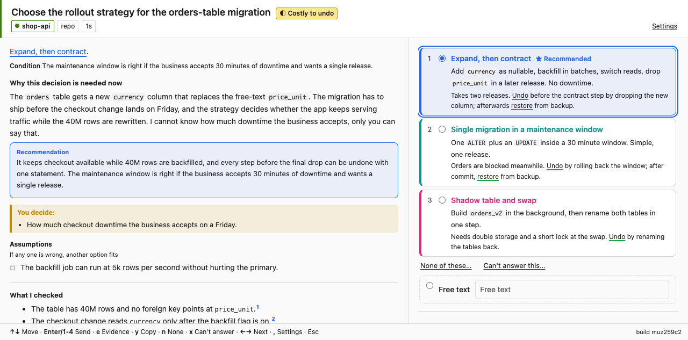
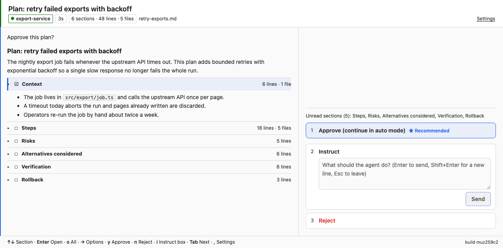
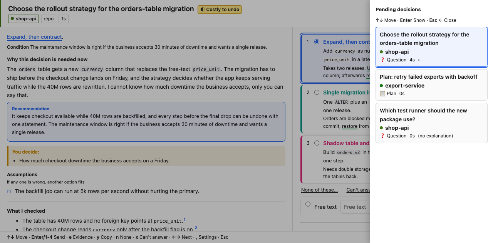

<p align="center"></p>

<h1 align="center">ukagai</h1>

<p align="center"><b>Agents ask. Humans decide.</b><br>One inbox for every question and plan approval from Claude Code and Codex CLI, with the context to answer them.</p>

English | [日本語](README.ja.md)



## What it is

ukagai intercepts the decisions a coding agent asks a human for (Claude Code's `AskUserQuestion` and plan approval) with hooks, and collects them in one localhost GUI (or a terminal UI). Each decision comes with an explanation the agent wrote itself: why now, a recommendation, an options table, a Mermaid diagram and the related diff. No MCP is involved: it is hooks + a skill + a GUI.

## Why

Coding agents stop and ask a question mid-task, and those questions scatter across terminals and tabs, where the human often lacks the context to answer. ukagai puts every question in one place, next to the agent's own explanation of why it is asking.

## Quick start

Requirements: Node.js >= 22, macOS or Linux (Windows is not supported), Claude Code and / or Codex CLI.

```sh
curl -fsSL https://raw.githubusercontent.com/Asugawara/ukagai/main/install.sh | sh -s -- --lang en
```

Then start `claude`. The server starts by itself and the GUI opens on your first session of the day; from then on every `AskUserQuestion` and plan approval lands there. Use `--lang ja` for a Japanese GUI, and add `--codex --claude` to register Codex CLI as well (`--codex` alone registers Codex only).

Right after installing, `ukagai doctor` reports the server and the token as "not started yet"; after your first `claude` session it prints `no problems`.



## What you get

- **Decision screen**: options with the agent's recommendation, keys for everything, a list of pending decisions (`b`). [Guide](docs/guide.md#the-decision-screen)
- **Plan approval**: approve (and continue in auto mode), instruct ("do this first") or reject. [Guide](docs/guide.md#plan-approval)
- **Progress checkpoints**: answer the agent's session recap with an instruction or a stop. [Guide](docs/guide.md#progress-checkpoints)
- **TUI**: the same screen in the terminal, `ukagai tui`. [Guide](docs/guide.md#the-tui)
- **Codex CLI**: hooks plus a bridge for plan approval. [Guide](docs/guide.md#codex-cli)
- **Settings page**: language, theme, notifications, plan auto-show. [Guide](docs/guide.md#settings)
- **Rich Markdown**: callouts, Mermaid, diffs, task lists and more in explanations and plans. [Guide](docs/guide.md#rich-markdown)



## Install options

`install.sh` only installs the binary unless you pass `--lang`, `--codex` or `--claude`; then it also runs `ukagai install`, which registers the hooks and the skill (and backs up your settings first). `wget` works too.

| Flag | Meaning |
|---|---|
| `--lang en\|ja` | GUI / TUI language, passed to `ukagai install` (stored in `<data-dir>/config.json`) |
| `--codex` | Register the Codex CLI hooks (Codex only; add `--claude` for Claude Code too) |
| `--claude` | Register the Claude Code hooks |
| `--version vX.Y.Z` | Install this version (default: latest release) |
| `--force` | Replace a non-ukagai file at the bin path |

| Environment | Meaning |
|---|---|
| `UKAGAI_HOME`, `UKAGAI_BIN_DIR` | Where versions are installed (`~/.local/share/ukagai`) and where `ukagai` is linked (`~/.local/bin`) |
| `UKAGAI_DATA_DIR` | Forwarded to `ukagai install` as `--data-dir` (default `~/.ukagai`) |
| `UKAGAI_PORT` | Port of the running server checked before old versions are pruned (default 4818) |
| `UKAGAI_NODE`, `UKAGAI_DOWNLOADER`, `UKAGAI_VERSION` | Node.js path, `curl` or `wget`, version |

**Plugin marketplaces** (instead of `install.sh`; the data stays in `~/.ukagai`):

- Claude Code: `/plugin marketplace add Asugawara/ukagai`, then `/plugin install ukagai@ukagai`.
- Codex CLI: `codex plugin marketplace add Asugawara/ukagai`, then `codex plugin add ukagai@ukagai`, then run `/hooks` in the Codex TUI and trust the hooks.

A plugin-only user cannot type `ukagai` in the shell: run `"${CLAUDE_PLUGIN_ROOT}/bin/ukagai" doctor` through the agent's Bash tool in Claude Code. If you also ran `install.sh`, `ukagai install` removes its own registration so the hooks run once.

**Update**: run the install command again; a running server is replaced at the next session start (decisions it still held fall back to the terminal). **Uninstall**: `ukagai uninstall` (`--dry-run` first; `--codex --claude` when Codex is registered too) removes the hooks and the skill and stops the server once no hooks remain, then `rm -rf ~/.local/share/ukagai ~/.local/bin/ukagai`; `~/.ukagai` (settings, history, logs) is kept, `rm -rf ~/.ukagai` removes it too; for plugins `/plugin uninstall ukagai@ukagai` or `codex plugin remove ukagai`.

Something wrong? Run `ukagai doctor` ([troubleshooting](docs/guide.md#troubleshooting)).

## Documentation

| Path | Content |
|---|---|
| `docs/guide.md` | The user guide: screens, keys, checkpoints, TUI, Settings, Codex, troubleshooting |
| `docs/strategy/` | The implementation plans (`03-*` MVP, `04-*` distribution) |
| `docs/spec/api.md` | Server API, state transitions, authorization |
| `docs/spec/explain.md` | The explanation file the agent writes and the hook's validation rules |
| `docs/spec/markdown.md` | The Markdown dialect explanations and plans are written in |
| `docs/verification/` | Records of real-environment verification (01 question injection, 02 Codex hooks and hook limits, 03 E2E, 04 plan-writing context, 05 plan instruct and approve-and-auto, 06 wake-up turns and the progress check) |
| `skills/ukagai-explain/SKILL.md` | The skill that teaches Claude how to write explanations |

## Development

```sh
git clone https://github.com/Asugawara/ukagai.git && cd ukagai
npm ci
npm run build
npm run vendor                              # bundle marked / mermaid into public/vendor/
node dist/cli.js install --dry-run          # preview the changes to ~/.claude/settings.json
node dist/cli.js install --lang en          # register hooks + skill
npm run typecheck
npm test              # GUI tests (test/gui/) run only when agent-browser is available
npm run dev:serve
```

To try it without touching your real settings, write to a separate file and start a test session with it (the skill is left alone; add `--skill` to place it too):

```sh
node dist/cli.js install --settings /tmp/ukagai-settings.json --data-dir /tmp/ukagai-data --lang en
claude --settings /tmp/ukagai-settings.json
```

`claude --settings <file>` is used together with the global settings, so a globally installed hook also fires in a test session and writes into your real queue. Run `UKAGAI_DISABLE=1 claude …` to silence the global hook (the `hook` subcommand then prints nothing and exits 0 for every event), or enable only the hook in the test settings file.

Releases: `npm run release:stage` (`sh scripts/build-release.sh <version> out`) stages the release tree and writes `ukagai-<version>.tar.gz` and `SHA256SUMS` into `out/`. CI does the rest:

- Conventional commits on `main` make release-please open a release PR.
- Merging that PR creates the tag and a draft release.
- The package job builds the tarball and `SHA256SUMS`.
- The publish job uploads them and publishes the release.
- The plugin job pushes the stage tree to the `plugin` branch, which both marketplaces read.

## License

MIT, see [LICENSE](LICENSE). Third-party licences: `public/vendor/LICENSES.md`.
