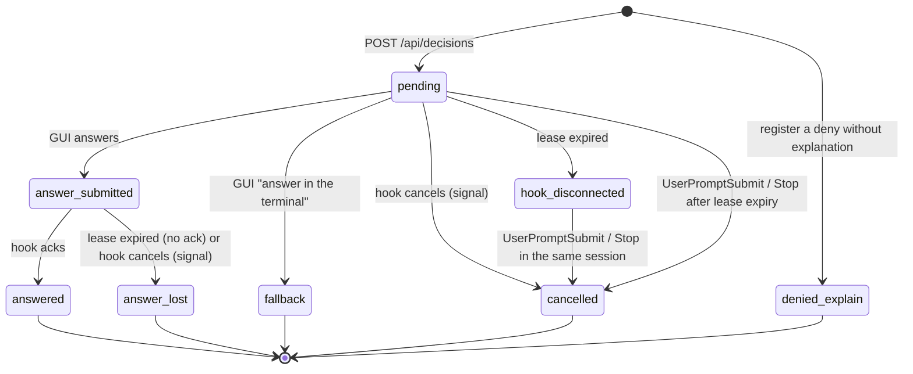

# API spec

A human-readable version of the contract in section 3 of `docs/strategy/03-mvp-implementation-plan.md`. The source of truth for types is `src/contract.ts` (zod). If this document disagrees, treat the plan and `contract.ts` as correct and fix this document.

`ukagai serve` listens on `127.0.0.1:4818`. The values in the JSON examples are the same as the real files in `test/fixtures/` (T1 of verification 01).

## Endpoints

| API | Caller | Role |
|---|---|---|
| `POST /api/decisions` | hook | Register a decision. Returns the existing one for the same `tool_use_id` |
| `GET /api/decisions/:id/wait?timeout_ms=25000` | hook | Long-poll. If answered (`answer_submitted` / `fallback`), 200 + response; if unanswered and the timeout passes, 204; if the decision is closed (`answered` etc., including when it becomes so while waiting), 410 immediately. Updates `lease_until` at the end of each poll |
| `POST /api/decisions/:id/ack` | hook | Confirmation that the response was received. Sets `answered` and `delivered_at` |
| `POST /api/decisions/:id/cancel` | hook | Notification when the hook exits on SIGTERM / SIGINT / SIGHUP. `pending` → `cancelled`, `answer_submitted` → `answer_lost` |
| `POST /api/decisions/:id/answer` | GUI | Submit an answer |
| `GET /api/decisions?status=pending` | GUI | List |
| `GET /api/decisions/:id` | GUI | Detail |
| `POST /api/events` | hook (observation) | Raw JSON of an observation hook. The `--observe` timestamps, `escaped_question` from Stop, consumption of PermissionRequest |
| `GET /api/sessions` | GUI | State per session |
| `GET /api/sessions/:id/pending-mode-switch` | hook | Read the unconsumed "approve and switch to auto" record |
| `POST /api/sessions/:id/pending-mode-switch/consume` | hook | Delete the record above |
| `GET /api/sessions/:id/pending-rewrite` | hook | The session's last "Cannot answer" memo, or `null` |
| `POST /api/sessions/:id/pending-rewrite/consume` | hook | Delete the memo above |
| `GET /api/metrics` | GUI | Aggregates for (a')(b)(d) |
| `GET /api/decisions/:id/history` | GUI / TUI (cookie or Bearer) | The human instructions of the decision's session (first + last 20), read from the transcript on request |
| `GET /api/config` | GUI (cookie or Bearer) | Returns `{ "lang": "en" \| "ja", "build": string }`: the display language from `<data-dir>/config.json` (read once at startup; missing/malformed → `"en"`) and the current `app.js` version (the `?v=` value). The GUI reloads itself when `build` differs from its own |
| `GET /api/stream` | GUI | SSE. `decision.created` / `decision.updated` / `session.updated` |
| `GET /healthz` | hook | Connectivity check |

### POST /api/decisions

Request (`CreateDecisionRequest`. The server collects `context`, so the hook does not send it):

```json
{
  "tool_use_id": "toolu_01C9XvdLwhw5t7NsMYWcdF4R",
  "kind": "answer_question",
  "session": {
    "session_id": "00000000-0000-4000-8000-000000000001",
    "cwd": "/Users/user/dev/ukagai",
    "transcript_path": "/Users/user/.claude/projects/-Users-user-dev-ukagai/00000000-0000-4000-8000-000000000001.jsonl",
    "scratchpad_dir": "/tmp/scratchpad",
    "permission_mode": "auto"
  },
  "request": {
    "questions": [
      {
        "question": "Which do you choose, A or B?",
        "header": "Choice",
        "options": [
          { "label": "A", "description": "Option A" },
          { "label": "B", "description": "Option B" }
        ],
        "multiSelect": false
      }
    ]
  }
}
```

`kind` is `answer_question` (AskUserQuestion) or `approve_plan` (ExitPlanMode). `request` holds the hook's `tool_input` as is. `explanation` is optional (its shape is `Decision.explanation` in section 3 of the plan). `explanation.type` (`decision` / `blocker`, omitted = decision) is the `type` in the explanation file's front matter; the server only stores and returns it. `explanation.none_reason` is `plan_mode` / `loop_guard` (set by the hook) or `not_required` (reserved. No path sets it. It stays in the contract because the GUI / TUI hold the display text).

Response: **201 for a new decision, 200 if the same `tool_use_id` already exists** (the body is the whole `Decision` in both cases). `status` is `pending`.

- To record a deny without an explanation, use the same API and add `"status": "denied_explain"` to the request (`CreateDecisionRequest.status`). `Decision.status` becomes `denied_explain`. It does not appear in the GUI list (the default of `GET /api/decisions`), sends no SSE, does not change session state, and does not collect context. `GET /api/decisions?status=denied_explain` retrieves it. The reason for the deny is the request's `missing` (an array of MissingCode, only for `denied_explain`), which is stored as is in `Decision.missing` and returned (the server does not interpret it).
- `session.agent` (`"claude"` | `"codex"`, optional, absent means `claude`) says which agent the session belongs to. The server stores it as sent and returns it on the decision; events carry it too. For `codex` the server does not read a transcript: `context` is the git part only and `GET /api/decisions/:id/history` returns `total: 0` (the Codex rollout format is not examined yet).
- **Empty `options`**: a question with `options: []` is a free-text-only question (the Codex Stop hook registers a prose question this way). The GUI and TUI always offer the free-text entry next to the options, so nothing extra is needed; the answer is the free text. No flag (like `free_text_only`) exists.
- **Codex approvals** (`PermissionRequest`) are registered as an ordinary `answer_question` with one question, `header: "Approval"`, `question` = the model's description + a blank line + the command in backticks, `options: [{label:"Allow"},{label:"Deny"}]`, `explanation.none_reason: "not_required"` and `session.agent: "codex"` (no new `kind`). `request.tool_name` carries the tool. The hook turns the answer `Allow` into `behavior: allow`, `Deny` or any free text into `behavior: deny` with `message` "Denied in the ukagai GUI" (+ the text).
- `first_denied_at` is set by the server. When the request's `explanation.attached_via` is `after_deny`, it is set to the `created_at` of the most recent `denied_explain` with the same `session_id + agent_id + questions[0].question` within the last 120 seconds. `attached_via` itself is stored as the hook decided it.
- At registration the server collects context (git, transcript). If the transcript cannot be read, it re-reads once after 500 ms, so **this POST takes up to 1.5 seconds** (an absolute upper bound on the server side). The hook must set the POST timeout longer than 1.5 seconds (the check of whether it can connect may be shorter).
- 400 if `transcript_path` or `explanation.path` is not allowed. A missing `cwd` still gives 201, and `context` is just empty.

`status_reason` (optional string on a decision) says why a decision was closed without an answer. Only the codex-bridge sets it today: `answered_elsewhere` when the terminal moved first (see `docs/spec/codex-bridge.md`). Decisions of `kind: "approve_plan"` with `session.agent: "codex"` and `explanation.path: ""` are not created through this endpoint but by the codex-bridge inside `serve`; `request.planFilePath` is `""` for them.

### GET /api/decisions/:id/history

Returns what the human typed in the session, so a viewer can see what the session is about. Allowed with cookie or Bearer (same as `GET /api/decisions/:id`). 404 `{error}` if the decision does not exist. It is not part of the decision list or SSE; clients fetch it on demand.

```json
{
  "session_id": "…",
  "ai_title": "…",
  "total": 77,
  "first": { "at": "2026-10-02T03:04:36.144Z", "text": "…" },
  "recent": [ { "at": "…", "text": "…" } ]
}
```

- `ai_title` is the last `ai-title` record of the transcript (omitted if none). `total` counts human instructions. `first` is the first one, cut to 4000 characters. `recent` is the last 20 in chronological order (not newest first), each cut to 500 characters; it may overlap `first`. A cut text ends with `…`. `at` is the record's `timestamp` (`""` if it has none).
- Source: only `session.transcript_path`, even for a subagent decision (the human's instructions live in the parent transcript). If the path is not allowed (`isAllowedTranscriptPath`), missing or unreadable, the response is 200 `{ session_id, total: 0, first: null, recent: [] }`.
- Limits: the file is streamed line by line from the start and at most 64 MB are read; if the file is larger, the result covers the part that was read (a line cut at the limit is ignored). Broken lines are skipped.
- Cache: in memory for 5 seconds, keyed by `transcript_path + mtimeMs + session_id`.
- What counts as a human instruction: a `type: "user"` record whose `message.content` is a string, or an array with `text` blocks (`tool_result`-only records are excluded). Excluded: `isSidechain: true`, `isMeta: true`, slash-command / local-command records (`<command-name>`, `<command-message>`, `<command-args>`, `<local-command-stdout>`, `<local-command-stderr>`, `<local-command-caveat>`), and `[Request interrupted by user…]`. `<system-reminder>…</system-reminder>` blocks are removed, `<pasted_content …>` tags are removed (the content stays), and a record that is empty afterwards is excluded. Text is otherwise kept as is (newlines and spaces included).

### GET /api/decisions/:id/wait

- Answered: 200

```json
{
  "response": {
    "via": "gui",
    "answers": { "Which do you choose, A or B?": "B" },
    "decided_at": "2026-10-02T03:09:12.400Z"
  }
}
```

The response for `approve_plan` carries `approve` / `reason` / `set_mode_auto` instead of `answers`. When `via` is `terminal`, `{fallback:true}` was sent, and the hook exits without printing anything.

- Unanswered and `timeout_ms` (default 25000) has passed: 204 (no body). Terminal states such as `answered` / `hook_disconnected` return 410 (`{error, status}`) immediately without waiting.
- `timeout_ms` is clamped to 0–600000. If it is not a number, the default is used.
- Lease update: at both the **start and end** of a poll, set `lease_until = now + timeout_ms + LEASE_GRACE_MS` (without updating at the start too, the initial lease expires during the first long poll). The initial lease right after registration is `now + LEASE_GRACE_MS`. It is updated only for `pending` / `answer_submitted`. A lease-only update is not written to `decisions.jsonl`.

The hook sends the ack after receiving 200 and before writing to stdout (it prints only after the ack succeeds).

### POST /api/decisions/:id/ack

No request body is needed, but `Content-Type: application/json` is required, so send `{}`. Response 200 with the `Decision` (`status: "answered"`, with `response.delivered_at`).

### POST /api/decisions/:id/cancel

Bearer required. `Content-Type: application/json` is required, so send `{}`. If `pending`, it becomes `cancelled`; if `answer_submitted`, it becomes `answer_lost`; response 200 + `Decision` (SSE `decision.updated`). 409 for a terminal state. The hook receives the SIGTERM that Claude Code sends on Esc / ctrl+c (E1-3) and sends this once, with a 300 ms timeout. This avoids the decision lingering in the GUI until the lease expires. It is not sent for signals before registration or after output.

### POST /api/decisions/:id/answer

The request is one of the following 4 shapes (`AnswerRequest`. Mixed keys give 400):

```json
{ "answers": { "Which do you choose, A or B?": "B" } }
{ "approve": true, "set_mode_auto": true }
{ "approve": false, "reason": "Narrow the scope first, then resubmit" }
{ "fallback": true }
```

- The values of `answers` are strings only. For `multiSelect`, it is one string of the labels joined with `MULTI_SELECT_SEPARATOR` (tentatively `", "`).
- `approve: false` requires `reason` as a non-empty string.
- `set_mode_auto` is allowed only with `approve: true`.
- `{fallback:true}` transitions `pending` → `fallback` (the GUI does not send it; the button was removed). Anything else transitions `pending` → `answer_submitted`.

Response 200: the updated `Decision`.

### POST /api/events

Sends the observation hook's stdin as is and adds `received_at` (`EventInput`). Unknown keys are preserved.

```json
{
  "session_id": "00000000-0000-4000-8000-000000000001",
  "transcript_path": "/Users/user/.claude/projects/-Users-user-dev-ukagai/00000000-0000-4000-8000-000000000001.jsonl",
  "cwd": "/Users/user/dev/ukagai",
  "hook_event_name": "PreToolUse",
  "tool_name": "AskUserQuestion",
  "received_at": "2026-10-02T03:09:12.000Z",
  "observe": { "phase": "start" }
}
```

- `observe.phase`: `start` for PreToolUse and `end` for PostToolUse under `--observe`.
- `escaped_question: true`: when Stop's `last_assistant_message` matches the rough detection.
- `blocker_detected: true`: when Stop's `last_assistant_message` matches the blocker vocabulary (stored in `events.jsonl` and counted in `a.blocker_detected` of `GET /api/metrics`. Not included in `a.total`).

Response 204.

The same API is used when the GUI sends "opened the session list panel" as a supplementary metric for (c) (it can be sent with a cookie).

```json
{
  "session_id": "gui",
  "transcript_path": "gui",
  "cwd": "gui",
  "hook_event_name": "ukagai.session_panel_open",
  "received_at": "2026-10-02T03:09:12.000Z"
}
```

- An event whose `hook_event_name` is `ukagai.session_panel_open` changes neither session state nor the session list; it only increments `metrics.c.session_panel_opens` by 1. `session_id` / `transcript_path` / `cwd` are values just to pass the schema and can be anything.

### GET /api/sessions

`SessionSummary[]`:

```json
[
  {
    "session_id": "00000000-0000-4000-8000-000000000001",
    "state": "waiting_decision",
    "last_event_at": "2026-10-02T03:09:12.000Z",
    "title": "A/B choice",
    "cwd": "/Users/user/dev/ukagai"
  }
]
```

`state` is `working` / `waiting_decision` / `idle` / `ended`.

### GET /api/sessions/:id/pending-mode-switch / POST .../consume

The bodies are `PendingModeSwitch` / `ConsumeModeSwitchResponse` in `contract.ts`. The record is created by an answer with `approve: true, set_mode_auto: true` and expires after 120 seconds (`MODE_SWITCH_TTL_MS`).

```json
{ "pending": false }
{ "pending": true, "set_at": "2026-10-02T03:09:12.000Z", "expires_at": "2026-10-02T03:11:12.000Z" }
```

`POST .../consume` deletes the record if there is an unconsumed, unexpired one and returns `{ "consumed": true }`; otherwise `{ "consumed": false }` (consume requires `Content-Type: application/json`, so send `{}`).

### GET /api/sessions/:id/pending-rewrite / POST .../consume

`PendingRewrite` / `ConsumeRewriteResponse` in `contract.ts`. `POST /api/decisions/:id/answer` with an `answers` value of the form `Cannot answer — <reason>[: <detail>]` (see `docs/spec/explain.md` section 15) stores one memo per session (a later one overwrites). The memo is kept in memory until consumed; it has no expiry and is lost on restart.

```json
null
{ "question": "Which store?", "reason": "Undefined terms", "terms": ["W-T2", "FT4"], "body_hash": "<sha-256 hex of the explanation without front matter>", "at": 1790000000000 }
```

`terms` is empty unless `reason` is `Undefined terms`. `POST .../consume` (send `{}`) returns `{ "consumed": true }` if there was a memo, otherwise `{ "consumed": false }`.

### GET /api/metrics

`Metrics`:

```json
{
  "a": { "answered": 9, "fallback": 1, "hook_disconnected": 0, "answer_lost": 0, "cancelled": 0, "escaped_question": 0, "blocker_detected": 0, "cannot_answer": 0, "total": 10, "rate": 0.9 },
  "b": {
    "human": { "count": 9, "median_ms": 21000, "mean_ms": 25000 },
    "agent": { "count": 3, "median_ms": 18000, "mean_ms": 19000 },
    "baseline": { "count": 12, "median_ms": 40000, "mean_ms": 52000 }
  },
  "c": { "session_panel_opens": 14 },
  "d": { "first_call": 6, "after_deny": 3, "none": 1, "total": 10, "attach_rate": 0.9 }
}
```

- (a') `rate = answered / total`. `total = answered + fallback + hook_disconnected + answer_lost + cancelled + escaped_question`. `null` if the denominator is 0.
- (b) `human` = `created_at → decided_at`, `agent` = `first_denied_at → created_at`, `baseline` = values taken with `--observe`.
- (d) Decisions with `plan_mode` are excluded from `total`.

### GET /api/config

Returns the GUI display language, from `<data-dir>/config.json`. It is read once when the server starts; a missing or malformed file gives `"en"`. Allowed with cookie or Bearer.

```json
{ "lang": "ja", "build": "mabc12" }
```

`build` is the mtime-based version of `app.js` (the same value as the `?v=` in index.html), read on every request. The GUI compares it with its own on every SSE `open` and calls `location.reload()` when they differ.

### GET /api/stream

SSE. The event names are `decision.created` / `decision.updated` (data is `Decision`) and `session.updated` (data is `SessionSummary`).

AskUserQuestion is not available inside subagents, so no decision arises there (confirmed with Claude Code 2.1.287).

### GET /

Serves `public/index.html`. The server injects the `?v=` version into the asset URLs, and also injects `<html lang="…" data-lang="…">` into index.html, with `lang` taken from the same config as `GET /api/config`.

## State transitions



The allowed transitions are as above (`cancel` uses the existing transitions) (`canTransition`). `denied_explain` is terminal; on a repeat call it is looked up by `session_id + agent_id + questions[0].question` and used to attach `attached_via: after_deny` and `first_denied_at`.

`lease_until` is the end of the last poll + `POLL_TIMEOUT_MS` (25 seconds) + `LEASE_GRACE_MS` (10 seconds).

**Server restart.** `store.load()` keeps `pending` / `answer_submitted` decisions as they are and re-arms `lease_until = now + LEASE_GRACE_MS`. A hook that resumes `wait` within its retry window (120 s) renews the lease and carries on with the same decision; if none comes, the lease expires and the decision becomes `hook_disconnected` (`pending`) / `answer_lost` (`answer_submitted`) as usual. The GUI / TUI get the current state on the SSE reconnect (`loadAll`).

## Authorization and input validation

- **Bearer**: `serve` creates a token at startup and writes it to `~/.ukagai/token` (0600). The hook reads it and sends it as `Authorization: Bearer <token>`.
- **cookie**: the GUI receives a `SameSite=Strict; HttpOnly` cookie `ukagai_session` from `GET /`. The value is a random value separate from the token, and the server keeps it in memory (it becomes invalid on restart, so the GUI re-fetches `GET /`).
- **Authorization per endpoint** (as implemented):

| Authorization | Endpoints |
|---|---|
| Bearer only | `POST /api/decisions`, `GET /api/decisions/:id/wait`, `POST /api/decisions/:id/ack`, `GET /api/sessions/:id/pending-mode-switch`, `GET /api/sessions/:id/pending-rewrite`, `POST .../consume` (both) |
| cookie or Bearer | `POST /api/decisions/:id/answer`, `POST /api/events` (with cookie alone, only events whose `hook_event_name` is `ukagai.session_panel_open`. Others get 403), `GET /api/decisions`, `GET /api/decisions/:id`, `GET /api/decisions/:id/history`, `GET /api/sessions`, `GET /api/metrics`, `GET /api/config`, `GET /api/stream` |
| none | `GET /healthz`, `GET /`, `GET /public/*` |
- **Host**: anything other than `127.0.0.1:<port>` and `localhost:<port>` (port is the serve one) gets 400 (DNS rebinding protection).
- **Content-Type**: **every POST** (including ack / consume, which have no body) requires `application/json` (otherwise 415). If there is no body, send `{}`. The order of checks is Host (400) → authorization (401) → Content-Type (415) → body (400).
- **Paths**: `transcript_path` must be under `~/.claude/projects/` or `~/.codex/sessions/` (for `session.agent: "codex"` an empty string is accepted too: Codex has no transcript with `--ephemeral`), `explanation.path` under `<scratchpad_dir>/ukagai/`, `<data-dir>/explain/` (the server's own data directory) or `~/.ukagai/explain/`, and `cwd` an existing directory (`isAllowedTranscriptPath` / `isAllowedExplanationPath`. Judged after resolving `..` and symlinks).
- **Cookie limit**: a cookie is issued without authorization at `GET /`. Other processes on the same machine can obtain one with `curl -c`. This is an MVP limitation (section 7 of the plan). At most 1000 cookies are kept; beyond that the oldest are dropped.
- **Terminal states of wait**: `GET /api/decisions/:id/wait` returns 410 `{error, status}` immediately when the decision is `answered` / `hook_disconnected` / `answer_lost` / `cancelled` / `denied_explain` (including when it becomes so while waiting). The hook retries other errors (connection failure, timeout, 5xx, unparseable body) with a 1 s, 2 s, 4 s … (max 30 s) backoff until 120 seconds of consecutive failures have passed (`--retry-window-ms`), then exits without output. 401 / 404 / 410 are final and exit without output immediately. A failed `ack` is retried once after 1 second. Abnormal exits and retries are appended to `<data-dir>/hook.log` (one JSON line each: `at`, `pid`, `event`, `decision_id`, `session_id`, `elapsed_s`, `status`, `message`).
- Limitation: another process of the same user that can read `~/.ukagai/token` can call the API (section 7 of the plan).

## Error responses

The body is `{"error":"<short description>"}`.

| status | Condition |
|---|---|
| 400 | JSON shape does not match the schema (`{"error":..., "issues":[...]}`), invalid `Host`, a disallowed path, an answer that does not fit the kind |
| 415 | The POST `Content-Type` is not `application/json` |
| 401 | Insufficient authorization (table above), or a token / cookie mismatch |
| 403 | `POST /api/events` sent with a cookie alone and `hook_event_name` is not `ukagai.session_panel_open` |
| 404 | A nonexistent `:id` |
| 409 | State transition violation (e.g. `answer` on `answered`, `ack` on `pending`) |
| 410 | The target of `wait` is a closed decision (`answered` / `hook_disconnected` / `answer_lost` / `cancelled` / `denied_explain`). The body is `{error, status}` |

## Hook output (stdout)

| Decision | stdout |
|---|---|
| Answer (allow) | `test/fixtures/t1-stdout.json`. `updatedInput` is `tool_input` plus `answers` |
| Plan approval (allow) | `test/fixtures/t5-stdout.json`. `updatedInput` is `tool_input` as is |
| deny | `test/fixtures/t4-stdout.json`. The reason is in `permissionDecisionReason` |
| Approve and switch to auto (PermissionRequest) | `{"hookSpecificOutput":{"hookEventName":"PermissionRequest","decision":{"behavior":"allow","updatedPermissions":[{"type":"setMode","mode":"auto","destination":"session"}]}}}` |
| SessionStart / SubagentStart | `{"hookSpecificOutput":{"hookEventName":"SessionStart","additionalContext":"..."}}` |
| Answer in the terminal / cannot connect / budget exhausted | No output, exit 0 |

## Points not in the plan (added by this document and contract.ts)

- `DecisionContext.ai_title` (the transcript's `ai-title`. Also copied to `session.title` if that is missing), `CreateDecisionRequest.status`, `PendingModeSwitch` / `ConsumeModeSwitchResponse`, the constants `MODE_SWITCH_TTL_MS` / `CANCEL_WINDOW_MS`.

- `WaitResponse` is `{ "response": DecisionResponse }` (the plan says "200 + response").
- The response of `POST /api/decisions/:id/ack` is `Decision`, the error body is `{"error":...}`, and the response of `POST /api/events` is 204.
- The shape of `Metrics` (`a` / `b` / `c` / `d`) is drafted from the metric names in section 2 of the plan.

## Conventions added by W4 (hook)

Hook-side conventions aligned with the W3 implementation.

- `CreateDecisionRequest` gets an optional `status: "denied_explain"` (`contract.ts`. W3 made the same addition, so resolve the duplicate at merge). When the hook records a deny without an explanation, it sends `POST /api/decisions` with `status: "denied_explain"` (without `explanation`). `first_denied_at` is set by the server, so the hook does not send it. `attached_via` is decided and sent by the hook.
- Every POST uses `Content-Type: application/json`. ack / consume, which have no body, also send the body `{}`.
- `POST /api/decisions` is 201 for new and 200 for existing. The hook treats both as success. The timeout is 3 seconds (context collection takes up to 1.5 seconds), wait is `timeout_ms + 5` seconds, and others 1 second.
- Loop guard: the hook takes all of `GET /api/decisions?status=denied_explain` and filters by `session_id`, `agent_id`, `questions[0].question` (`kind: approve_plan` for ExitPlanMode), and the last 2 minutes. On failure (cannot connect / non-200) it does not deny and prints nothing.
- wait returns 200 only for `answer_submitted` / `fallback`. A fallback has `response.via: "terminal"`, and the hook prints nothing and does not ack.
- The `explanation` for no explanation (`attached_via: none`) and for ExitPlanMode has `path: ""` (for plan, `markdown` holds the plan body; for none, `markdown: ""`) and a fixed `match: "question"`. The server does not reject an empty `path`.
- `GET /api/sessions/:id/pending-mode-switch` is 200 + `{"pending": boolean}`, and `POST .../consume` is 2xx.
- `GET /api/sessions/:id/pending-rewrite` is 200 + a memo or `null`; the hook treats anything else as no memo.
- Hook arguments: `--poll-timeout-ms` (for tests), `--deny-template A|B` (default A).
