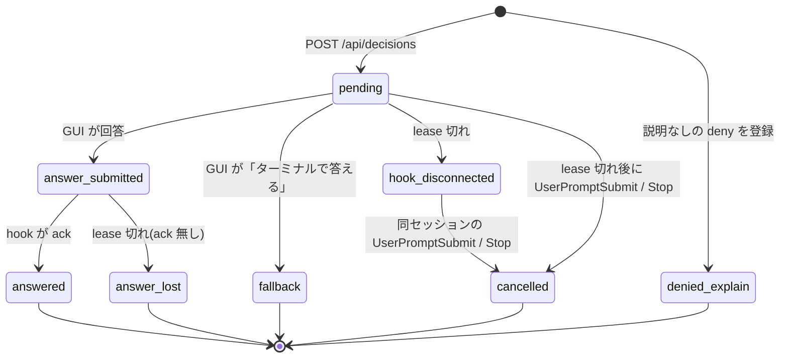

# API 仕様

`docs/strategy/03-mvp-implementation-plan.md` 3 節の契約を人向けに書いたもの。型の正は `src/contract.ts`(zod)。食い違ったら計画と `contract.ts` を正とし、この文書を直す。

`ukagai serve` は `127.0.0.1:4818` で待ち受ける。JSON 例の値は `test/fixtures/` の実物(検証 01 の T1)と同じ。

## エンドポイント

| API | 呼び手 | 役割 |
|---|---|---|
| `POST /api/decisions` | hook | 判断を登録。同じ `tool_use_id` なら既存を返す |
| `GET /api/decisions/:id/wait?timeout_ms=25000` | hook | long-poll。回答済みなら 200 + response、未回答で timeout なら 204。各 poll の終了時に `lease_until` を更新 |
| `POST /api/decisions/:id/ack` | hook | response を受け取った確認。`answered` と `delivered_at` が付く |
| `POST /api/decisions/:id/answer` | GUI | 回答の送信 |
| `GET /api/decisions?status=pending` | GUI | 一覧 |
| `GET /api/decisions/:id` | GUI | 詳細 |
| `POST /api/events` | hook(観測) | 観測 hook の生 JSON。`--observe` の時刻、Stop の `escaped_question`、PermissionRequest の消費 |
| `GET /api/sessions` | GUI | セッションごとの状態 |
| `GET /api/sessions/:id/pending-mode-switch` | hook | 「承認して auto」の未消費記録を読む |
| `POST /api/sessions/:id/pending-mode-switch/consume` | hook | 上の記録を消す |
| `GET /api/metrics` | GUI | (a')(b)(d) の集計 |
| `GET /api/stream` | GUI | SSE。`decision.created` / `decision.updated` / `session.updated` |
| `GET /healthz` | hook | 接続確認 |

### POST /api/decisions

要求(`CreateDecisionRequest`。`context` は server が集めるので hook は送らない):

```json
{
  "tool_use_id": "toolu_01C9XvdLwhw5t7NsMYWcdF4R",
  "kind": "answer_question",
  "session": {
    "session_id": "00000000-0000-4000-8000-000000000001",
    "cwd": "/Users/user/dev/ukagai",
    "transcript_path": "/Users/user/.claude/projects/-Users-user-dev-ukagai/00000000-0000-4000-8000-000000000001.jsonl",
    "scratchpad_dir": "/tmp/scratchpad",
    "permission_mode": "auto"
  },
  "request": {
    "questions": [
      {
        "question": "A と B のどちらにしますか？",
        "header": "選択",
        "options": [
          { "label": "A", "description": "選択肢 A" },
          { "label": "B", "description": "選択肢 B" }
        ],
        "multiSelect": false
      }
    ]
  }
}
```

`kind` は `answer_question`(AskUserQuestion)か `approve_plan`(ExitPlanMode)。`request` は hook の `tool_input` をそのまま入れる。`explanation` は任意(形は計画 3 節の `Decision.explanation`)。

応答 200(新規・既存とも): `Decision` 全体。`status` は `pending`。説明なしの deny を記録するときも同じ API を使い、`status` は `denied_explain`(GUI には出ない)。

### GET /api/decisions/:id/wait

- 回答済み: 200

```json
{
  "response": {
    "via": "gui",
    "answers": { "A と B のどちらにしますか？": "B" },
    "decided_at": "2026-10-02T03:09:12.400Z"
  }
}
```

`approve_plan` の応答は `answers` の代わりに `approve` / `reason` / `set_mode_auto` が入る。`via` が `terminal` のときは `{fallback:true}` が送られた場合で、hook は何も出力せず終了する。

- 未回答で `timeout_ms`(既定 25000)が過ぎた: 204(本文なし)。

hook は 200 を受けて stdout に書く前に ack を打つ(ack が通ってから出力する)。

### POST /api/decisions/:id/ack

要求は本文なし。応答 200 で `Decision`(`status: "answered"`、`response.delivered_at` 付き)。

### POST /api/decisions/:id/answer

要求は次の 4 形のどれか(`AnswerRequest`。キーの混在は 400):

```json
{ "answers": { "A と B のどちらにしますか？": "B" } }
{ "approve": true, "set_mode_auto": true }
{ "approve": false, "reason": "影響範囲を狭めてから出し直して" }
{ "fallback": true }
```

- `answers` の値は文字列のみ。`multiSelect` はラベルを `MULTI_SELECT_SEPARATOR`(仮に `", "`)で結合した 1 文字列。
- `approve: false` は `reason` が空でない文字列で必須。
- `set_mode_auto` は `approve: true` のときだけ。
- `{fallback:true}` は `pending` → `fallback` に遷移する。それ以外は `pending` → `answer_submitted`。

応答 200: 更新後の `Decision`。

### POST /api/events

観測 hook の stdin をそのまま送り、`received_at` を足す(`EventInput`)。知らないキーは保持する。

```json
{
  "session_id": "00000000-0000-4000-8000-000000000001",
  "transcript_path": "/Users/user/.claude/projects/-Users-user-dev-ukagai/00000000-0000-4000-8000-000000000001.jsonl",
  "cwd": "/Users/user/dev/ukagai",
  "hook_event_name": "PreToolUse",
  "tool_name": "AskUserQuestion",
  "received_at": "2026-10-02T03:09:12.000Z",
  "observe": { "phase": "start" }
}
```

- `observe.phase`: `--observe` の PreToolUse が `start`、PostToolUse が `end`。
- `escaped_question: true`: Stop の `last_assistant_message` が粗い検出に掛かったとき。

応答 204。

### GET /api/sessions

`SessionSummary[]`:

```json
[
  {
    "session_id": "00000000-0000-4000-8000-000000000001",
    "state": "waiting_decision",
    "last_event_at": "2026-10-02T03:09:12.000Z",
    "title": "A/B の選択",
    "cwd": "/Users/user/dev/ukagai"
  }
]
```

`state` は `working` / `waiting_decision` / `idle` / `ended`。

### GET /api/metrics

`Metrics`:

```json
{
  "a": { "answered": 9, "fallback": 1, "hook_disconnected": 0, "answer_lost": 0, "cancelled": 0, "escaped_question": 0, "total": 10, "rate": 0.9 },
  "b": {
    "human": { "count": 9, "median_ms": 21000, "mean_ms": 25000 },
    "agent": { "count": 3, "median_ms": 18000, "mean_ms": 19000 },
    "baseline": { "count": 12, "median_ms": 40000, "mean_ms": 52000 }
  },
  "c": { "session_panel_opens": 14 },
  "d": { "first_call": 6, "after_deny": 3, "none": 1, "total": 10, "attach_rate": 0.9 }
}
```

- (a') `rate = answered / total`。`total = answered + fallback + hook_disconnected + answer_lost + cancelled + escaped_question`。分母が 0 なら `null`。
- (b) `human` = `created_at → decided_at`、`agent` = `first_denied_at → created_at`、`baseline` = `--observe` で取った値。
- (d) `plan_mode` の判断は `total` から除く。

### GET /api/stream

SSE。イベント名は `decision.created` / `decision.updated`(データは `Decision`)、`session.updated`(データは `SessionSummary`)。

## 状態遷移



許可される遷移は上の 7 本だけ(`canTransition`)。`denied_explain` は終端で、再呼び出し時に `session_id + agent_id + questions[0].question` で引いて `attached_via: after_deny` と `first_denied_at` を付けるのに使う。

`lease_until` は最後の poll 終了 + `POLL_TIMEOUT_MS`(25 秒)+ `LEASE_GRACE_MS`(10 秒)。

## 認可と入力検証

- **Bearer**: `serve` が起動時に作るトークンを `~/.ukagai/token`(0600)に書く。hook は読んで `Authorization: Bearer <token>` で送る。
- **cookie**: GUI は `GET /` で `SameSite=Strict; HttpOnly` cookie を受け取る。書き込み API(POST)は cookie か Bearer のどちらかを要求する。
- **Host**: `127.0.0.1:4818` と `localhost:4818` 以外は 400(DNS rebinding 対策)。
- **Content-Type**: 書き込み API は `application/json` 必須。
- **パス**: `transcript_path` は `~/.claude/projects/` 配下、`explanation.path` は `<scratchpad_dir>/ukagai/` か `~/.ukagai/explain/` 配下、`cwd` は実在ディレクトリに限る(`isAllowedTranscriptPath` / `isAllowedExplanationPath`。`..` と symlink を解決してから判定)。
- 限界: 同一ユーザーの他プロセスが `~/.ukagai/token` を読めば API を叩ける(計画 7 節)。

## エラー応答

本文は `{"error":"<短い説明>"}`。

| status | 条件 |
|---|---|
| 400 | JSON の形が schema に合わない、`Host` 不正、`Content-Type` が JSON でない、許可外のパス |
| 401 | 書き込み API でトークンも cookie も無い、または不一致 |
| 404 | 存在しない `:id` |
| 409 | 状態遷移違反(例: `answered` に `answer`、`pending` に `ack`) |

## hook の出力(stdout)

| 判断 | stdout |
|---|---|
| 回答(allow) | `test/fixtures/t1-stdout.json`。`updatedInput` は `tool_input` に `answers` を足したもの |
| 計画承認(allow) | `test/fixtures/t5-stdout.json`。`updatedInput` は `tool_input` そのまま |
| deny | `test/fixtures/t4-stdout.json`。`permissionDecisionReason` に理由 |
| 承認して auto(PermissionRequest) | `{"hookSpecificOutput":{"hookEventName":"PermissionRequest","decision":{"behavior":"allow","updatedPermissions":[{"type":"setMode","mode":"auto","destination":"session"}]}}}` |
| SessionStart / SubagentStart | `{"hookSpecificOutput":{"hookEventName":"SessionStart","additionalContext":"..."}}` |
| ターミナルで答える / 接続不可 / budget 切れ | 出力なし、exit 0 |

## 計画に無い点(この文書と contract.ts で足したもの)

- `WaitResponse` は `{ "response": DecisionResponse }`(計画は「200 + response」)。
- `POST /api/decisions/:id/ack` の応答は `Decision`、エラー本文は `{"error":...}`、`POST /api/events` の応答は 204、`pending-mode-switch` の本文は未定義(W3 が決める)。
- `Metrics` の形(`a` / `b` / `c` / `d`)は計画 2 節の指標名からの起案。
