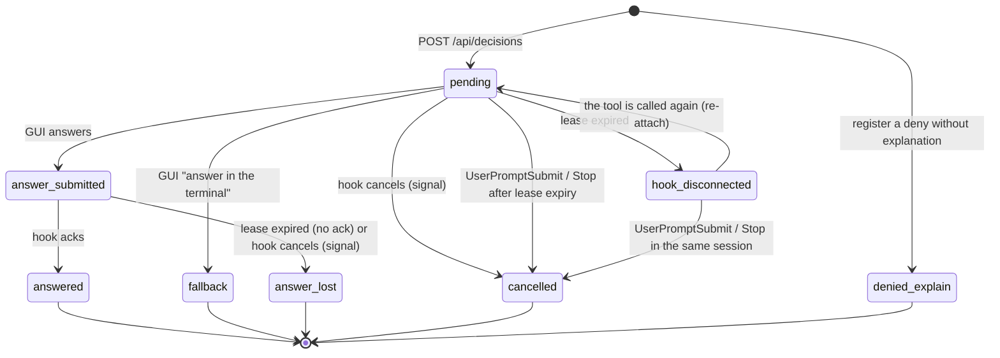

# API spec

A human-readable version of the contract in section 3 of `docs/strategy/03-mvp-implementation-plan.md`. The source of truth for types is `src/contract.ts` (zod). If this document disagrees, treat the plan and `contract.ts` as correct and fix this document.

`ukagai serve` listens on `127.0.0.1:4818`. The values in the JSON examples are the same as the real files in `test/fixtures/` (T1 of verification 01).

## Endpoints

| API | Caller | Role |
|---|---|---|
| `POST /api/decisions` | hook | Register a decision. Returns the existing one for the same `tool_use_id` |
| `GET /api/decisions/:id/wait?timeout_ms=25000` | hook | Long-poll. If answered (`answer_submitted` / `fallback`), 200 + response; if unanswered and the timeout passes, 204; if the decision is closed (`answered` etc., including when it becomes so while waiting), 410 immediately. Updates `lease_until` at the end of each poll |
| `POST /api/decisions/:id/ack` | hook | Confirmation that the response was received. Sets `answered` and `delivered_at` |
| `POST /api/decisions/:id/handoff` | hook | The hook's budget for this leg ended: the decision stays `pending` and waits for the agent's next call (see "Hand-off") |
| `GET /api/sessions/:id/open?fingerprint=&tool_use_id=[&agent_id=]` | hook | The still-open decision of the session and agent with the same fingerprint (re-attach), or 404 |
| `POST /api/decisions/:id/cancel` | hook | Notification when the hook exits on SIGTERM / SIGINT / SIGHUP. `pending` → `cancelled`, `answer_submitted` → `answer_lost` |
| `POST /api/decisions/:id/answer` | GUI | Submit an answer |
| `GET /api/decisions?status=pending` | GUI | List |
| `GET /api/decisions/:id` | GUI | Detail |
| `POST /api/events` | hook (observation) | Raw JSON of an observation hook. The `--observe` timestamps, `escaped_question` from Stop, consumption of PermissionRequest |
| `GET /api/sessions` | GUI | State per session |
| `GET /api/sessions/:id/instruction` | hook | The human's reply to a progress checkpoint (`instruct` / `stop`), consumed on read, or 404. See "Progress checkpoints" |
| `GET /api/sessions/:id/pending-mode-switch` | hook | Read the unconsumed "approve and switch to auto" record |
| `POST /api/sessions/:id/pending-mode-switch/consume` | hook | Delete the record above |
| `GET /api/sessions/:id/pending-rewrite` | hook | The session's last "Cannot answer" memo, or `null` |
| `POST /api/sessions/:id/pending-rewrite/consume` | hook | Delete the memo above |
| `GET /api/metrics` | GUI | Aggregates for (a')(b)(d) |
| `GET /api/decisions/:id/history` | GUI / TUI (cookie or Bearer) | The human instructions of the decision's session (first + last 20), read from the transcript on request |
| `GET /api/plans` / `GET /api/plans/:name` | GUI / TUI (cookie or Bearer) | Read-only view of the plan files Claude Code writes to `~/.claude/plans` (list, and one file). See below |
| `GET /api/sessions/:id/plan-versions` | GUI / TUI (cookie or Bearer) | The versions of the session's plan and the section diffs between them. See "Plan versions" |
| `POST /api/plans/:name/instruct` | GUI / TUI (cookie or Bearer) | Tell the agent that is still writing a plan something (queued like a checkpoint reply, typed into its terminal when idle). See below |
| `GET /api/files` | GUI / TUI (cookie or Bearer) | An image of the document being shown (explanation or plan), from an allowlisted folder. See below |
| `POST /api/plans/:name/read` / `DELETE /api/plans/:name/read` | GUI / TUI (cookie or Bearer) | Mark a plan read (at a given `mtime`) / unread again. Kept in `<data-dir>/plans-read.json`. See below |
| `GET /api/config` | GUI (cookie or Bearer) | Returns `{ "lang": "en" \| "ja", "build": string }`: the display language (the live `lang` setting, see `GET /api/settings`) and the current `app.js` version (the `?v=` value). The GUI reloads itself when `build` differs from its own |
| `GET /api/settings` / `PUT /api/settings` | GUI / TUI (cookie or Bearer) | The settings kept in `<data-dir>/config.json`: read, and replace as a whole (validated, applied live, broadcast as `settings.updated`). See below |
| `POST /api/gui/open` | hook (Bearer only) | Body `{}`. Asks the server to open the GUI once a day: returns `{ "result": "opened_today" \| "connected" \| "pending" }`. See below |
| `GET /api/stream` | GUI / TUI | SSE. `decision.created` / `decision.updated` / `session.updated` / `plan.updated` / `plan.removed` / `settings.updated` |
| `GET /healthz` | hook | Connectivity check |

### POST /api/decisions

Request (`CreateDecisionRequest`. The server collects `context`, so the hook does not send it):

```json
{
  "tool_use_id": "toolu_01C9XvdLwhw5t7NsMYWcdF4R",
  "kind": "answer_question",
  "session": {
    "session_id": "00000000-0000-4000-8000-000000000001",
    "cwd": "/Users/user/dev/ukagai",
    "transcript_path": "/Users/user/.claude/projects/-Users-user-dev-ukagai/00000000-0000-4000-8000-000000000001.jsonl",
    "scratchpad_dir": "/tmp/scratchpad",
    "permission_mode": "auto"
  },
  "request": {
    "questions": [
      {
        "question": "Which do you choose, A or B?",
        "header": "Choice",
        "options": [
          { "label": "A", "description": "Option A" },
          { "label": "B", "description": "Option B" }
        ],
        "multiSelect": false
      }
    ]
  }
}
```

`kind` is `answer_question` (AskUserQuestion) or `approve_plan` (ExitPlanMode). `request` holds the hook's `tool_input` as is. `explanation` is optional (its shape is `Decision.explanation` in section 3 of the plan). `explanation.type` (`decision` / `blocker` / `quiz`, omitted = decision) is the `type` in the explanation file's front matter; the server only stores and returns it. `explanation.none_reason` is `plan_mode` / `loop_guard` (set by the hook) or `not_required` (reserved. No path sets it. It stays in the contract because the GUI / TUI hold the display text).

Response: **201 for a new decision, 200 if the same `tool_use_id` already exists** (the body is the whole `Decision` in both cases). `status` is `pending`.

- To record a deny without an explanation, use the same API and add `"status": "denied_explain"` to the request (`CreateDecisionRequest.status`). `Decision.status` becomes `denied_explain`. It does not appear in the GUI list (the default of `GET /api/decisions`), sends no SSE, does not change session state, and does not collect context. `GET /api/decisions?status=denied_explain` retrieves it. The reason for the deny is the request's `missing` (an array of MissingCode, only for `denied_explain`), which is stored as is in `Decision.missing` and returned (the server does not interpret it).
- `session.agent` (`"claude"` | `"codex"`, optional, absent means `claude`) says which agent the session belongs to. The server stores it as sent and returns it on the decision; events carry it too. For `codex` the server does not read a transcript: `context` is the git part only and `GET /api/decisions/:id/history` returns `total: 0` (the Codex rollout format is not examined yet).
- **Empty `options`**: a question with `options: []` is a free-text-only question (the Codex Stop hook registers a prose question this way). The GUI and TUI always offer the free-text entry next to the options, so nothing extra is needed; the answer is the free text. No flag (like `free_text_only`) exists.
- **Codex approvals** (`PermissionRequest`) are registered as an ordinary `answer_question` with one question, `header: "Approval"`, `question` = the model's description + a blank line + the command in backticks, `options: [{label:"Allow"},{label:"Deny"}]`, `explanation.none_reason: "not_required"` and `session.agent: "codex"` (no new `kind`). `request.tool_name` carries the tool. The hook turns the answer `Allow` into `behavior: allow`, `Deny` or any free text into `behavior: deny` with `message` "Denied in the ukagai GUI" (+ the text).
- `plan_name` (approve_plan only) is the basename of `request.planFilePath` when it resolves to a plan file directly inside `<HOME>/.claude/plans`, set once at create; otherwise absent. It is how a closed plan decision finds its read mark (see `POST /api/plans/:name/read`).
- `first_denied_at` is set by the server. When the request's `explanation.attached_via` is `after_deny`, it is set to the `created_at` of the most recent `denied_explain` with the same `session_id + agent_id + questions[0].question` within the last 120 seconds. `attached_via` itself is stored as the hook decided it.
- At registration the server collects context (git, transcript). If the transcript cannot be read, it re-reads once after 500 ms, so **this POST takes up to 1.5 seconds** (an absolute upper bound on the server side). The hook must set the POST timeout longer than 1.5 seconds (the check of whether it can connect may be shorter).
- 400 if `transcript_path` or `explanation.path` is not allowed. A missing `cwd` still gives 201, and `context` is just empty.

`status_reason` (optional string on a decision) says why a decision was closed without an answer. Only the codex-bridge sets it today: `answered_elsewhere` when the terminal moved first (see `docs/spec/codex-bridge.md`). Decisions of `kind: "approve_plan"` with `session.agent: "codex"` and `explanation.path: ""` are not created through this endpoint but by the codex-bridge inside `serve`; `request.planFilePath` is `""` for them.

Codex checkpoints: a `checkpoint` decision with `session.agent: "codex"` is created by the codex-bridge (not the transcript watcher) when a turn has been completed for `codexCheckpointDelayMs` (default 180 s) with no new turn; its `recap` is the turn's last agent message. Its `instruct` / `stop` answer is delivered by the bridge as `turn/start` (after `turn/interrupt` when a turn runs), which consumes the instruction itself, so `GET /api/sessions/:id/instruction` returns 404 for it; a failed delivery makes the decision `answer_lost`. See `docs/spec/codex-bridge.md`.

### GET /api/decisions/:id/history

Returns what the human typed in the session, so a viewer can see what the session is about. Allowed with cookie or Bearer (same as `GET /api/decisions/:id`). 404 `{error}` if the decision does not exist. It is not part of the decision list or SSE; clients fetch it on demand.

```json
{
  "session_id": "…",
  "ai_title": "…",
  "total": 77,
  "first": { "at": "2026-10-02T03:04:36.144Z", "text": "…" },
  "recent": [ { "at": "…", "text": "…" } ]
}
```

- `ai_title` is the last `ai-title` record of the transcript (omitted if none). `total` counts human instructions. `first` is the first one, cut to 4000 characters. `recent` is the last 20 in chronological order (not newest first), each cut to 500 characters; it may overlap `first`. A cut text ends with `…`. `at` is the record's `timestamp` (`""` if it has none).
- Source: only `session.transcript_path`, even for a subagent decision (the human's instructions live in the parent transcript). If the path is not allowed (`isAllowedTranscriptPath`), missing or unreadable, the response is 200 `{ session_id, total: 0, first: null, recent: [] }`.
- Limits: the file is streamed line by line from the start and at most 64 MB are read; if the file is larger, the result covers the part that was read (a line cut at the limit is ignored). Broken lines are skipped.
- Cache: in memory for 5 seconds, keyed by `transcript_path + mtimeMs + session_id`.
- What counts as a human instruction: a `type: "user"` record whose `message.content` is a string, or an array with `text` blocks (`tool_result`-only records are excluded). Excluded: `isSidechain: true`, `isMeta: true`, `isCompactSummary: true` (the summary written at context compaction), slash-command / local-command / `!` shell records (`<command-name>`, `<command-message>`, `<command-args>`, `<local-command-stdout>`, `<local-command-stderr>`, `<local-command-caveat>`, `<bash-input>`, `<bash-stdout>`, `<bash-stderr>`), and `[Request interrupted by user…]`. `<system-reminder>…</system-reminder>` and `<task-notification>…</task-notification>` blocks (harness notices about background tasks, monitors and subagents) are removed, `<pasted_content …>` tags are removed (the content stays), and a record that is empty afterwards is excluded. Text is otherwise kept as is (newlines and spaces included).

### GET /api/decisions/:id/wait

- Answered: 200

```json
{
  "response": {
    "via": "gui",
    "answers": { "Which do you choose, A or B?": "B" },
    "decided_at": "2026-10-02T03:09:12.400Z"
  }
}
```

The response for `approve_plan` carries `approve` / `reason` / `set_mode_auto` (or `instruct` / `text`) instead of `answers`. When `via` is `terminal`, `{fallback:true}` was sent, and the hook exits without printing anything.

- Unanswered and `timeout_ms` (default 25000) has passed: 204 (no body). Terminal states such as `answered` / `hook_disconnected` return 410 (`{error, status}`) immediately without waiting.
- `timeout_ms` is clamped to 0–600000. If it is not a number, the default is used.
- Lease update: at both the **start and end** of a poll, set `lease_until = now + timeout_ms + LEASE_GRACE_MS` (without updating at the start too, the initial lease expires during the first long poll). The initial lease right after registration is `now + LEASE_GRACE_MS`. It is updated only for `pending` / `answer_submitted`. A lease-only update is not written to `decisions.jsonl`.

The hook sends the ack after receiving 200 and before writing to stdout (it prints only after the ack succeeds).

### POST /api/decisions/:id/ack

No request body is needed, but `Content-Type: application/json` is required, so send `{}`. Response 200 with the `Decision` (`status: "answered"`, with `response.delivered_at`).

### POST /api/decisions/:id/handoff

Bearer required, body `{ "session_id": string }` (`Content-Type: application/json`). Marks a `pending` decision as awaiting re-attach: `handoffs += 1`, `lease_until = now + handoffGraceMs` (server option, default `HANDOFF_GRACE_MS` = 120 s). The status stays `pending`. The change is kept in memory and broadcast but not written to the decision store (the re-attach that follows persists the record, and a restart re-arms every live lease). Response 200 + `Decision` (SSE `decision.updated`). 403 when `session_id` is not the decision's session, 404 unknown id, 409 when the decision is not `pending`.

### GET /api/sessions/:id/open

Bearer required. Query: `fingerprint` (see `decisionFingerprint` in `src/contract.ts`) and `tool_use_id` (the caller's), both required (400 otherwise), and `agent_id` (the calling subagent; absent for the main agent). Returns `{ decision }` for the newest decision of the session and agent (`session.agent_id` equals `agent_id`, both absent counting as equal, so two subagents asking the same question never collapse) whose status is `pending` (handed off or not, so a crashed hook can re-attach too) or `hook_disconnected` and whose `fingerprint` matches; 404 otherwise. Side effects on a hit: a `hook_disconnected` decision is revived to `pending` (no second count in the metrics); `tool_use_id` becomes the caller's and the old one is appended to `previous_tool_use_ids` (every id ever used still finds the decision); the lease is re-armed with `LEASE_GRACE_MS`; SSE `decision.updated`. This is the only attach path: `POST /api/decisions` never merges into an open decision (it creates one unless the `tool_use_id` is already known).

The fingerprint is the sha256 hex of the questions with their option labels (`question` and the label list only: descriptions, header and key order do not count), or, for `approve_plan`, of the trimmed plan text (the plan file path when the plan is empty).

### POST /api/decisions/:id/cancel

Bearer required. `Content-Type: application/json` is required, so send `{}`. If `pending`, it becomes `cancelled`; if `answer_submitted`, it becomes `answer_lost`; response 200 + `Decision` (SSE `decision.updated`). 409 for a terminal state. The hook receives the SIGTERM that Claude Code sends on Esc / ctrl+c (E1-3) and sends this once, with a 300 ms timeout. This avoids the decision lingering in the GUI until the lease expires. It is not sent for signals before registration or after output.

### POST /api/decisions/:id/answer

The request is one of the following 5 shapes (`AnswerRequest`. Mixed keys give 400):

```json
{ "answers": { "Which do you choose, A or B?": "B" } }
{ "approve": true, "set_mode_auto": true }
{ "approve": false, "reason": "Narrow the scope first, then resubmit" }
{ "approve": false }
{ "instruct": true, "text": "Have a second model review this plan adversarially and fold the critical findings in" }
{ "fallback": true }
```

A progress checkpoint (`kind: "checkpoint"`) takes a sixth shape, `{ "kind": "continue" | "instruct" | "stop", "text"?: string }` (`text` is required and non-blank for `instruct`; `via` / `decided_at` may be sent and are ignored). It answers only checkpoints and the 5 shapes above never fit one (400).

- The values of `answers` are strings only. For `multiSelect`, it is one string of the labels joined with `MULTI_SELECT_SEPARATOR` (tentatively `", "`).
- `approve: false` takes an optional `reason` (missing, empty or blank all mean "rejected without a reason": the stored response has no `reason`; with a reason it is trimmed text). `{ "approve": false }` is a valid body. The hook then denies with `[ukagai] The human rejected the plan without giving a reason. Revise the plan (look for what a reader would object to) or ask one question about what to change, then call ExitPlanMode again.`; the Codex bridge starts no turn (the no-feedback path). A reasonless rejection is not a version instruction.
- `set_mode_auto` is allowed only with `approve: true`.
- `{ "instruct": true, "text": "…" }` is for `approve_plan` only (400 for any other kind): "do this before I approve". `text` is trimmed, 1 to 4000 characters. It is stored like a reject (`answer_submitted`, same events, same history) with the response `{ "via": "gui", "instruct": true, "text": "…", "decided_at": … }` (`approve` and `reason` are absent). The hook answers ExitPlanMode with a deny whose reason is `[ukagai] The human has not approved the plan yet and asks you to do this first: <text>` followed by `You are still in plan mode: do it (research, subagents and reviews are fine; do not edit project files), update the plan file, then call ExitPlanMode again.`; the agent's next ExitPlanMode is a new decision. The Codex bridge starts a Plan-mode turn with the same text (like a reject with feedback).
- `{fallback:true}` transitions `pending` → `fallback` (the GUI does not send it; the button was removed). Anything else transitions `pending` → `answer_submitted`.

Response 200: the updated `Decision`.

### POST /api/events

Sends the observation hook's stdin as is and adds `received_at` (`EventInput`). Unknown keys are preserved.

```json
{
  "session_id": "00000000-0000-4000-8000-000000000001",
  "transcript_path": "/Users/user/.claude/projects/-Users-user-dev-ukagai/00000000-0000-4000-8000-000000000001.jsonl",
  "cwd": "/Users/user/dev/ukagai",
  "hook_event_name": "PreToolUse",
  "tool_name": "AskUserQuestion",
  "received_at": "2026-10-02T03:09:12.000Z",
  "observe": { "phase": "start" }
}
```

- `observe.phase`: `start` for PreToolUse and `end` for PostToolUse under `--observe`.
- `escaped_question: true`: when Stop's `last_assistant_message` matches the rough detection.
- `wakeup: true`: on `UserPromptSubmit` only, when the first 400 characters of the prompt contain `<task-notification>` or start with `[SYSTEM NOTIFICATION` (a harness wake-up such as a finished background task or a monitor, not a human). Only the boolean is posted, never the prompt. The events of a wake-up turn (until the next `UserPromptSubmit` without it, or `SessionEnd`) are not activity for the progress-recap check (`no_progress`), except a `PostToolUse` of Edit / Write / MultiEdit / NotebookEdit; a registered decision always is. A wake-up prompt is not the human speaking: it does not cancel pending cards, does not lift a stop and does not drop a queued stop.
- `blocker_detected: true`: **no longer emitted since the Stop detector was removed (explain.md section 12); counts historical events only.** The field stays in the event schema and `a.blocker_detected` in `GET /api/metrics` stays (always 0 for new data) so old `events.jsonl` lines still load. Not included in `a.total`.

Response 204.

The same API is used when the GUI sends "opened the session list panel" as a supplementary metric for (c) (it can be sent with a cookie).

```json
{
  "session_id": "gui",
  "transcript_path": "gui",
  "cwd": "gui",
  "hook_event_name": "ukagai.session_panel_open",
  "received_at": "2026-10-02T03:09:12.000Z"
}
```

- An event whose `hook_event_name` is `ukagai.session_panel_open` changes neither session state nor the session list; it only increments `metrics.c.session_panel_opens` by 1. `session_id` / `transcript_path` / `cwd` are values just to pass the schema and can be anything.

### GET /api/sessions

`SessionSummary[]`:

```json
[
  {
    "session_id": "00000000-0000-4000-8000-000000000001",
    "state": "waiting_decision",
    "last_event_at": "2026-10-02T03:09:12.000Z",
    "title": "A/B choice",
    "cwd": "/Users/user/dev/ukagai",
    "transcript_path": "/Users/user/.claude/projects/-Users-user-dev-ukagai/00000000-0000-4000-8000-000000000001.jsonl"
  }
]
```

`state` is `working` / `waiting_decision` / `idle` / `ended`. `transcript_path` comes from the hook events (absent before the first event and for Codex `--ephemeral`).

### GET /api/sessions/:id/pending-mode-switch / POST .../consume

The bodies are `PendingModeSwitch` / `ConsumeModeSwitchResponse` in `contract.ts`. The record is created by an answer with `approve: true, set_mode_auto: true` and expires after 60 minutes (`MODE_SWITCH_TTL_MS`). Its consumer is the `PermissionRequest` hook, which has no matcher: the first permission prompt of **any** tool (Bash, Write, WebFetch, …) after the approval takes it and answers `setMode auto`. (After a hook-allowed ExitPlanMode Claude Code lands in the default mode, and the first prompt is usually not Write / Edit.) The record is also cleared when the session ends (`SessionEnd`) and when a new `approve_plan` decision is created for the session (a new plan: the human decides again).

```json
{ "pending": false }
{ "pending": true, "set_at": "2026-10-02T03:09:12.000Z", "expires_at": "2026-10-02T03:11:12.000Z" }
```

`POST .../consume` deletes the record if there is an unconsumed, unexpired one and returns `{ "consumed": true }`; otherwise `{ "consumed": false }` (consume requires `Content-Type: application/json`, so send `{}`).

### GET /api/sessions/:id/pending-rewrite / POST .../consume

`PendingRewrite` / `ConsumeRewriteResponse` in `contract.ts`. `POST /api/decisions/:id/answer` with an `answers` value of the form `Cannot answer — <reason>[: <detail>]` (see `docs/spec/explain.md` section 15) stores one memo per session (a later one overwrites). The memo is kept in memory until consumed; it has no expiry and is lost on restart.

```json
null
{ "question": "Which store?", "reason": "Undefined terms", "terms": ["W-T2", "FT4"], "body_hash": "<sha-256 hex of the explanation without front matter>", "at": 1790000000000 }
```

`terms` is empty unless `reason` is `Undefined terms`. `POST .../consume` (send `{}`) returns `{ "consumed": true }` if there was a memo, otherwise `{ "consumed": false }`.

### GET /api/metrics

`Metrics`:

```json
{
  "a": { "answered": 9, "fallback": 1, "hook_disconnected": 0, "answer_lost": 0, "cancelled": 0, "escaped_question": 0, "blocker_detected": 0, "handoffs": 0, "reattached": 0, "cannot_answer": 0, "total": 10, "rate": 0.9 },
  "b": {
    "human": { "count": 9, "median_ms": 21000, "mean_ms": 25000 },
    "agent": { "count": 3, "median_ms": 18000, "mean_ms": 19000 },
    "baseline": { "count": 12, "median_ms": 40000, "mean_ms": 52000 }
  },
  "c": { "session_panel_opens": 14, "checkpoints": { "created": 4, "answered": 2, "delivered": 1 } },
  "d": { "first_call": 6, "after_deny": 3, "none": 1, "total": 10, "attach_rate": 0.9 }
}
```

- (a') `rate = answered / total`. `total = answered + fallback + hook_disconnected + answer_lost + cancelled + escaped_question`. `null` if the denominator is 0.
- `a.handoffs` is the sum of `Decision.handoffs`, `a.reattached` the number of re-attaches (the sum of `previous_tool_use_ids` lengths). Neither is part of `total`.
- (b) `human` = `created_at → decided_at`, `agent` = `first_denied_at → created_at`, `baseline` = values taken with `--observe`.
- (d) Decisions with `plan_mode` are excluded from `total`.
- `c.checkpoints`: `created` = checkpoint decisions, `answered` = those in `answered`, `delivered` = those whose reply reached the agent (`response.delivered_at`: hook, terminal, bridge or noop). Checkpoints are excluded from `a` (including `total`), `b` and `d`.

### GET /api/plans / GET /api/plans/:name

Read-only access to the plan files Claude Code writes in plan mode, so a plan can be read outside the approval moment. Allowed with cookie or Bearer. Source: `<HOME>/.claude/plans` (`HOME` of the server process). The plan files themselves are never written or deleted. Changes arrive over SSE (`plan.updated` / `plan.removed`, see `GET /api/stream`); the only state ukagai keeps is the read mark (below).

`GET /api/plans` → 200

```json
{ "plans": [ { "name": "foo-bar.md", "title": "Add X", "mtime": "2026-10-03T06:00:00.000Z", "bytes": 1234, "sections": 4, "lines": 60, "read": false, "format_ok": true, "ready": false, "session_id": "…" } ] }
```

- `session_id` (optional, also on the detail) is the live Claude Code session writing the plan: Claude Code names the plan after the session's `slug` and every transcript line carries `"slug":"<name>"`, so it is the session (not ended, last event within 6 hours, transcript under `~/.claude/projects/`) whose transcript has that slug. Claude Code assigns the slug lazily, when the session first enters plan mode (lines written before carry none, every later line does), so the lookup reads the **last** 256 KB of the transcript first (complete lines only), then the first 256 KB (once). While a session's slug is unknown the tail is read again whenever the file grew (one 256 KB read per poll per session); a found slug is kept for good. Absent when none is found. The `plan.updated` SSE event carries `session_id` when it is known: a plan whose session is found later (the server looks on a 10 s timer and on each of these two calls) is announced again with `session_id`, once, so clients learn it without a file write.
- `format_ok` is true when the file has the sections ukagai's plan-writing rules (`planContextText`) ask for: an H2 `Steps` with at least one list item and an H2 `Verification` with at least one task item (`- [ ]` / `- [x]`), headings trimmed and case-insensitive.
- `ready` (also on the detail and on every `plan.updated`) is computed by the server and is the only thing the GUI / TUI use to decide whether a plan is queued, shown by itself and counted. It is state, not size (a one-section plan shows): true when `session_id` is known, that session is not `working` (not between `UserPromptSubmit` and `Stop`; the file is in flux then), its last `Stop` was not an escaped question (the hook posted `escaped_question: true`: the agent ended its turn with a question and waits for the human in the terminal; cleared by the next `UserPromptSubmit`), it has no decision `pending` (the human is asked that first), no background subagent is running for it (`SubagentStart` / `SubagentStop` are observed: a `Stop` while subagents run is not final, and a `SubagentStop` after the `Stop` makes the harness wake the agent, so the plan waits until that wake-up `UserPromptSubmit`; a running entry older than 60 minutes or a wake-up mark older than 2 minutes is ignored), and, **only when ukagai handed its plan format to that session** (the plan-context marker `<data-dir>/plan-context/<session_id, sanitized>` exists), `format_ok`. A session that never got the rules (no hook, a plan begun before plan mode, another language or format) is judged on state alone, so its plan is not "writing" forever. A plan that is not `ready` is still listed (labelled Writing / 作成中). `ready` flips without the file changing, so the server announces `plan.updated` again when a session's state changes (hook event, session end, the escaped-question flag, a subagent starting or stopping) or one of its decisions is created or leaves `pending`, for the plans found for that session, and only when `ready` changed.
- Only `*.md` files, newest `mtime` first, at most 50. Names starting with `.` are skipped. A file whose `realpath` is outside the plans directory (a symlink leading out) is not listed. A missing directory gives `{ "plans": [] }`.
- `name` is the file name including `.md`. `title` is the first H1 (`# …`, outside code fences), or `name` if there is none. `sections` counts H2 headings (outside code fences). `lines` counts lines (0 for an empty file). A file over 1 MB is listed with `title = name` and `sections = 0`. `read` is true when the stored read mark equals the current `mtime`.

`GET /api/plans/:name` → 200

```json
{ "name": "foo-bar.md", "title": "Add X", "mtime": "2026-10-03T06:00:00.000Z", "markdown": "# Add X\n…", "read": false, "format_ok": true, "ready": false, "session_id": "…" }
```

- 400 if `name` is empty or contains `/`, `\`, `..` or a NUL, or starts with `.` (URL-encoded separators are decoded first). 404 if the file does not exist, is not a regular file, or its `realpath` is outside the plans directory. 413 if it is larger than 1 MB.

### GET /api/config

Returns the GUI display language: the `lang` of the live settings (below), which starts as `<data-dir>/config.json`'s value (a missing or malformed file gives `"en"`) and follows `PUT /api/settings`. Allowed with cookie or Bearer. The GUI reads the rest of its configuration from `GET /api/settings`.

```json
{ "lang": "ja", "build": "mabc12" }
```

`build` is the mtime-based version of `app.js` (the same value as the `?v=` in index.html), read on every request. The GUI compares it with its own on every SSE `open` and calls `location.reload()` when they differ.

### GET /api/settings / PUT /api/settings

The settings page (`/settings`) edits `<data-dir>/config.json` through these two calls. Cookie or Bearer. `GET` returns the whole object with every default filled in. `PUT` (`Content-Type: application/json`, 415 otherwise) takes the **whole** object, validates it with the zod schema `Settings` in `src/contract.ts` (400 `{ "error": "invalid request", "issues": [...] }` on failure, nothing is saved), writes `config.json` (tmp + rename, writes one after another), applies it live, broadcasts SSE `settings.updated` with the new object and returns it.

```json
{
  "lang": "en",                      // "en" | "ja": GUI / TUI display language (also what `install --lang` sets)
  "theme": "system",                 // "system" | "light" | "dark": the GUI sets <html data-theme> (system = prefers-color-scheme)
  "hints": true,                     // false hides the GUI's bottom key-hint line
  "checkpoints": {
    "enabled": true,                 // false: the recap watcher and the Codex bridge create no progress checkpoint (log: checkpoint_skipped, reason "disabled"); cards already pending stay
    "codex_delay_s": 180,            // integer 30..3600: quiet time after a finished Codex turn; read when the timer is armed
    "terminal_delivery": true        // false: a reply is never typed into a herdr pane; it waits for the agent's next tool call (no terminal is looked up)
  },
  "plans": {
    // one-click chips on plan cards: at most 10 lines of 1-300 characters (trimmed, blank lines dropped)
    "instruction_presets": [],
    "auto_show": true,   // false: new plan files do not pop up and do not count in Pending (the drawer list and an arriving approval still show them). Whatever it says, a plan file without `session_id` never pops up or counts (it has no actions): it is listed in the drawer until `plan.updated` brings the session
  },
  "notify": {
    "sound": false,                  // a short beep on a new decision while the GUI tab is not focused
    "browser": false,                // a browser Notification on a new decision while the tab is hidden (the page asks the browser for permission when it is turned on)
    "title_badge": true              // the "(N)" pending count in the tab title
  }
}
```

A failed write (for example a read-only data directory) is a 500 `{ "error": "internal error" }` and **changes nothing**: the new values become current, reach the listeners and are broadcast only after the file was written (tmp + rename), so the server never runs on values that are not on disk. Concurrent `PUT`s are applied one after another (the last one wins, memory and file agree). Keys the schema does not know are stripped without an error.

`install --lang` rewrites `config.json` behind a running server's back; the server does not watch the file. A `PUT` that leaves `lang` as the server has it keeps the file's `lang` (so the install is not written over); other fields changed in the file by hand need a restart of `serve` (or any `PUT`, which writes the server's values).

`config.json` is read tolerantly (`readConfig`): a missing or malformed file, or any unknown / invalid field, falls back to that field's default and never throws (a key an older version wrote is ignored); `writeConfig` writes the whole object. `install --lang` keeps the other settings. Not settings: ports, the data directory, hook budgets, the Codex home.

Live application, without a restart: the recap watcher, the Codex bridge (`codex_delay_s` at arm time) and the terminal delivery read the current value at the moment they act; `lang` changes what `GET /api/config`, the injected `<html lang data-lang>` and the next GUI / TUI load use (the hook reads `config.json` per call already). `theme`, `hints`, `plans.auto_show`, and `notify.*` are applied by the GUI itself; the TUI takes `lang` (unless `--lang` pinned it) from `GET /api/settings` at start, on every reconnect refetch and on `settings.updated`.

### POST /api/plans/:name/instruct

Cookie or Bearer, JSON. Body `{ "text": "…" }` (trimmed, 1 to 4000 characters, else 400). Tells the agent that is still writing the plan something while no hook waits. 404 when no session maps to the plan (see `session_id` above). Otherwise the text is delivered exactly like a checkpoint "instruct" reply: queued for `GET /api/sessions/:id/instruction` (the agent's next tool call; the hook words it `[ukagai] About the plan you are writing: <text>`), and typed into the agent's terminal when the agent is idle and its terminal is found (same line, same rules as a checkpoint reply). The session has one queue slot: if a checkpoint `stop` is queued the call is 409 `{ "error": "a stop is queued for this session" }` (the stop must still reach the agent); if a checkpoint reply or an earlier plan instruction is queued, the texts are joined with a newline (capped at 4000 characters) and the earlier one keeps its identity, so its checkpoint is marked delivered when the joined text is consumed or typed. A plan instruction that is queued while the agent works is typed into its terminal when the agent goes idle (`Stop`), and is dropped (log line `plan_instruction_dropped`) when an `approve_plan` decision is created for the session (the human instructs on the approval card then). Plan instructions are not persisted: a server restart loses an undelivered one (checkpoint replies still survive). No decision record is created. The plan's content at that moment is stored as a plan version (see `GET /api/sessions/:id/plan-versions`; at most 20 per session). 200 `{ "delivered_via": "hook" | "terminal" | "noop" }` (`hook`: waiting for the next tool call; `terminal`: typed; `noop` is unused here), and one `plan_instructed` line goes to `serve.log`.

### GET /api/sessions/:id/plan-versions

`GET /api/sessions/:id/plan-versions?current=decision:<id>|plan:<name>`. Cookie or Bearer. 200 `{ "versions": PlanVersion[], "diffs": PlanDiff[] }` (`PlanVersionsResponse` in `src/contract.ts`). After the human instructs on a plan, the agent rewrites and resubmits it; this is how a client shows what changed since the version the human instructed on. Computed on the server so the GUI and the TUI only render.

- **PlanVersion** `{ n, at, source: "approval" | "file", decision_id?, plan, instruction?, current? }`. `n` is 1-based in `at` order. `instruction` `{ text, kind: "instruct" | "reject", at }` is what the human sent *after* this version (what led to the next one; a rejection without a reason has an empty `text`). The versions start after the last approved plan of the session: the latest `approve_plan` decision with `approve: true` and every decision or snapshot not later than its `created_at` are left out (nothing is deleted on disk). Sources, merged by `at`: (1) every `approve_plan` decision of the session: `plan = request.plan`, `at = created_at`, `instruction` from its response (`{instruct:true,text}` → `instruct`; a rejection → `reject`, with `text: ""` when it carried no reason; an approval has none); (2) the plan-file snapshots below (`source: "file"`).
- **Snapshots.** An accepted `POST /api/plans/:name/instruct` stores the file's content (explain blocks stripped, as `GET /api/plans/:name` serves it) at that moment as a version with `instruction = { text, kind: "instruct", at: now }`, because the file is rewritten afterwards. Storage: `<data-dir>/plan-versions/<encodeURIComponent(session_id)>/<at>.md` plus an `index.json` (`[{ at, file, instruction }]`, written via tmp + rename; a missing or corrupt index is empty). At most 20 per session: the oldest are dropped (with their files). They survive a restart.
- **current.** `current` names what the client shows: `decision:<id>` (an `approve_plan` decision of this session; its `request.plan`) or `plan:<name>` (the plan file's current content). It is not stored: it is appended as the last version (`source: "file"`, `at` = the plan file's `mtime` for `plan:<name>` so repeated fetches are identical, now for `decision:<id>`, no `decision_id`) when it differs from the last version, so `versions[last]` is what the client shows. The last version gets `current: true` when its plan equals the shown one. Without `current` nothing is appended.
- **PlanDiff** `{ sections: [{ heading, status, lines?, old_lines?, new_lines? }], summary: { added, changed, removed, same } }`; `diffs[i]` is the diff from `versions[i-1].plan` to `versions[i].plan` (`diffs[0]` against an empty plan: everything added). Plans are split into H2 sections (outside code fences); the text before the first H2 is a section with heading `""` (omitted when blank). Sections are matched by trimmed heading, first match wins, duplicates match in order. An unmatched section of `next` is `added` (`new_lines`), an unmatched one of `prev` is `removed` (`old_lines`), appended at the end; matching sections with identical text (trailing whitespace and trailing blank lines ignored) are `same` (so a moved section is `same`); otherwise `changed` with `lines: [{ kind: "same" | "add" | "del", text }]` (LCS over lines, trailing-whitespace-insensitive; a section pair too big to diff line by line, `(old lines + 1) × (new lines + 1)` over 4 000 000 cells, is `changed` without `lines`). Sections are in the order of `next`.
- Errors: 404 for an unknown session (no event, no `approve_plan` decision and no snapshot), for a `decision:` that is unknown, not an `approve_plan` or of another session, and for a missing `plan:` file; 400 for a malformed `current` (neither `decision:<id>` nor `plan:<name>.md`).
- SSE: nothing new; a new `approve_plan` decision already arrives as `decision.created`, and a client that shows a plan refetches.

### POST /api/plans/:name/read / DELETE /api/plans/:name/read

Cookie or Bearer. `POST` body `{ "mtime": "<ISO>" }` (the `mtime` the human actually read) → 200 `{ "name": "foo-bar.md", "read": true }`. `DELETE` → 200 `{ "name", "read": false }`. 400 if `name` is invalid (same rule as the detail endpoint, and it must end in `.md`) or `mtime` is missing / empty; 404 if the file does not exist or is not listable. A plan is `read` while the stored mark equals its current `mtime` string, so any later write to the file makes it unread again. Marks live in `<data-dir>/plans-read.json` (`{ "<name>": "<mtime ISO>" }`, loaded once, written atomically via tmp + rename; a missing or corrupt file is `{}`); written asynchronously, one write after another; entries whose file is gone are pruned when the file is loaded and when the watcher sees the file removed. Both calls broadcast `plan.updated` with the current summary so other clients learn of it. The server also marks a plan read by itself when an `approve_plan` decision leaves `pending` for any reason (answered, answered in the terminal / fallback, cancelled, lease expired, or cancelled by the next prompt in that session) and its `request.planFilePath` resolved (realpath) to a `.md` file directly inside the plans directory when the decision was created (`Decision.plan_name`, the file's basename): the mark is at the file's current mtime and `plan.updated` with `read: true` is broadcast, both before the `decision.updated` of that status change goes out (so no client sees the closed decision with the plan still new). A path outside the plans directory, a subdirectory, a symlink leaving it, or a missing file is ignored without error.

### GET /api/files

`GET /api/files?decision=<id>&path=<string>` or `GET /api/files?plan=<name>&path=<string>`. Cookie or Bearer. Serves an image a document refers to (``, see `docs/spec/markdown.md` 2.12). `path` is the string as written in the Markdown: a relative path resolves against the document's directory (for `decision`: `explanation.path` without the `#ukagai-explain` suffix; for a plan approval without an explanation: `<HOME>/.claude/plans`, and only when the decision has a `plan_name`, otherwise 404; for `plan`: `<HOME>/.claude/plans`), an absolute path is used as given.

**HTML.** `.html` / `.htm` (≤ 2 MB) are served too, as `text/html; charset=utf-8` with `Content-Security-Policy: sandbox; default-src 'none'; img-src 'self' data:; style-src 'unsafe-inline'; font-src 'self' data:` and `X-Content-Type-Options: nosniff` (no script runs, nothing leaves the origin). Relative local references in the page (`src=`, `href=`, `url(...)`; not `/x`, `//x`, `#x` or a scheme such as `data:` / `http(s):` / `mailto:`) are rewritten to `/api/files?<decision|plan>=…&path=<absolute path>` so they resolve through the same roots, each with `&tag=<HMAC of "<decision|plan>=…|<path>", per-process secret>`: a sandboxed frame has an opaque origin and sends no `SameSite=Strict` cookie, so the tag authorises exactly that one file of that one document in place of the cookie (a wrong tag falls back to the normal cookie / Bearer check); `<script>` is left in place (the sandbox stops it). Other file types keep the 10 MB cap.

The real path (symlinks resolved) must be a regular file under one of: `<HOME>/.claude/plans/`, a Claude Code scratchpad (`<tmp>/claude-*/…/scratchpad/` under `/private/tmp`, `/tmp` or `os.tmpdir()`), `<data-dir>/`, or the document's own directory **only when the document is a standalone explanation file** (its `explanation.path` has no `#ukagai-explain` suffix and passed the create-time path check); a plan file's or plan-block explanation's directory never becomes a root; its extension one of `.png` `.jpg` `.jpeg` `.gif` `.webp`; at most 10 MB. → 200 with the bytes, `Content-Type` by extension, `X-Content-Type-Options: nosniff`, `Cache-Control: private, no-cache`. Everything else (unknown decision / plan, missing file, directory, forbidden location, symlink leaving the roots, wrong extension, too big, NUL in the path) → 404 `{ "error": "not found" }`, with no difference between missing and forbidden. 401 without cookie or Bearer. There is never a directory listing.

### POST /api/gui/open

Bearer only (a cookie is 401), `Content-Type: application/json`, body `{}`. The SessionStart hook calls it once the server is up; the server owns the daily open and the marker `<data-dir>/gui-opened` (local `YYYY-MM-DD`). `opened_today`: the marker is today, nothing happens. `connected`: a browser GUI tab is on `/api/stream` now, so the marker is written and nothing is opened. `pending`: no tab is connected; the first such call arms one 8 s timer (a reconnecting pinned tab retries every 5 s at most), further calls only return `pending`. When it fires the marker is written and, if still no tab is connected, `open` (darwin) / `xdg-open` (linux) is run on `http://127.0.0.1:<port>/?autostart=1` (no opener on other platforms). One `gui_open` line goes to `serve.log` (`result`, `opened`). Never fails the caller.

### GET /api/stream

SSE. A client that connects with the cookie (the GUI) counts as a browser tab for `POST /api/gui/open`; one that uses the Bearer token (the TUI) does not. The event names are `decision.created` / `decision.updated` (data is `Decision`), `session.updated` (data is `SessionSummary`), `plan.updated` (data is `PlanSummary`, including `read`, `format_ok`, `ready` and, when known, `session_id`), `plan.removed` (data is `{ "name" }`) and `settings.updated` (data is the full `Settings` object after a `PUT /api/settings`).

`plan.updated` fires when a `*.md` file in `~/.claude/plans` is created or modified (debounced 400 ms per file: a burst of writes gives one event with the final state; files that are dotfiles, escape the directory by symlink, or exceed 1 MB are skipped silently) when the read mark of a plan changes, and when `ready` flips with no file change (see `ready` above). `plan.removed` fires when a plan is deleted or renamed away. Plans already present when the server starts are not announced; use `GET /api/plans`. The server watches with `fs.watch` plus a 10 s listing poll (`name → mtime + size`), and polls until the directory exists if it is missing.

AskUserQuestion is not available inside subagents, so no decision arises there (confirmed with Claude Code 2.1.287).

### GET / and GET /settings

`GET /` serves `public/index.html`; `GET /settings` (and `/settings/`) serves `public/settings.html`, the settings page. Both issue the session cookie the same way. The server injects the `?v=` version into the asset URLs (`app.js` / `settings.js`, `app.css`), and injects `<html lang="…" data-lang="…">` (plus `data-theme="light|dark"` when the theme is pinned) with the values of the live settings.

## Progress checkpoints

Claude Code writes a "session recap" into the session transcript when the human has been away: a JSONL line `{"type":"system","subtype":"away_summary","content":"…","timestamp":"…"}`. No hook sees it, so the server watches for it and turns it into a **non-blocking** decision the human may answer; the agent never waits.

- **Decision.** `kind: "checkpoint"`, `request: { recap, recap_at }` (`recap_at` = the line's `timestamp`). `tool_use_id` = `checkpoint:<session_id>:<recap_at>`, `fingerprint` = sha256 of `recap_at`. No `lease_until`, no `explanation` (the GUI / TUI treat it as `none_reason: "not_required"`), `context` is `{}`. Creating one emits `decision.created` and does **not** change the session state (the session keeps working / idle). `POST /api/decisions` (Bearer) accepts it too (the `request` must be `{ recap, recap_at }`, no `status`), which is how tests and the UI harness seed one.
- **Watcher** (`src/serve/recap-watch.ts`). For every session whose `last_event_at` is within 6 h, whose state is not `ended` and whose `transcript_path` is under `~/.claude/projects` (checked with `isAllowedTranscriptPath`), the server keeps a byte offset into the transcript. Every 5 s (`recapPollMs`) and on each hook event of that session it reads from the offset to the end, consumes complete lines only, parses just the lines containing `"away_summary"` and creates a checkpoint for each. The offset starts at the end of the file the first time a session is seen (old recaps are never replayed, also after a server restart); a file larger than 256 MB is skipped; a file that shrank resets to its end. A `UserPromptSubmit` scan advances the offset without creating anything (a recap older than the human's prompt is stale).
- **Lifecycle.** `pending` → `answered` (the human; there is no hook ack, so `response.delivered_at` means the reply reached the agent, see `delivered_via` under "Delivery") or `cancelled` with `status_reason`: `superseded` (a newer recap or checkpoint of the session), `new_prompt` (the session's next `UserPromptSubmit`), `session_end`, `expired` (pending for 12 h, `CHECKPOINT_TTL_MS`, swept with the lease monitor). The `pending → answered` step is made by the store directly (the transition table above is for blocking decisions). Checkpoints are ignored by `GET /api/sessions/:id/open`.
- **Answer.** `POST /api/decisions/:id/answer` with `{ kind, text? }` → `response: { via: "gui", kind, text?, decided_at }` (`CheckpointResponse`). 409 if the checkpoint is not `pending`. `continue` makes no instruction. `instruct` / `stop` queue an **instruction** `{ decision_id, kind, text, created_at, about? }` for the session (`about: "plan"` with `decision_id: ""` marks one from a plan file card, see `POST /api/plans/:name/instruct`) (one per session, a newer one replaces an undelivered older one; `text` is `""` for a bare `stop`). It survives a restart (rebuilt from the undelivered answered checkpoints, at most 12 h old) and is dropped at `SessionEnd`.
- **Delivery** (Claude Code sessions; Codex is delivered by the bridge). An idle agent calls no tool, so the hook alone would hand the reply over only after the human typed something themselves. `response.delivered_at` is set together with `response.delivered_via` (`hook` | `terminal` | `bridge` | `noop`) and `decision.updated` is emitted. When a checkpoint is created the server looks up the session's terminal (`src/serve/terminal.ts`; today herdr: `herdr pane list`, the pane whose `agent_session.value` is the session id) and shows it as `SessionSummary.terminal` (e.g. `"herdr:w1:p1"`, optional, in `GET /api/sessions` and `session.updated`).

  | Answer | Session state | How it arrives |
  |---|---|---|
  | `continue` | any | nothing to deliver |
  | `instruct` | `idle`, terminal found and its agent not `working` / `blocked` | typed into the terminal as one line `[ukagai] Reply to your progress recap: <text>` (newlines collapsed, 4000 chars max) + Enter; `delivered_via: "terminal"`, nothing queued |
  | `instruct` | `idle`, no terminal or the agent is `working` / `blocked` | queued; the hook reads it at the next tool call (`delivered_via: "hook"`) |
  | `instruct` | `working` | queued for the hook; a later live `Stop` event with it still queued runs the terminal delivery |
  | `stop` | `idle` | nothing to stop: `delivered_at` set at once, `delivered_via: "noop"`, nothing queued |
  | `stop` | `working` | queued; the hook denies the next tool call |

  herdr statuses: `idle` and `done` count as idle; a `working` agent is asked again up to 6 times, 500 ms apart (herdr can lag behind the `Stop` event); `blocked` / `unknown`, a pane that is not a `claude` agent and a missing `herdr` leave the reply queued (logged as `terminal_busy` / `terminal_not_found` / `herdr_failed` in `serve.log`). The terminal is looked up again at answer time (`SessionSummary.terminal` follows, and is cleared when not found). The reply is typed only while the session is still `idle` and the answer is at most 12 h old (`CHECKPOINT_TTL_MS`). Control characters are stripped from the typed text. If `send-text` worked but Enter failed the text is not typed again (`terminal_enter_failed`). A `stop` queued mid-turn is marked `noop` when the agent stops by itself or the human sends their own prompt. Replies typed this way appear in the transcript as user prompts starting with `[ukagai] Reply to your progress recap:`; the history lists hide those rows in favour of the checkpoint row.

  After a `stop` was delivered (hook deny or `noop`), the session gets no new checkpoint until its next `UserPromptSubmit`: the recap watcher skips it and logs `checkpoint_skipped` with `reason: "after_stop"` (Claude Code only).

  A queued `stop` is dropped by the session's next `UserPromptSubmit` (its deny would hit the first tool call of the human's own prompt); a queued `instruct` stays. If typing fails the instruction goes back on the queue. Delivery never fails the answer.
- **No progress, no card** (Claude Code only). Claude Code rewrites its recap about every 30 minutes while the human is away, even when nothing happened. A recap is skipped (`checkpoint_skipped`, `reason: "no_progress"`) when the session already has a checkpoint (any status) and the agent did nothing since the newest one was created. Activity is a hook event received for the session (`POST /api/events`: `UserPromptSubmit`, `Stop`, observe events, `Notification`, …) or a decision registered by its hook; inserting a checkpoint, answering or cancelling one, the terminal lookup and settings changes are not. The session's first recap is never skipped by this rule, `after_stop` is checked first, and Codex checkpoints are not affected. The activity time is kept in memory and rebuilt at startup from `events.jsonl` and the non-checkpoint decisions in `decisions.jsonl`.
- **`GET /api/sessions/:id/instruction`** (Bearer; the hook, before each matching tool call). 200 `{ "instruction": { … } }` and consumes it: the decision's `response.delivered_at` is set (`delivered_via: "hook"`) and `decision.updated` is emitted. 404 `{ "error": "no instruction" }` when there is none (the common case).

## State transitions



The allowed transitions are as above (`cancel` uses the existing transitions) (`canTransition`). `denied_explain` is terminal; on a repeat call it is looked up by `session_id + agent_id + questions[0].question` and used to attach `attached_via: after_deny` and `first_denied_at`.

`lease_until` is the end of the last poll + `POLL_TIMEOUT_MS` (25 seconds) + `LEASE_GRACE_MS` (10 seconds).

**Hand-off.** A Claude Code hook has a timeout (3600 s installed; the hook's own `--budget` is 3590 s) after which the tool call would go on without it and Claude Code would show its own prompt. So the hook never lets the budget end on a fallback: at the end of a leg it calls `POST /api/decisions/:id/handoff` and denies the tool call with "the human has not answered yet; the question stays open in ukagai; call the tool again now with the same question". The agent calls the tool again; the new hook run asks `GET /api/sessions/:id/open` first, skips the explanation check and waits on the same decision (fresh budget). The decision keeps its id, so the GUI / TUI show nothing new. If the agent does not call again within `handoffGraceMs` the lease expires (`hook_disconnected`, as above); a `UserPromptSubmit` cancels the open decision as always. Only when the hand-off itself cannot be recorded (server gone, 4xx) does the hook still answer with `fallback` and print nothing.

**Server restart.** `store.load()` keeps `pending` / `answer_submitted` decisions as they are and re-arms `lease_until = now + LEASE_GRACE_MS`. A hook that resumes `wait` within its retry window (120 s) renews the lease and carries on with the same decision; if none comes, the lease expires and the decision becomes `hook_disconnected` (`pending`) / `answer_lost` (`answer_submitted`) as usual. The GUI / TUI get the current state on the SSE reconnect (`loadAll`).

## Authorization and input validation

- **Bearer**: `serve` creates a token at startup and writes it to `~/.ukagai/token` (0600). The hook reads it and sends it as `Authorization: Bearer <token>`.
- **cookie**: the GUI receives a `SameSite=Strict; HttpOnly` cookie `ukagai_session` from `GET /`. The value is a random value separate from the token, and the server keeps it in memory (it becomes invalid on restart, so the GUI re-fetches `GET /`).
- **Authorization per endpoint** (as implemented):

| Authorization | Endpoints |
|---|---|
| Bearer only | `POST /api/decisions`, `GET /api/decisions/:id/wait`, `POST /api/decisions/:id/ack`, `POST /api/decisions/:id/handoff`, `GET /api/sessions/:id/open`, `GET /api/sessions/:id/pending-mode-switch`, `GET /api/sessions/:id/pending-rewrite`, `POST .../consume` (both) |
| cookie or Bearer | `POST /api/decisions/:id/answer`, `POST /api/events` (with cookie alone, only events whose `hook_event_name` is `ukagai.session_panel_open`. Others get 403), `GET /api/decisions`, `GET /api/decisions/:id`, `GET /api/decisions/:id/history`, `GET /api/plans`, `GET /api/plans/:name`, `GET /api/sessions/:id/plan-versions`, `GET /api/files`, `POST /api/plans/:name/instruct`, `POST /api/plans/:name/read`, `DELETE /api/plans/:name/read`, `GET /api/sessions`, `GET /api/metrics`, `GET /api/config`, `GET /api/settings`, `PUT /api/settings`, `GET /api/stream` |
| none | `GET /healthz`, `GET /`, `GET /settings` (and `/settings/`), `GET /public/*` |
- **Host**: anything other than `127.0.0.1:<port>` and `localhost:<port>` (port is the serve one) gets 400 (DNS rebinding protection).
- **Content-Type**: **every POST** (including ack / consume, which have no body) requires `application/json` (otherwise 415). If there is no body, send `{}`. The order of checks is Host (400) → authorization (401) → Content-Type (415) → body (400).
- **Paths**: `transcript_path` must be under `~/.claude/projects/` or `~/.codex/sessions/` (for `session.agent: "codex"` an empty string is accepted too: Codex has no transcript with `--ephemeral`), `explanation.path` under `<scratchpad_dir>/ukagai/`, `<data-dir>/explain/` (the server's own data directory) or `~/.ukagai/explain/`, and `cwd` an existing directory (`isAllowedTranscriptPath` / `isAllowedExplanationPath`. Judged after resolving `..` and symlinks).
- **Cookie limit**: a cookie is issued without authorization at `GET /`. Other processes on the same machine can obtain one with `curl -c`. This is an MVP limitation (section 7 of the plan). At most 1000 cookies are kept; beyond that the oldest are dropped.
- **Terminal states of wait**: `GET /api/decisions/:id/wait` returns 410 `{error, status}` immediately when the decision is `answered` / `hook_disconnected` / `answer_lost` / `cancelled` / `denied_explain` (including when it becomes so while waiting). The hook retries other errors (connection failure, timeout, 5xx, unparseable body) with a 1 s, 2 s, 4 s … (max 30 s) backoff until 120 seconds of consecutive failures have passed (`--retry-window-ms`), then exits without output. 401 / 404 / 410 are final and exit without output immediately. A failed `ack` is retried once after 1 second. Abnormal exits and retries are appended to `<data-dir>/hook.log` (one JSON line each: `at`, `pid`, `event`, `decision_id`, `session_id`, `elapsed_s`, `status`, `message`).
- **Data-dir files**: `token`, `config.json`, `explain/`, `hook.log`, the decision store, `plan-versions/` (plan snapshots), and `plans-read.json` (plan read marks; created at the first start with every plan already in `~/.claude/plans` marked read at its mtime, so a fresh install does not surface old plans as new; an existing file, even `{}`, is never re-seeded).
- Limitation: another process of the same user that can read `~/.ukagai/token` can call the API (section 7 of the plan).

## Error responses

The body is `{"error":"<short description>"}`.

| status | Condition |
|---|---|
| 400 | JSON shape does not match the schema (`{"error":..., "issues":[...]}`), invalid `Host`, a disallowed path, an answer that does not fit the kind |
| 415 | The POST `Content-Type` is not `application/json` |
| 401 | Insufficient authorization (table above), or a token / cookie mismatch |
| 403 | `POST /api/events` sent with a cookie alone and `hook_event_name` is not `ukagai.session_panel_open` |
| 404 | A nonexistent `:id` |
| 409 | State transition violation (e.g. `answer` on `answered`, `ack` on `pending`) |
| 410 | The target of `wait` is a closed decision (`answered` / `hook_disconnected` / `answer_lost` / `cancelled` / `denied_explain`). The body is `{error, status}` |

## Hook output (stdout)

| Decision | stdout |
|---|---|
| Answer (allow) | `test/fixtures/t1-stdout.json`. `updatedInput` is `tool_input` plus `answers` |
| Plan approval (allow) | `test/fixtures/t5-stdout.json`. `updatedInput` is `tool_input` as is |
| deny | `test/fixtures/t4-stdout.json`. The reason is in `permissionDecisionReason` |
| Approve and switch to auto (PermissionRequest) | `{"hookSpecificOutput":{"hookEventName":"PermissionRequest","decision":{"behavior":"allow","updatedPermissions":[{"type":"setMode","mode":"auto","destination":"session"}]}}}` |
| SessionStart / SubagentStart | `{"hookSpecificOutput":{"hookEventName":"SessionStart","additionalContext":"..."}}` |
| Answer in the terminal / cannot connect / budget exhausted | No output, exit 0 |

## Points not in the plan (added by this document and contract.ts)

- `DecisionContext.ai_title` (the transcript's `ai-title`. Also copied to `session.title` if that is missing), `CreateDecisionRequest.status`, `PendingModeSwitch` / `ConsumeModeSwitchResponse`, the constants `MODE_SWITCH_TTL_MS` / `CANCEL_WINDOW_MS`.

- `WaitResponse` is `{ "response": DecisionResponse }` (the plan says "200 + response").
- The response of `POST /api/decisions/:id/ack` is `Decision`, the error body is `{"error":...}`, and the response of `POST /api/events` is 204.
- The shape of `Metrics` (`a` / `b` / `c` / `d`) is drafted from the metric names in section 2 of the plan.

## Conventions added by W4 (hook)

Hook-side conventions aligned with the W3 implementation.

- `CreateDecisionRequest` gets an optional `status: "denied_explain"` (`contract.ts`. W3 made the same addition, so resolve the duplicate at merge). When the hook records a deny without an explanation, it sends `POST /api/decisions` with `status: "denied_explain"` (without `explanation`). `first_denied_at` is set by the server, so the hook does not send it. `attached_via` is decided and sent by the hook.
- Every POST uses `Content-Type: application/json`. ack / consume, which have no body, also send the body `{}`.
- `POST /api/decisions` is 201 for new and 200 for existing. The hook treats both as success. The timeout is 3 seconds (context collection takes up to 1.5 seconds), wait is `timeout_ms + 5` seconds, and others 1 second.
- Loop guard: the hook takes all of `GET /api/decisions?status=denied_explain` and filters by `session_id`, `agent_id`, `questions[0].question` (`kind: approve_plan` for ExitPlanMode), and the last 2 minutes. On failure (cannot connect / non-200) it does not deny and prints nothing.
- wait returns 200 only for `answer_submitted` / `fallback`. A fallback has `response.via: "terminal"`, and the hook prints nothing and does not ack.
- The `explanation` for no explanation (`attached_via: none`) and for ExitPlanMode has `path: ""` (for plan, `markdown` holds the plan body; for none, `markdown: ""`) and a fixed `match: "question"`. The server does not reject an empty `path`.
- `GET /api/sessions/:id/pending-mode-switch` is 200 + `{"pending": boolean}`, and `POST .../consume` is 2xx.
- `GET /api/sessions/:id/pending-rewrite` is 200 + a memo or `null`; the hook treats anything else as no memo.
- Hook arguments: `--poll-timeout-ms` (for tests), `--deny-template A|B` (default A).
