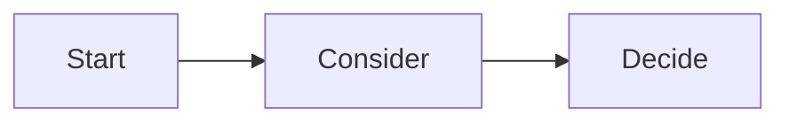

# ukagai-explain

Write the explanation a human needs to decide as Markdown, then ask the same question with AskUserQuestion. The ukagai GUI builds the decision screen from this file. The human decides with arrow keys and Enter only. The formal specification is `docs/spec/explain.md`.

**Language.** Write the explanation in the language given by the SessionStart context (the user's configured language). Section headings and the blocker's fixed labels are accepted in English or Japanese; prefer English headings.

## Think before asking (most important)

- Read the code and verify with commands, then narrow the options to 2–4.
- **Always recommend exactly one.** Put it first and append ` (Recommended)` to its label.
- If you cannot state in one sentence **why only a human can decide** (taste, external circumstances, responsibility for an irreversible change, premises the agent cannot know), do not ask. Proceed with the recommendation and report it afterwards.
- **One AskUserQuestion call = one question.** If there are several, ask them **from the start** one at a time, writing one explanation file per question and calling them in order (a call with two or more questions is denied by the hook and the rewrite costs time).
- **A `reversible` + `file` decision is not asked: proceed and report it.**

### Decide scope and reversibility before asking

| Value | Meaning |
|---|---|
| `reversibility: reversible` | Easy to undo |
| `reversibility: costly` | Can be undone, but at some effort or cost |
| `reversibility: irreversible` | Cannot be undone |
| `scope: file` | A few files |
| `scope: repo` | The whole repository |
| `scope: machine` | This machine (files, settings and processes outside the repository) |
| `scope: external` | Other people or systems (push, publish, billing, sending messages) |

### When there are several questions

```
Question 1: write the explanation file → AskUserQuestion (one question only) → receive the answer
Question 2: write the explanation file → AskUserQuestion (one question only) → receive the answer
```

An earlier answer can change the next question. Never batch them into one call.

When asking several questions in order, read the answers to the earlier ones and check that the later explanations do not contradict them. Never write a statement that contradicts an answer.

## When to write

- **Right before** calling AskUserQuestion: a design fork, a hard-to-undo operation, naming.
- ExitPlanMode needs no separate file. Put a "Scope and reversibility" section in the plan body. Do not put steps nobody asked for (deletion, cleanup, unrelated changes) in the plan. If they are needed, give the reason and make them a separate option.
- AskUserQuestion in plan mode needs none.

## Where to write

`<scratchpad_dir>/ukagai/<any name>.md`. The scratchpad path is in the system prompt and the SessionStart instructions. If there is none, use `~/.ukagai/explain/<session_id>/`. Never put it in the repository.

## Front matter

```
---
ukagai: 1
question: the AskUserQuestion question, verbatim
title: the decision for the human, in one sentence
recommended: label of the option you recommend
reversibility: reversible | costly | irreversible
scope: file | repo | machine | external
---
```

- `question` is for matching and is not shown in the GUI. Make it exactly the same as `questions[0].question`.
- `title` is the decision heading in the GUI. One sentence for what the human decides, such as "Choose A or B for …".
- `recommended` is the label of the option you recommend. It must match one of the `options[].label` of AskUserQuestion (a trailing `(Recommended)` is optional).

## Body sections

| Section | Required | What to write |
|---|---|---|
| Why this decision is needed now | Always | The situation, and **why a human must decide** (what you cannot know). 2–3 sentences |
| Options | Always | A table. First column = option label. Columns: "What happens if chosen" and "Risks and how to undo". One row per option |
| Recommendation | Always | **Keep it to 3 sentences.** Sentence 1 = the option you recommend and why, sentence 2 = supplement (optional), last sentence = the condition under which another option is right (write it as "if …, B", "when …, B", "unless …, A", etc.). More than 5 sentences is denied (`recommend_long`) |
| Diagram | When reversibility is anything but reversible, or scope is machine / external (`repo` + `reversible` is optional) | Mermaid |
| What I checked | Optional | file:line, command results. Mark guesses as guesses |
| Related diff | Optional | Only the hunks that bear on the decision. At most 20 lines in a ` ```diff ` block |

- Each cell of the options table is 1–2 sentences. The reader decides with arrow keys and Enter only, so write **sentences that let one card carry the decision**.
- Japanese headings and column names are accepted as aliases: 「なぜ今この判断が要るか」「選択肢」「推奨」「図」「確かめたこと」「関係する差分」「影響範囲と可逆性」, and columns 「選ぶと起きること」「リスクと戻し方」. Prefer the English names.

### Length limits

The hook checks them (over the limit is denied). The right column of the GUI keeps the option cards on screen, so long explanations get folded away and are rarely read.

- Recommendation: at most 5 sentences and 400 characters (`recommend_long`). Aim for 3 sentences.
- Table cells (what happens if chosen, risks and how to undo): at most 160 characters per cell (`cell_long`; sentences are not counted; aim for 2 sentences).
- Why this decision is needed now (for a blocker, "Why I stopped"): aim for 2–3 sentences. The limit is 600 characters (`why_long`).
- Recommendation needs the condition under which another option is right ("if …, B"). The text of the section must contain one of: if / when / unless / otherwise / in case, or the Japanese なら / 場合 / とき / であれば / 際は / 際に. Without it the hook denies (`recommend_cond`). "ならない", "なければならない" and "ときどき" do not count.
- Put details, evidence and logs in the "What I checked" section as bullets. Do not write what the decision does not need.

- Make the labels match the AskUserQuestion `options[].label` (a trailing `(Recommended)` is optional).
- Draw only structure, flow and dependencies. Pick one type:
  - `flowchart`: how parts connect, the flow of processing, branches.
  - `sequenceDiagram`: the order of exchanges among several actors.
  - `stateDiagram-v2`: states and transitions (pending → answered, etc.).
- Draw only structures and flows that exist. When you draw an assumption or a proposal, say "(proposal)" right before the diagram.
- Draw the diagram so that the difference between the options shows. **Even when a diagram is required, if the difference between the options does not show in it, do not write one; make the table rows more detailed instead.**
- Write Mermaid so that it is readable in the TUI too (advice; the hook does not check): put spaces around arrows (`A --> B`, not `A-->B`), at most 10 nodes, at most 100 columns per line.
- Do not include the whole diff (the GUI attaches `git diff` separately).

## Emphasis

- Use `**bold**` for only two things: **the name of the option you recommend** and **a fact that cannot be undone**. **At most one per sentence and 8 in the whole explanation. Never bold everything.** The GUI draws it in the accent color (red inside "Risks and how to undo").
- Write irreversible results and effects on other people or external systems in a callout of 1–2 lines. Use `> [!WARNING]` when undoing costs something and `> [!CAUTION]` when it cannot be undone. A callout may sit inside the Recommendation section (the GUI moves it out of the fold). There is no need to change where it sits.
- A checked fact that sways the decision may use `> [!NOTE]`.

```markdown
| JSONL | Stores by appending only, and **restores by reading once at startup**. | Search reads everything. **Moving to SQLite needs migration code**. |

> [!WARNING]
> Changing the storage format leaves some people unable to read existing logs.
```

## When stopped by human work (blocker)

Use this when you cannot proceed because of **work only a human can do**: authentication, login, granting permissions, two-factor authentication, placing a key, a physical operation. **Ending the turn with prose such as "please authenticate" is forbidden.** Ending that way shows nothing in the ukagai GUI, and work stays stopped until the human notices and types "continue".

Write the explanation file with `type: blocker` and call AskUserQuestion with **one question and exactly these 3 fixed options**:

1. `Done. Continue (Recommended)`
2. `Skip this step and continue`
3. `Stop here`

(The Japanese labels `対応した。続けて` / `この手順は飛ばして続けて` / `ここで中断` are accepted as aliases. Prefer English.)

When the human picks "Done", **retry the same work**.

Front matter: `ukagai: 1`, `question` (verbatim), `type: blocker`, `title` (what is needed, in one sentence), `recommended: Done. Continue`, `reversibility` / `scope` (usually `reversible` / `machine`).

Required body sections (**no Recommendation and no Diagram**):

| Section | What to write |
|---|---|
| Why I stopped | The failed command and an excerpt of the error (a code block of at most 10 lines) |
| What you need to do | Numbered steps, and a code block with commands the human can type as they are (at least one; without it the hook denies) |
| Options | A table. First column = the 3 labels above. Columns: "What happens if chosen" and "Risks and how to undo" |

Good example (expired gcloud authentication):

````markdown
---
ukagai: 1
question: Your gcloud authentication has expired. Could you take care of it?
type: blocker
title: gcloud authentication has expired; please run `gcloud auth login`
recommended: Done. Continue
reversibility: reversible
scope: machine
---

## Why I stopped

`gcloud run deploy` failed with an authentication error. A browser login is required, which I cannot do.

```
ERROR: (gcloud.run.deploy) You do not currently have an active account selected.
Please run: $ gcloud auth login
```

## What you need to do

1. Run the following in a terminal and log in in the browser.
2. Also refresh the application default credentials.

```sh
gcloud auth login
gcloud auth application-default login
```

## Options

| Option | What happens if chosen | Risks and how to undo |
|---|---|---|
| Done. Continue | Retry the same deploy and carry on. | If authentication did not succeed, it stops again with the same message. |
| Skip this step and continue | Skip the deploy and do the rest of the work. | The work proceeds without the deploy. Undo by deploying manually later. |
| Stop here | Stop the work here. | Changes made so far stay. Resume to continue. |
````

## Do not

- **Ask without settling on a recommendation.**
- **Rely on the raw question text.** The GUI does not show `question`. Put what the decision needs in `title`, "Recommendation" and the options table.
- Decorative diagrams ("start → consider → decide" and the like, which do not help the decision).
- A table with only one option, a table with empty cells, or a table with pros / cons / cost columns.
- Paraphrase `question`.
- Write the GUI URL or API in the explanation.

## Good example (design fork, two options)

````markdown
---
ukagai: 1
question: Should decisions be persisted as JSONL or SQLite?
title: Choose JSONL or SQLite as the storage format of the decision log
recommended: JSONL
reversibility: costly
scope: repo
---

## Why this decision is needed now

W3's store cannot be written until the storage format is decided. JSONL needs only appends; SQLite is strong at search, but `node:sqlite` is experimental and schema migrations are needed. How the log will be used (whether search and aggregation are wanted early) is something I cannot know, so a human decides.

## Options

| Option | What happens if chosen | Risks and how to undo |
|---|---|---|
| JSONL | Stores by appending only, and **restores by reading once at startup**. About 0.5 days to implement. | Search and aggregation read everything. Move to SQLite when needed (**migration code is needed**). |
| SQLite | Search and aggregation are written in SQL. About 1.5 days to implement. | `node:sqlite` is experimental and needs schema migrations. Going back to JSONL needs an export. |

## Recommendation

I recommend **JSONL**. Two weeks of logs need no search, and with no dependency restoring is one read. SQLite becomes the right choice if you already know you will use aggregation or search from the start.

> [!WARNING]
> Changing the storage format requires a migration that re-reads existing logs.

## Diagram


## What I checked

- `src/server/` has no persistence implementation yet (`grep -rn jsonl src` finds nothing).
````

## Bad example (same subject)

````markdown
---
ukagai: 1
question: What should we do about persistence?
reversibility: costly
scope: repo
---

## Why this decision is needed now

I want to decide how to save.

## Options

| Option | Pros | Cons | Cost |
|---|---|---|---|
| JSONL | | | |

## Diagram


````

What is wrong:

- There is no recommendation (both `recommended` and the Recommendation section are missing). `title` is missing too.
- The table has one row, its columns are pros / cons / cost, and the cells are empty.
- There is no reason a human must decide.
- The question was paraphrased, so it cannot be matched.
- The diagram is decoration that does not help the decision.
