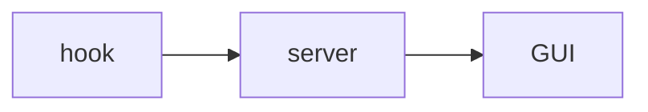
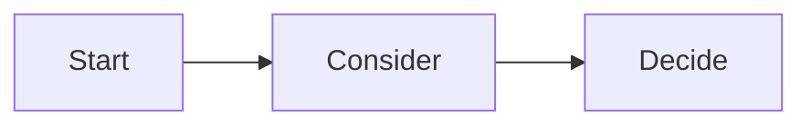

# ukagai-explain

Write the explanation a human needs to decide as Markdown, then ask the same question with AskUserQuestion. The ukagai GUI builds the decision screen from this file. The human decides with arrow keys and Enter only. The formal specification is `docs/spec/explain.md`.

**Language.** Write the explanation in the language given by the SessionStart context (the user's configured language). Section headings and the blocker's fixed labels are accepted in English or Japanese; prefer English headings.

When the configured language is Japanese, write the title, the explanation, and the AskUserQuestion `question`, option labels and descriptions in Japanese too (code, proper nouns and an option that is itself an English sentence excepted); the hook denies (`language`) a Japanese setting with an English title / question / descriptions. The recommended label ends with `(推奨)` (`(Recommended)` in English) and the blocker labels are `完了。続けて` / `この手順を飛ばして続けて` / `ここで止める` (English: `Done. Continue` / `Skip this step and continue` / `Stop here`). The answer **values** `None of these — …` and `Cannot answer — …` stay English (they are for the agent); the GUI / TUI translate how they are displayed.

## Think before asking (most important)

- Read the code and verify with commands, then narrow the options to 2–4.
- **Always recommend exactly one.** Put it first and append ` (Recommended)` to its label.
- If you cannot state in one sentence **why only a human can decide** (taste, external circumstances, responsibility for an irreversible change, premises the agent cannot know), do not ask. Proceed with the recommendation and report it afterwards.
- **One AskUserQuestion call = one question.** If there are several, ask them **from the start** one at a time, writing one explanation file per question and calling them in order (a call with two or more questions is denied by the hook and the rewrite costs time).
- **A `reversible` + `file` decision is not asked: proceed and report it.**
- **Never use internal identifiers in the explanation: plan item codes (W-T2, P-GH), phase / gate / step numbers, worker or session names, ticket-like codes. The reader did not write your plan and cannot know them. Say what the thing is in plain words ("the GitHub repository", "the restore test on the Cloud Run deployment"). If you must name one, define it under Terms with what it is and why it matters here, not where it came from.** The hook denies undefined ones (`coined_term`, below). If the human answers Cannot answer — Undefined terms, the hook will refuse the next explanation that still uses those words undefined.

### Decide scope and reversibility before asking

| Value | Meaning |
|---|---|
| `reversibility: reversible` | Easy to undo |
| `reversibility: costly` | Can be undone, but at some effort or cost |
| `reversibility: irreversible` | Cannot be undone |
| `scope: file` | A few files |
| `scope: repo` | The whole repository |
| `scope: machine` | This machine (files, settings and processes outside the repository) |
| `scope: external` | Other people or systems (push, publish, billing, sending messages) |

### When there are several questions

```
Question 1: write the explanation file → AskUserQuestion (one question only) → receive the answer
Question 2: write the explanation file → AskUserQuestion (one question only) → receive the answer
```

An earlier answer can change the next question. Never batch them into one call.

When asking several questions in order, read the answers to the earlier ones and check that the later explanations do not contradict them. Never write a statement that contradicts an answer.

## When to write

- **Right before** calling AskUserQuestion: a design fork, a hard-to-undo operation, naming.
- ExitPlanMode needs no separate file. Put a "Scope and reversibility" section in the plan body, and make its first 2 lines `Reversibility: reversible | costly | irreversible` and `Scope: file | repo | machine | external` (English values; bullets are fine). The GUI uses them for the reversibility chip and the confirm-twice / undo grace; without them the plan is approved with a single press. Do not put steps nobody asked for (deletion, cleanup, unrelated changes) in the plan. If they are needed, give the reason and make them a separate option.
- AskUserQuestion in plan mode: the explanation goes into the plan file (see "In plan mode" below), not a separate file.

## In plan mode

In plan mode the explanation of an AskUserQuestion goes **into the plan file** (the only Markdown you write there; the session's scratchpad stays writable for mockups and screenshots, see Screenshots): append one block per question, then call AskUserQuestion with the same question.

```
<!-- ukagai-explain -->
---
ukagai: 1
question: <the AskUserQuestion question verbatim>
title: ...
recommended: ...
reversibility: ...
scope: ...
---
## Why this decision is needed now
... (the normal explanation: same sections, same rules)
<!-- /ukagai-explain -->
```

The block is checked exactly like an explanation file. The hook strips these blocks from the plan the human approves at ExitPlanMode, so do not delete them by hand.

## Where to write

`<scratchpad_dir>/ukagai/<any name>.md`. The scratchpad path is in the system prompt and the SessionStart instructions. If there is none, use `~/.ukagai/explain/<session_id>/`. Never put it in the repository.

## Front matter

```
---
ukagai: 1
question: the AskUserQuestion question, verbatim
title: the decision for the human, in one sentence
recommended: label of the option you recommend
reversibility: reversible | costly | irreversible
scope: file | repo | machine | external
---
```

- `question` is for matching and is not shown in the GUI. Make it exactly the same as `questions[0].question`.
- `title` is the decision heading in the GUI. One sentence for what the human decides, such as "Choose A or B for …".
- `recommended` is the label of the option you recommend. It must match one of the `options[].label` of AskUserQuestion (a trailing `(Recommended)` is optional).

## Body sections

| Section | Required | What to write |
|---|---|---|
| Why this decision is needed now | Always | The situation, and **why a human must decide** (what you cannot know). 2–3 sentences. **Sentence 1 is the situation: what is being decided, where, and when.** The reader did not watch your work |
| What only you know | Always (1–3 bullets) | What you could not settle by investigating and only the human can say (taste, plans, external circumstances). Shown as the "You decide:" band under the title. Not required by the hook yet, but always write it |
| Options | Always | A table. First column = option label. Columns: "What happens if chosen" and "Risks and how to undo", then optionally extra columns (cost, effort, …; 3 or more columns are allowed). One row per option. **Every risk cell says how to undo** (or that it cannot be undone), else `undo` |
| Recommendation | Always | **Keep it to 3 sentences.** Sentence 1 = **a conclusion that lets the human decide from that sentence alone**: the option you recommend, **called by its label** (quote its first words with 「…」 / "…" when the label is a long sentence), and why. It is shown as the headline. **Never call an option by position ("the first one", `1つ目`, `案 A`, `option B`): the hook denies it (`recommend_name`)**. Sentence 2 = supplement (optional), last sentence = the condition under which another option is right (write it as "if …, B", "when …, B", "unless …, A", etc.). More than 5 sentences is denied (`recommend_long`) |
| Assumptions | Always (one premise per bullet, **at most 3**) | The premises under which the recommendation holds. Keep only what you did not verify and what would change the pick; no implementation details (line numbers, which paragraph stays). More than 3 is denied (`assumptions_long`). The GUI shows them as a checklist: "if any one is wrong, another option is right". Not required by the hook yet |
| Counterargument | Optional | The strongest argument against your recommendation, in 1–2 sentences. Shown beside the recommendation as "Against this:" |
| Affected | Optional | Concrete names (files, services, people, environments), one per bullet. Shown as chips (up to 6, then "+N") |
| Terms | Optional | `- **term** — definition` for each word the human may not know (`- **term**: definition` and `- term — definition` also work). The GUI annotates the term wherever it appears |
| Diagram | Required when reversibility is anything but reversible, or scope is machine / external (`repo` + `reversible` is optional) **and a diagram that meets the rule below exists**; otherwise one line under Options: `No diagram: <why>` | Mermaid. **Rule: Draw a diagram only when it shows something the Options table cannot: a sequence of 3 or more steps between 2 or more actors, a state machine with 4 or more states, or a data flow between 3 or more components (a flowchart needs 5 or more nodes). Never draw the options themselves as nodes (a branch into A / B / C) and never restate the table; at most one diagram; when in doubt, none.** A flowchart / graph with 4 or fewer nodes, or with at least half of its node labels equal to option labels, is denied (`diagram_trivial`) |
| What I checked | **Required unless `reversible` + `file`** (`checked`) | file:line, command results. Mark guesses as guesses. Put evidence in footnotes: write `[^1]` in the body and `[^1]: evidence` here. A `[^n]` in the body without a definition is denied (`footnote`) |
| Related diff | Optional | Only the hunks that bear on the decision. At most 20 lines in a ` ```diff ` block |

- Each cell of the options table is 1–2 sentences. The reader decides with arrow keys and Enter only, so write **sentences that let one card carry the decision**.
- Japanese headings and column names are accepted as aliases: 「なぜ今この判断が要るか」「あなたにしか分からないこと」「選択肢」「推奨」「前提」「反論」「影響を受けるもの」「用語」「図」「確かめたこと」「関係する差分」「影響範囲と可逆性」, and columns 「選ぶと起きること」「リスクと戻し方」. Prefer the English names.
- **Use only these section names for H2.** A heading the format does not define is not shown prominently on the decision screen (it is easy to miss), so put the content in a defined section.

### Length limits

The hook checks them (over the limit is denied). The right column of the GUI keeps the option cards on screen, so long explanations get folded away and are rarely read.

- Recommendation: at most 5 sentences and 400 characters (`recommend_long`). Aim for 3 sentences.
- Table cells (what happens if chosen, risks and how to undo): at most 160 characters per cell (`cell_long`; sentences are not counted; aim for 2 sentences).
- Why this decision is needed now (for a blocker, "Why I stopped"): aim for 2–3 sentences. The limit is 600 characters (`why_long`).
- **The headline names the option.** The first sentence of the Recommendation must contain the recommended label (without `(Recommended)` / `(推奨)`) or its opening (first 3 words, or first 12 characters for a long or Japanese label), and no positional wording (`recommend_name`). Order of the new codes: `recommend_cond`, `recommend_name`, `against_weak`, `assumptions_long`.
- Recommendation needs the condition under which another option is right ("if …, B"). The text of the section must contain one of: if / when / unless / otherwise / in case, or the Japanese なら / 場合 / とき / であれば / 際は / 際に. Without it the hook denies (`recommend_cond`). "ならない", "なければならない" and "ときどき" do not count.
- Put details, evidence and logs in the "What I checked" section as bullets. Do not write what the decision does not need.
- **Risk cells say how to undo.** Each cell of "Risks and how to undo" must contain a whole word such as undo / revert / roll back / restore / reinstall / recreate / re-run / `git checkout` / delete the … / remove the …, or say it cannot be undone (cannot be restored / irreversible / permanent / unrecoverable; Japanese 戻せ / 戻す / 元に戻 / 消せ / やり直 / 再実行 / 再作成 / 復元 / 戻せない / 元に戻らない). Without it the hook denies (`undo`). The GUI / TUI paint the cannot-be-undone phrases red and the how-to-undo words green.
- **Evidence by footnote.** Cite what you checked from the body with `[^1]` and define it in "What I checked" (`[^1]: \`grep -rn jsonl src\` finds nothing`). The GUI shows the evidence on hover. A definition without a reference is fine; a reference without a definition is denied (`footnote`).
- **No coined identifiers.** The hook scans the title and body (not code fences; inline code counts) for short codes such as `W-T2`, `FT4`, `TM28`, `P-GH`, and for `Phase 2` / `Gate B` / `フェーズ 2` / `第 3 段階`. Abbreviations like CI / API / JSON, versions (`v0.2.0`), `#12` and HTTP statuses are fine (one letter + one digit such as `W3` or `P1` is a hit, except M1-M4, L1-L4, Q1-Q4, H1-H2, T1-T3, V8, R2, U2, Z3), common product / hardware / spec codes (ARM64, E2E, ES6, H264, SOC2, W3C, FY25, CVE ids, regions like US-EAST-1), and so are tokens in the question or in option labels. Any other token must be defined under Terms in at least 12 characters of plain words ("the plan item" / "plan の行" alone does not count), or you get `coined_term`; rewrite in plain words instead.
- **Order of the codes** the hook reports: … `cell_long`, `coined_term`, `undo`, … `diagram`, `diagram_trivial`, `checked`, `footnote`.

- Make the labels match the AskUserQuestion `options[].label` (a trailing `(Recommended)` is optional).
- Draw only structure, flow and dependencies. Pick one type:
  - `flowchart`: how parts connect, the flow of processing, branches.
  - `sequenceDiagram`: the order of exchanges among several actors.
  - `stateDiagram-v2`: states and transitions (pending → answered, etc.).
- Draw only structures and flows that exist. When you draw an assumption or a proposal, say "(proposal)" right before the diagram.
- Draw a diagram only when it shows something the Options table cannot: a sequence of 3 or more steps between 2 or more actors, a state machine with 4 or more states, or a data flow between 3 or more components (a flowchart needs 5 or more nodes). Never draw the options themselves as nodes (a branch into A / B / C) and never restate the table; at most one diagram; when in doubt, none. When the decision is not reversible or the scope is machine / external, a diagram that meets this rule is required; if none does, write none and say why in one line under Options ("No diagram: <why>").
- The hook denies a trivial flowchart / graph (`diagram_trivial`): 4 or fewer distinct nodes, or at least half of the node labels equal an option label (trimmed, case-folded, `(Recommended)` / `（推奨）` stripped). Other diagram types are never trivial by this check. When a diagram is required but none meets the rule, the line `No diagram: <why, 8+ characters>` (or `図なし: <理由>`) under Options satisfies `diagram`.
- Bad (the options as nodes; denied):
  ```mermaid
  flowchart TD
    Q[Which?] --> A[Option A]
    Q --> B[Option B]
    Q --> C[Option C]
  ```
- Good (a sequence the table cannot show):
  ```mermaid
  sequenceDiagram
    agent->>serve: POST /api/decisions
    serve-->>browser: SSE decision.created
    browser->>serve: POST /answer
  ```
- Write Mermaid so that it is readable in the TUI too (advice; the hook does not check): put spaces around arrows (`A --> B`, not `A-->B`), at most 10 nodes, at most 100 columns per line.
- Do not include the whole diff (the GUI attaches `git diff` separately).

### Headline: good and bad (a real case: three English opening lines for a README)

- Bad: 「説明文の1つ目を勧める。」 — which card is that? The human must go back and count. Denied (`recommend_name`).
- Good: 「『Decisions made by humans, together』の標語を残す案を勧める。標語の印象を優先するなら、この案。」 — the label is quoted, so the headline matches exactly one card; the condition for another option follows.
- Bad Assumptions (implementation notes, not premises): 「見出しの下にある説明段落(5 行目)は残す」「対象の『1 文』は見出し直下の標語(3 行目)を指す」. Good: 「近く他の agent に対応する予定はない」(unverified, and it would change the pick).

## Writing for the three layers

The GUI reads the file in layers. Write each piece so it works at its layer.

| Layer | What the human sees in that time | Write |
|---|---|---|
| 1 second | title, the first sentence of the Recommendation (headline), reversibility and scope, Affected chips, "You decide:" | A headline that is a conclusion on its own; 1–3 things only the human knows; concrete names in Affected |
| 10 seconds | rest of the Recommendation, Assumptions, Counterargument, option cards | One premise per line; the strongest counterargument in 1–2 sentences; two-sentence cells |
| 60 seconds | Why, What I checked (footnotes), diagram, diff, Terms, comparison table | Evidence, definitions, details |

- **Terms**: only words a new reader would not know; do not define common terms (TTY, JSON). One line each.
- **What only you know**: 1–3 bullets, phrased as the thing to decide ("Whether the GUI will ever send messages to the server"). Never list things you could have checked yourself.
- **Assumptions**: one premise per line, checkable ("Only server-to-browser pushes are needed"). An Assumption is something you did not verify and that would change the pick. Generic truths are not assumptions.
- **Counterargument**: argue against yourself honestly; do not write a strawman. The Counterargument attacks the recommendation; do not restate its condition. If its text is contained in the Recommendation the hook denies (`against_weak`).
- **Honesty about evidence**: if you checked nothing, say so in Why, not as a footnote. Do not state facts you did not verify as facts; mark guesses.
- **Affected**: concrete names, not "the code" or "some files".

## When the answer is "None of these"

The GUI offers "None of these…" after the options. If the answer starts with `None of these — `, the format is `None of these — <type>: <text>` (`<text>` may be empty). Act on the type:

| Type | Do |
|---|---|
| `Missing option` | Add the option the human has in mind (read `<text>`) and ask again with a new explanation file |
| `Wrong premise` | Fix the premise (see Assumptions), then ask again |
| `Need more evidence` | Add what is missing to "What I checked" (run the commands), then ask again |
| `Ask me later` | Do not ask now: proceed with the work that does not depend on it and ask later |

## When the answer is "Cannot answer"

The GUI / TUI also offers "Can't answer this…" next to "None of these…": the human could not read the explanation (not a complaint about the options). An answer starting with `Cannot answer — ` is **not a choice: do not proceed on any option.** The format is `Cannot answer — <reason>: <detail>` (`<detail>` may be empty except for Undefined terms). Act on the reason, then ask the same question again with a new explanation file:

| Reason | Do |
|---|---|
| `Undefined terms` | `<detail>` lists the words the human did not know. Replace each with plain words, or define it under Terms (what it is and why this decision needs it, at least 12 characters) |
| `Unclear` | Cut it down: a 1-sentence Recommendation and 2–3 options, then rewrite |
| `Too much at once` | Split it into single decisions and ask only the first one now |

The hook remembers the last Cannot answer of the session and denies the next explanation if it is identical, still uses the listed terms undefined (`coined_term`), keeps a long Recommendation after Unclear (`recommend_long`), or asks the same question after Too much at once (`multi`).

## Emphasis

- Use `**bold**` for only two things: **the name of the option you recommend** and **a fact that cannot be undone**. **At most one per sentence and 8 in the whole explanation. Never bold everything.** The GUI draws it in the accent color (red inside "Risks and how to undo").
- Write irreversible results and effects on other people or external systems in a callout of 1–2 lines. Use `> [!WARNING]` when undoing costs something and `> [!CAUTION]` when it cannot be undone. A callout may sit inside the Recommendation section (the GUI moves it out of the fold). There is no need to change where it sits.
- A checked fact that sways the decision may use `> [!NOTE]`.

```markdown
| JSONL | Stores by appending only, and **restores by reading once at startup**. | Search reads everything. **Moving to SQLite needs migration code**. |

> [!WARNING]
> Changing the storage format leaves some people unable to read existing logs.
```

## Quiz (a question with no recommendation)

A comprehension quiz (`type: quiz`) is normally written by a tool (whoknows, through its Stop hook), which also asks the AskUserQuestion; you do not decide a quiz, you only present it. If the explanation file is already there, do not rewrite it, and **never add a recommendation to a quiz** (no `recommended`, no Recommendation section, no hint in the title or the sections: that would give the answer away). What the file must contain:

- Front matter: `ukagai: 1`, `type: quiz`, `question` (a `question: |` block scalar holding the AskUserQuestion text verbatim), `title`, `reversibility`, `scope`. No `recommended`.
- `## Why this question now` (1 to 600 characters) and `## Premise` (non-empty, at most 600 characters); optional `## How to answer` and `## Terms`.
- No option label of 6 or more characters inside those sections (the hook denies it as `quiz_leak`). No Options table, Diagram or What I checked is needed.

## Rich Markdown (ukagai dialect)

Explanations and plans may use the constructs below. The GUI renders each richly; the TUI shows the fallback, so one file serves both. Use one only when it makes the decision easier to read. Full contract: `docs/spec/markdown.md`. Raw HTML other than `<details>` / `<summary>` / `<br>` / `<sub>` / `<sup>` never renders.

| Construct | Syntax | Use it for | TUI fallback |
|---|---|---|---|
| Callout | `> [!CAUTION] Title` + `> body` (NOTE, TIP, IMPORTANT, WARNING, CAUTION) | CAUTION irreversible / external, WARNING costly to undo, IMPORTANT a premise, TIP the easy path, NOTE context | coloured `[!KIND] Title`, indented body |
| Task list | `- [x] done` / `- [ ] open` | acceptance criteria, pre-flight checks (never options) | `☑` / `☐` |
| Folding | `<details>` `<summary>Log</summary>` blank line, Markdown, `</details>` | long logs and evidence the reader may skip | `▸ summary (N lines)` + body |
| Mermaid | ```` ```mermaid ```` with any diagram type | flowchart structure, sequenceDiagram calls, stateDiagram lifecycle, gantt / timeline rollout, quadrantChart risk × effort | ASCII for 6 types, else `diagram: <type>` + source |
| Code title / diff | ```` ```ts title="src/x.ts" ````, ```` ```diff ```` | file excerpts; proposed changes | dim title line; green / red lines |
| Badge | `[done]` `[todo]` `[doing]` `[blocked]` `[risk]` `[skip]` (exactly these) | step or row status | same words, coloured |
| Highlight | `==the one phrase==` | the phrase not to miss (sparingly) | inverse video |
| Columns | `::: columns` … `---` … `:::` | before / after, A vs B too wide for a table (the Options section stays a table) | stacked with rules |
| Steps | `## Steps` + ordered list, bold titles | plan timeline | the list as written |
| File ref | `` `src/x.ts:12` `` | one path per sentence | inline code |
| Image | `` | what the reader must see | `[image] alt — path` |

````markdown
> [!WARNING] Rewrites history
> The branch is force-pushed; undo with the reflog.

- [x] typecheck passes
- [ ] `npm test` passes

<details>
<summary>Full log (120 lines)</summary>

```text
…
```

</details>

```ts title="src/serve/store.ts"
export const limit = 10;
```

```diff
-const limit = 10;
+const limit = 20;
```



1. **Add the schema** [done] — `src/contract.ts:12`

::: columns
Before: one queue.

---

After: ==two== queues.
:::
````

### Plans

A plan has these sections, in this order. Nothing but "Scope and reversibility" is checked by the hook (see "When to write"); the rest is what makes it readable.

1. `# Title`: one line saying what the plan does.
2. `## Scope and reversibility`: first 2 lines `Reversibility: …` and `Scope: …`.
3. `## Steps`: an ordered list; each item a **bold title**, a badge and the `path` it touches; nest task lists or `<details>`.
4. `## Risks`: one callout per risk (`CAUTION` irreversible, `WARNING` costly).
5. `## Verification`: a task list of the commands / checks.

### Screenshots

For a UI decision show, do not describe. Take the picture with agent-browser into `<scratchpad_dir>/ukagai/` (the document's own folder, for an explanation file), then reference it with a relative path from an explanation file, or with the absolute path from a plan file (a relative path in a plan resolves against `~/.claude/plans/`), and alt text the TUI reader can use on its own:

`<scratchpad_dir>/ukagai` is the folder the SessionStart context names (the explanation files live there). It stays writable in plan mode: when a plan hinges on a visual choice (UI variants, layouts), build the candidates there and ask with AskUserQuestion before ExitPlanMode; never schedule "make the mockups" as a step after approval. Reference a file only once it exists.

```bash
mkdir -p <scratchpad_dir>/ukagai/shots
agent-browser open http://localhost:3000/settings
agent-browser screenshot <scratchpad_dir>/ukagai/shots/settings-dark.png
agent-browser close
```

```markdown

```

From a plan file use the absolute path:

```markdown

```

Only `.png` / `.jpg` / `.jpeg` / `.gif` / `.webp` up to 10 MB, under the document's folder, `~/.claude/plans/` or the scratchpad, are shown; external `http(s)` images never are.

A comparison page you built (HTML with screenshots, up to 2 MB, in the document's folder or the scratchpad) goes in the same way: ``. The GUI shows it in a sandboxed frame (no scripts run; relative `src` / `url()` work, so keep screenshots next to it) with a full-screen button; the TUI shows one line saying it is in the GUI.

Never open a file or a URL for the human (`open`, `xdg-open`, a browser): put it in the explanation — images ``, HTML pages `` (the GUI renders them in a sandboxed frame); files next to the explanation file or under the session's scratchpad. A Bash `open` / `xdg-open` on such a file is denied by the hook.

## When stopped by human work (blocker)

Use this when you cannot proceed because of **work only a human can do**: authentication, login, granting permissions, two-factor authentication, placing a key, a physical operation. **Ending the turn with prose such as "please authenticate" is forbidden.** Ending that way shows nothing in the ukagai GUI, and work stays stopped until the human notices and types "continue".

Write the explanation file with `type: blocker` and call AskUserQuestion with **one question and exactly these 3 fixed options**:

1. `Done. Continue (Recommended)`
2. `Skip this step and continue`
3. `Stop here`

(The Japanese labels `対応した。続けて` / `この手順は飛ばして続けて` / `ここで中断` are accepted as aliases. Prefer English.)

When the human picks "Done", **retry the same work**.

Front matter: `ukagai: 1`, `question` (verbatim), `type: blocker`, `title` (what is needed, in one sentence), `recommended: Done. Continue`, `reversibility` / `scope` (usually `reversible` / `machine`).

Required body sections (**no Recommendation and no Diagram**):

| Section | What to write |
|---|---|
| Why I stopped | The failed command and an excerpt of the error (a code block of at most 10 lines) |
| What you need to do | Numbered steps, and a code block with commands the human can type as they are (at least one; without it the hook denies) |
| Options | A table. First column = the 3 labels above. Columns: "What happens if chosen" and "Risks and how to undo" |

Good example (expired gcloud authentication):

````markdown
---
ukagai: 1
question: Your gcloud authentication has expired. Could you take care of it?
type: blocker
title: gcloud authentication has expired; please run `gcloud auth login`
recommended: Done. Continue
reversibility: reversible
scope: machine
---

## Why I stopped

`gcloud run deploy` failed with an authentication error. A browser login is required, which I cannot do.

```
ERROR: (gcloud.run.deploy) You do not currently have an active account selected.
Please run: $ gcloud auth login
```

## What you need to do

1. Run the following in a terminal and log in in the browser.
2. Also refresh the application default credentials.

```sh
gcloud auth login
gcloud auth application-default login
```

## Options

| Option | What happens if chosen | Risks and how to undo |
|---|---|---|
| Done. Continue | Retry the same deploy and carry on. | If authentication did not succeed, it stops again with the same message. |
| Skip this step and continue | Skip the deploy and do the rest of the work. | The work proceeds without the deploy. Undo by deploying manually later. |
| Stop here | Stop the work here. | Changes made so far stay. Resume to continue. |
````

## Do not

- **Ask without settling on a recommendation.**
- **Rely on the raw question text.** The GUI does not show `question`. Put what the decision needs in `title`, "Recommendation" and the options table.
- Decorative diagrams ("start → consider → decide" and the like, which do not help the decision).
- A table with only one option, a table with empty cells, or a table with pros / cons / cost columns.
- Paraphrase `question`.
- Write the GUI URL or API in the explanation.

## Good example (design fork, two options; everything included)

````markdown
---
ukagai: 1
question: Should decisions be persisted as JSONL or SQLite?
title: Choose JSONL or SQLite as the storage format of the decision log
recommended: JSONL
reversibility: costly
scope: repo
---

## Why this decision is needed now

The store cannot be written until the storage format is decided. JSONL needs only appends; SQLite is strong at search, but `node:sqlite` is experimental and needs schema migrations.[^1] How the log will be used is something I cannot know, so a human decides.

## What only you know

- Whether you will search or aggregate the log within the next month.
- Whether another tool will read the log file directly.

## Terms

- **JSONL** — one JSON object per line; appended, never rewritten.
- **migration** — rewriting existing data into a new format.

## Options

| Option | What happens if chosen | Risks and how to undo | Cost |
|---|---|---|---|
| JSONL | Stores by appending only, and **restores by reading once at startup**. | Search reads everything. To undo, move to SQLite (**migration code is needed**). | about 0.5 day |
| SQLite | Search and aggregation are written in SQL. | `node:sqlite` is experimental. To undo, export back to JSONL. | about 1.5 days |

## Recommendation

I recommend **JSONL**: two weeks of logs need no search, and with no dependency restoring is one read.[^2] SQLite becomes the right choice if you already know you will use aggregation or search from the start.

> [!WARNING]
> Changing the storage format requires a migration that re-reads existing logs.

## Assumptions

- The log stays under about 10 MB.
- Nothing outside ukagai reads `decisions.jsonl`.

## Counterargument

Starting with SQLite avoids the later migration entirely, and a migration written under pressure is where data gets lost.

## Affected

- `src/server/store.ts`
- `~/.ukagai/decisions.jsonl`
- The metrics tally in `docs/verification/`

## Diagram


## What I checked

[^1]: `node:sqlite` is marked experimental in the Node 22 docs; `node --version` is v22.x here.
[^2]: `src/server/` has no persistence yet (`grep -rn jsonl src` finds nothing); two weeks of logs are about 244 KB (`ls -l ~/.ukagai`).
````

## Bad example (same subject)

````markdown
---
ukagai: 1
question: What should we do about persistence?
reversibility: costly
scope: repo
---

## Why this decision is needed now

I want to decide how to save.

## Options

| Option | Pros | Cons | Cost |
|---|---|---|---|
| JSONL | | | |

## Diagram


````

What is wrong:

- There is no recommendation (both `recommended` and the Recommendation section are missing). `title` is missing too.
- The table has one row, its columns are pros / cons / cost, and the cells are empty.
- There is no reason a human must decide.
- The question was paraphrased, so it cannot be matched.
- The diagram is decoration that does not help the decision.

## Bad example: coined identifiers

````markdown
title: P-GH: create the repository private first?

W-T2 is done except FT4. The next gate G-T2 needs the TM28 restore drill, and both need P-GH.

## Terms
- **P-GH** — plan の行
````

The reader never saw your plan. W-T2 / FT4 / G-T2 / TM28 are undefined and P-GH's definition says nothing (`coined_term`).

Good rewrite (same content in plain words):

````markdown
title: Create the GitHub repository as private first, or public from the start?

The agent-side CI and release setup is done except the release workflow file. The release checkpoint needs a passing smoke test in the 3 CI modes and a restore test of the Cloud Run deployment from backup; both need the GitHub repository to exist.
````
