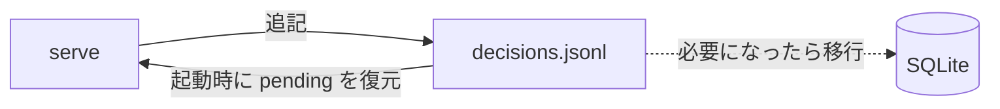
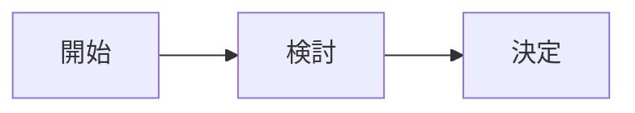

# ukagai-explain

人が判断するための説明を Markdown で書き、そのあとで同じ質問を AskUserQuestion で出す。ukagai の GUI はこのファイルで判断画面を組む。人は矢印キーと Enter だけで決める。正式な仕様は `docs/spec/explain.md`。

## 聞く前に考えること(最重要)

- コードを読み、コマンドで確かめてから、選択肢を 2〜4 に絞る。
- **必ず 1 つを推奨する。** その選択肢のラベル末尾に ` (Recommended)` を付けて先頭に置く。
- **人でなければ決められない理由**(好み、外部の事情、戻せない変更の責任、エージェントが知り得ない前提)を 1 文で言えないなら、聞かない。推奨どおり進めて、あとで報告する。
- **1 回の AskUserQuestion は 1 問。** 複数あるなら**最初から** 1 問ずつ、説明ファイルも 1 問ごとに書いて順に出す(2 問以上で出すと hook が deny し、書き直しで時間がかかる)。
- **`reversible` + `file` の判断は聞かずに進めて報告する。**

### 聞く前に scope と reversibility を決める

| 値 | 意味 |
|---|---|
| `reversibility: reversible` | 簡単に戻せる |
| `reversibility: costly` | 戻せるが手間かコストがかかる |
| `reversibility: irreversible` | 戻せない |
| `scope: file` | 数ファイル |
| `scope: repo` | リポジトリ全体 |
| `scope: machine` | この機械(リポジトリ外のファイル・設定・プロセス) |
| `scope: external` | 他人・他システム(push、公開、課金、メッセージ送信) |

### 複数の質問があるとき

```
1 問目: 説明ファイルを書く → AskUserQuestion(1 問だけ)→ 回答を受け取る
2 問目: 説明ファイルを書く → AskUserQuestion(1 問だけ)→ 回答を受け取る
```

前の回答で次の質問が変わることもある。まとめて 1 回で出さない。

複数の質問を順に聞くときは、先に出した質問の回答を読み、あとの説明の前提と矛盾しないか見直す。回答と矛盾する記述を書かない。

## いつ書くか

- AskUserQuestion を呼ぶ**直前**。設計の分岐、取り消しにくい操作、命名など。
- ExitPlanMode は別ファイル不要。計画本文に「影響範囲と可逆性」の節を入れる。計画には頼まれていない手順(削除・掃除・無関係な変更)を入れない。要るなら理由を書いて別の選択肢にする。
- plan mode 中の AskUserQuestion には要らない。

## どこに書くか

`<scratchpad_dir>/ukagai/<自由な名前>.md`。scratchpad のパスは system prompt と SessionStart の指示にある。無ければ `~/.ukagai/explain/<session_id>/`。リポジトリには置かない。

## front matter

```
---
ukagai: 1
question: AskUserQuestion の質問文を一字一句そのまま
title: 人に決めてほしいこと 1 文
recommended: 推す選択肢のラベル
reversibility: reversible | costly | irreversible
scope: file | repo | machine | external
---
```

- `question` は照合用。GUI には出ない。`questions[0].question` と完全に同じにする。
- `title` は GUI の判断見出し。「〜を A と B のどちらにするか」のように、決めてほしいことを 1 文で。
- `recommended` は推す選択肢のラベル。AskUserQuestion の `options[].label` のどれかと一致させる(末尾の `(Recommended)` の有無は問わない)。

## 本文の節

| 節 | 必須 | 書くこと |
|---|---|---|
| なぜ今この判断が要るか | 常に | 状況と、**人が決めるべき理由**(あなたが知り得ないこと)。2〜3 文 |
| 選択肢 | 常に | 表。先頭列 = 選択肢のラベル。列は「選ぶと起きること」「リスクと戻し方」。選択肢ごとに 1 行 |
| 推奨 | 常に | **3 文に収める。** 1 文目 = 推す選択肢と理由、2 文目 = 補足(省略可)、最後の 1 文 = 別の選択肢が正しくなる条件(「〜なら B」「〜の場合は B」「〜のときは B」「〜であれば B」のいずれかで書く)。5 文を超えると deny(`recommend_long`) |
| 図 | reversibility が reversible 以外、または scope が machine / external(`repo` + `reversible` は任意) | Mermaid |
| 確かめたこと | 任意 | file:line、コマンドの結果。推測は「推測」と書く |
| 関係する差分 | 任意 | 判断に関係する hunk だけ。` ```diff ` で 20 行以内 |

- 「選択肢」の各セルは 1〜2 文。読む人は矢印キーと Enter だけで決めるので、**カード 1 枚で判断できる文**にする。
### 長さの上限

hook が検査する(超えると deny)。GUI の右列は選択肢カードを画面内に収めるので、長い説明は折りたたまれて読まれにくくなる。

- 推奨: 5 文・400 文字以内(`recommend_long`)。目安は 3 文。
- 表のセル(選ぶと起きること・リスクと戻し方): 各セル 160 文字以内(`cell_long`。文数は検査しない。目安は 2 文)。
- なぜ今この判断が要るか(blocker は「なぜ止まったか」): 目安は 2〜3 文。上限は 600 文字(`why_long`)。
- 推奨には、別の選択肢が正しくなる条件(「〜なら B」)を入れる。推奨の本文に「なら」「場合」「とき」「であれば」「際は」「際に」、または英語の if / when / unless のいずれかが要る。無いと deny する(`recommend_cond`)。「ならない」「なければならない」「ときどき」は数えない。
- 詳細・根拠・ログは「確かめたこと」の節に箇条書きで書く。判断に要らないことは書かない。

- ラベルは AskUserQuestion の `options[].label` と揃える(末尾の `(Recommended)` の有無は問わない)。
- 図にするのは構造・流れ・依存関係だけ。型は 1 つ選ぶ:
  - `flowchart`: 部品のつながり、処理の流れ、分岐。
  - `sequenceDiagram`: 複数の主体のやりとりの順序。
  - `stateDiagram-v2`: 状態と遷移(pending → answered など)。
- 図は選択肢の違いが見えるように描く。**必須条件を満たしても、選択肢の違いが図に出ないなら図は書かず、代わりに表の行を詳しくする。**
- Mermaid は TUI でも読めるように書く(助言。hook は検査しない): 矢印の前後に空白を置く(`A --> B`。`A-->B` は不可)、ノードは 10 個以内、1 行は 100 桁以内。
- 差分は全体を載せない(GUI が `git diff` を別に添える)。

## 強調

- `**太字**` にするのは 2 種類だけ: **推す選択肢の名前**と、**取り消せない事実**。**1 文に 1 つまで、説明全体で 8 箇所まで。全部を太字にしない。** GUI は accent 色で描く(「リスクと戻し方」の中は赤)。
- 戻せない結果・他人や外部システムに及ぶ影響は、callout に 1〜2 行で書く。戻すのにコストがかかるなら `> [!WARNING]`、戻せないなら `> [!CAUTION]`。callout は「推奨」節の中に置いてよい(GUI が畳みの外に出す)。置き場所は変えなくてよい。
- 確かめた事実のうち判断を左右するものは `> [!NOTE]` でもよい。

```markdown
| JSONL | 追記だけで保存し、**起動時に 1 回読んで復元**する。 | 検索は全件読み。**SQLite へ移すには移行コードが要る**。 |

> [!WARNING]
> 保存形式を変えると、既存のログを読めなくなる人が出る。
```

## 人の作業で止まったとき(blocker)

認証・ログイン・権限付与・2 要素認証・鍵の配置・物理的な操作など、**人にしかできない作業**で進めなくなったときに使う。**文章で「認証してください」と言って turn を終えるのは禁止。** 終えると ukagai の GUI には何も出ず、人が気づいて「進めて」と打つまで止まる。

説明ファイルを `type: blocker` で書き、AskUserQuestion を **1 問、選択肢は次の固定の 3 つ**で出す:

1. `対応した。続けて (Recommended)`
2. `この手順は飛ばして続けて`
3. `ここで中断`

人が「対応した」を選んだら、**同じ作業を再試行する**。

front matter: `ukagai: 1`、`question`(一字一句)、`type: blocker`、`title`(何が必要か 1 文)、`recommended: 対応した。続けて`、`reversibility` / `scope`(たいてい `reversible` / `machine`)。

本文の必須節(**推奨と図は要らない**):

| 節 | 書くこと |
|---|---|
| なぜ止まったか | 失敗したコマンドとエラーの抜粋(コードブロックで 10 行以内) |
| 人にしてほしいこと | 番号付きの手順と、人がそのまま打てるコマンドのコードブロック(1 つ以上。無いと hook が deny する) |
| 選択肢 | 表。先頭列 = 上の 3 ラベル、列は「選ぶと起きること」「リスクと戻し方」 |

良い例(gcloud の認証切れ):

````markdown
---
ukagai: 1
question: gcloud の認証が切れています。対応できましたか？
type: blocker
title: gcloud の認証が切れているので `gcloud auth login` をしてほしい
recommended: 対応した。続けて
reversibility: reversible
scope: machine
---

## なぜ止まったか

`gcloud run deploy` が認証エラーで失敗しました。ブラウザでのログインが要り、私にはできません。

```
ERROR: (gcloud.run.deploy) You do not currently have an active account selected.
Please run: $ gcloud auth login
```

## 人にしてほしいこと

1. ターミナルで次を実行し、ブラウザでログインする。
2. アプリケーションのデフォルト認証も更新する。

```sh
gcloud auth login
gcloud auth application-default login
```

## 選択肢

| 選択肢 | 選ぶと起きること | リスクと戻し方 |
|---|---|---|
| 対応した。続けて | 同じデプロイを再試行して続ける。 | 認証が通っていなければ、また同じ表示で止まる。 |
| この手順は飛ばして続けて | デプロイを飛ばして残りの作業を進める。 | デプロイされないまま進む。あとで手動でデプロイすれば戻せる。 |
| ここで中断 | 作業をここで止める。 | 途中までの変更は残る。再開すれば続けられる。 |
````

## やってはいけないこと

- **推奨を決めずに聞く。**
- **生の質問文に頼る。** GUI は `question` を表示しない。判断に必要なことは `title`、「推奨」、「選択肢」の表に書く。
- 飾りの図(「開始 → 検討 → 決定」のような、判断に効かない図)。
- 選択肢を 1 つしか書かない表、空のセルがある表、利点・欠点・コストの列の表。
- `question` を言い換える。
- 説明の中に GUI の URL や API を書く。

## 良い例(設計分岐、2 択)

````markdown
---
ukagai: 1
question: decisions の永続化は JSONL と SQLite のどちらにしますか？
title: 判断ログの保存形式を JSONL と SQLite のどちらにするか
recommended: JSONL
reversibility: costly
scope: repo
---

## なぜ今この判断が要るか

保存形式を決めないと W3 の store を書き始められません。JSONL は追記だけで済み、SQLite は検索に強い反面、`node:sqlite` が実験的でスキーマ移行も要ります。ログを今後どう使うか(検索や集計を早く欲しいか)は私には分からず、人が決めることです。

## 選択肢

| 選択肢 | 選ぶと起きること | リスクと戻し方 |
|---|---|---|
| JSONL | 追記だけで保存し、**起動時に 1 回読んで復元する**。実装は約 0.5 日。 | 検索・集計は全件読みになる。必要になったら SQLite へ移す(**移行コードが要る**)。 |
| SQLite | 検索・集計を SQL で書ける。実装は約 1.5 日。 | `node:sqlite` が実験的で、スキーマ移行が要る。JSONL へ戻すには書き出しが要る。 |

## 推奨

**JSONL** を推します。2 週間分のログに検索は要らず、依存なしで復元も 1 回の読み込みで済みます。集計や検索を最初から使うと決まっているなら SQLite が正しくなります。

> [!WARNING]
> 保存形式を変えると、既存のログを読み直す移行が要る。

## 図



## 確かめたこと

- `src/server/` に永続化の実装はまだ無い(`grep -rn jsonl src` が 0 件)。
````

## 悪い例(同じ題材)

````markdown
---
ukagai: 1
question: 永続化の方式はどうしましょう？
reversibility: costly
scope: repo
---

## なぜ今この判断が要るか

保存方法を決めたいです。

## 選択肢

| 選択肢 | 利点 | 欠点 | コスト |
|---|---|---|---|
| JSONL | | | |

## 図


````

悪い点:

- 推奨が無い(`recommended` も「推奨」の節も欠けている)。`title` も無い。
- 表が 1 行しかなく、列が利点・欠点・コストで、セルも空。
- 人が決めるべき理由が無い。
- question が言い換えられていて照合できない。
- 図が判断に効かない飾り。
