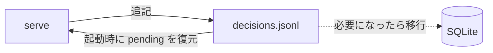
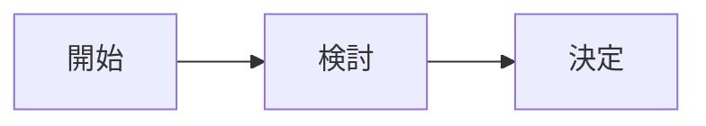

# ukagai-explain

人が判断するための説明を Markdown で書き、そのあとで同じ質問を AskUserQuestion で出す。ukagai の GUI がこのファイルを読んで描画する。正式な仕様は `docs/spec/explain.md`。

## いつ書くか

- AskUserQuestion を呼ぶ**直前**。設計の分岐、取り消しにくい操作、命名など。
- ExitPlanMode は別ファイル不要。計画本文に「影響範囲と可逆性」の節を入れる。
- plan mode 中の AskUserQuestion には要らない。

## どこに書くか

`<scratchpad_dir>/ukagai/<自由な名前>.md`。scratchpad のパスは system prompt と SessionStart の指示にある。無ければ `~/.ukagai/explain/<session_id>/`。リポジトリには置かない。

## front matter

```
---
ukagai: 1
question: AskUserQuestion の質問文を一字一句そのまま
title: 短い題(任意)
reversibility: reversible | costly | irreversible
scope: file | repo | machine | external
---
```

本文の見出し: 「なぜ今この判断が要るか」「選択肢の比較」は必須。「図」は scope が repo 以上、または reversibility が reversible 以外のとき必須。「関係する差分」はコード変更が絡むとき。

## 何を表にし、何を図にするか

- **選択肢の比較は必ず表**。選択肢ごとに 1 行、列は 利点・欠点・コスト(選択肢名は先頭列)。
- 図にするのは構造・流れ・依存関係だけ。型は 1 つ選ぶ:
  - `flowchart`: 部品のつながり、処理の流れ、分岐。
  - `sequenceDiagram`: 複数の主体のやりとりの順序。
  - `stateDiagram-v2`: 状態と遷移(pending → answered など)。
- 図は選択肢の違いが見えるように描く。

## 差分の切り出し

判断に関係する hunk だけを ` ```diff ` で載せる。20 行以内。全体の diff は載せない(GUI が `git diff` を別に添える)。

## やってはいけないこと

- 飾りの図(「開始 → 検討 → 決定」のような、判断に効かない図)。
- 選択肢を 1 つしか書かない表、空のセルがある表。
- question を言い換える。AskUserQuestion の `question` と完全に同じ文字列にする。
- 説明の中に GUI の URL や API を書く。

## 良い例(設計分岐、2 択)

````markdown
---
ukagai: 1
question: decisions の永続化は JSONL と SQLite のどちらにしますか？
title: 判断ログの保存形式
reversibility: costly
scope: repo
---

## なぜ今この判断が要るか

保存形式を決めないと W3 の store を書き始められません。JSONL は追記だけで済み、起動時の復元も 1 回の読み込みで足ります。SQLite は検索に強い反面、`node:sqlite` が実験的で、スキーマ移行も要ります。2 週間分のログに検索は要らないため、JSONL で始めて必要になった時点で移す案を推します。

## 選択肢の比較

| 選択肢 | 利点 | 欠点 | コスト |
|---|---|---|---|
| JSONL | 追記のみ、依存なし、復元が単純 | 検索・集計は全件読み | 実装 0.5 日 |
| SQLite | 検索・集計を SQL で書ける | `node:sqlite` が実験的、移行が要る | 実装 1.5 日 |

## 図


````

## 悪い例(同じ題材)

````markdown
---
ukagai: 1
question: 永続化の方式はどうしましょう？
reversibility: costly
scope: repo
---

## なぜ今この判断が要るか

保存方法を決めたいです。

## 選択肢の比較

| 選択肢 | 利点 | 欠点 | コスト |
|---|---|---|---|
| JSONL | | | |

## 図


````

悪い点: question が言い換えられていて照合できない。表が 1 行しかなく、セルも空。図が判断に効かない飾り。理由の節に判断材料が無い。
