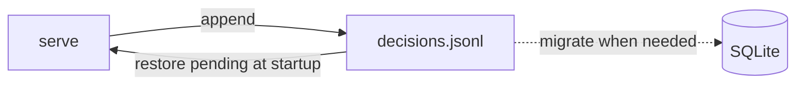
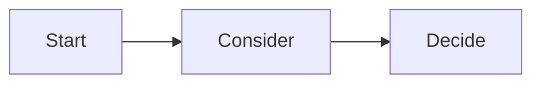

# Complete examples

- [A passing explanation](#a-passing-explanation)
- [A failing explanation and why](#a-failing-explanation-and-why)

## A passing explanation

A design fork with two options, everything included.

````markdown
---
ukagai: 1
question: Should decisions be persisted as JSONL or SQLite?
title: Choose JSONL or SQLite as the storage format of the decision log
recommended: JSONL
reversibility: costly
scope: repo
---

## Why this decision is needed now

The store cannot be written until the storage format is decided. JSONL needs only appends; SQLite is strong at search, but `node:sqlite` is experimental and needs schema migrations.[^1] How the log will be used is something I cannot know, so a human decides.

## What only you know

- Whether you will search or aggregate the log within the next month.
- Whether another tool will read the log file directly.

## Terms

- **JSONL** — one JSON object per line; appended, never rewritten.
- **migration** — rewriting existing data into a new format.

## Options

| Option | What happens if chosen | Risks and how to undo | Cost |
|---|---|---|---|
| JSONL | Stores by appending only, and **restores by reading once at startup**. | Search reads everything. To undo, move to SQLite (**migration code is needed**). | about 0.5 day |
| SQLite | Search and aggregation are written in SQL. | `node:sqlite` is experimental. To undo, export back to JSONL. | about 1.5 days |

## Recommendation

I recommend **JSONL**: two weeks of logs need no search, and with no dependency restoring is one read.[^2] SQLite becomes the right choice if you already know you will use aggregation or search from the start.

> [!WARNING]
> Changing the storage format requires a migration that re-reads existing logs.

## Assumptions

- The log stays under about 10 MB.
- Nothing outside ukagai reads `decisions.jsonl`.

## Counterargument

Starting with SQLite avoids the later migration entirely, and a migration written under pressure is where data gets lost.

## Affected

- `src/server/store.ts`
- `~/.ukagai/decisions.jsonl`
- The metrics tally in `docs/verification/`

## Diagram



## What I checked

[^1]: `node:sqlite` is marked experimental in the Node 22 docs; `node --version` is v22.x here.
[^2]: `src/server/` has no persistence yet (`grep -rn jsonl src` finds nothing); two weeks of logs are about 244 KB (`ls -l ~/.ukagai`).
````

## A failing explanation and why

````markdown
---
ukagai: 1
question: What should we do about persistence?
reversibility: costly
scope: repo
---

## Why this decision is needed now

I want to decide how to save.

## Options

| Option | Pros | Cons | Cost |
|---|---|---|---|
| JSONL | | | |

## Diagram


````

What is wrong:

- No recommendation (`recommended` and the Recommendation section are missing), and no `title`.
- One row, pros / cons / cost columns, empty cells.
- No reason a human must decide.
- The question was paraphrased, so it cannot be matched.
- The diagram is decoration that does not help the decision.
