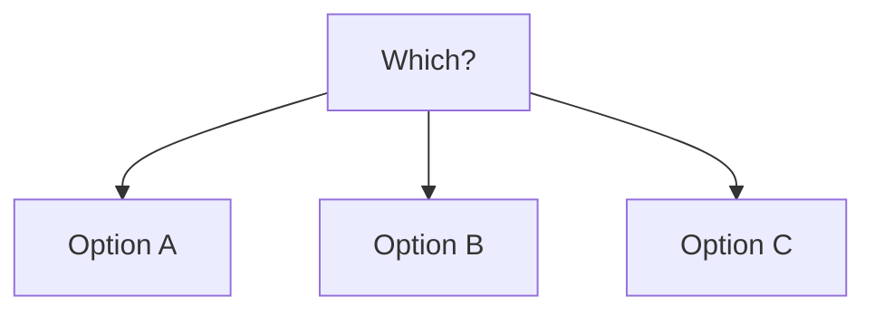
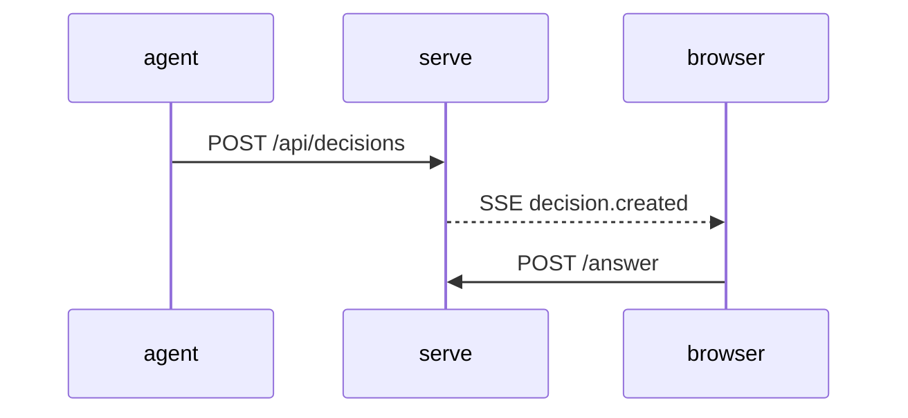

# Writing well: layers, headlines, diagrams, emphasis

## The three layers

The GUI reads the file in layers; write each piece so it works at its layer.

| Layer | The human sees | Write |
|---|---|---|
| 1 second | title, first sentence of the Recommendation, reversibility and scope, Affected chips, "You decide:" | A headline that is a conclusion on its own; 1-3 things only the human knows; concrete names in Affected |
| 10 seconds | rest of the Recommendation, Assumptions, Counterargument, option cards | One premise per line; the strongest counterargument in 1-2 sentences; two-sentence cells |
| 60 seconds | Why, What I checked (footnotes), diagram, diff, Terms | Evidence, definitions, details |

- Terms: only words a new reader would not know (not TTY, JSON). One line each.
- What only you know: phrased as the thing to decide ("Whether the GUI will ever send messages to the server"). Never list what you could have checked.
- Assumptions: checkable, one per line ("Only server-to-browser pushes are needed"). Unverified and pick-changing only; generic truths are not assumptions.
- Counterargument: argue against yourself honestly, no strawman, and do not restate the Recommendation's condition (`against_weak`).
- Honesty: if you checked nothing, say so in Why, not as a footnote. Mark guesses as guesses.
- Affected: concrete names, not "the code" or "some files".

## Headline

- Bad: "I recommend the first one." Which option is that? Denied (`recommend_name`).
- Good: "I recommend the option that keeps the tagline 'Decisions made by humans, together'. Choose another if the tagline matters less than the install steps." The label is quoted and a condition follows.

### (a Japanese-setting case)

Three English opening lines for a README, explained in Japanese:

- Bad: 「説明文の1つ目を勧める。」 Which card is that? Denied (`recommend_name`).
- Good: 「『Decisions made by humans, together』の標語を残す案を勧める。標語の印象を優先するなら、この案。」 The label is quoted, so it matches one card, and the condition for another option follows.
- Bad Assumptions (implementation notes): 「見出しの下にある説明段落(5 行目)は残す」「対象の『1 文』は見出し直下の標語(3 行目)を指す」. Good: 「近く他の agent に対応する予定はない」 (unverified, and it would change the pick).

## Diagrams

- Draw only structures and flows that exist. For an assumption or proposal, write "(proposal)" right before the diagram.
- Bad (the options as nodes; denied as `diagram_trivial`):



- Good (a sequence the table cannot show):



- Readable in the TUI too (advice, not checked): spaces around arrows (`A --> B`), at most 10 nodes, at most 100 columns per line.
- Do not include the whole diff; the GUI attaches `git diff` separately.

## Emphasis example

```markdown
| JSONL | Stores by appending only, and **restores by reading once at startup**. | Search reads everything. **Moving to SQLite needs migration code**. |

> [!WARNING]
> Changing the storage format leaves some people unable to read existing logs.
```

## Do not

- Ask without settling on a recommendation.
- Rely on the raw `question`: the GUI does not show it. Put what the decision needs in `title`, the Recommendation and the table.
- Draw decorative diagrams ("start → consider → decide").
- Write a one-option table, empty cells, or pros / cons / cost columns.
- Paraphrase `question`, or write the GUI URL or API.

## Coined identifiers: bad and good

````markdown
title: P-GH: create the repository private first?

W-T2 is done except FT4. The next gate G-T2 needs the TM28 restore drill, and both need P-GH.

## Terms
- **P-GH** — plan の行
````

The reader never saw your plan: W-T2 / FT4 / G-T2 / TM28 are undefined and P-GH's definition says nothing (`coined_term`). Rewrite in plain words:

````markdown
title: Create the GitHub repository as private first, or public from the start?

The agent-side CI and release setup is done except the release workflow file. The release checkpoint needs a passing smoke test in the 3 CI modes and a restore test of the Cloud Run deployment from backup; both need the GitHub repository to exist.
````
