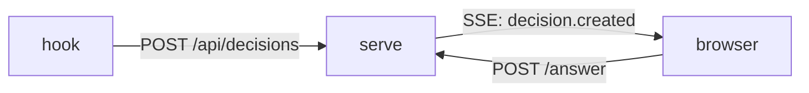

## Why this decision is needed now

W3's server must settle the notification mechanism before it implements `/api/stream`. The choice changes the delivery code in `src/server/` and the receiving code in `public/`.[^1] Switching later means rewriting both.

## What only you know

- Whether the GUI will ever send messages to the server continuously (two-way).
- Whether a delay of a few seconds is acceptable for the GUI.

## Terms

- **SSE** — Server-Sent Events: one-way streaming over plain HTTP.
- **long-poll**: a request the server holds open until it has something to say.
- ping — a periodic frame that keeps a connection alive.

## Options

| Option | What happens if chosen | Risks and how to undo | Cost |
|---|---|---|---|
| SSE | One-way delivery to the GUI; `EventSource` reconnects by itself. | To undo, switch to WebSocket and rewrite both ends. | about 0.5 day |
| WebSocket | Two-way is possible; reconnection and ping are hand-written. | Adds a dependency. To undo, switch back and fix both ends. | about 1.5 days |
| Polling | The GUI asks every second; no new server code. | Wastes requests. Remove the timer to revert; nothing else changes. | about 0.2 day |

## Recommendation

I recommend SSE. One-way delivery is enough and the standard handles reconnection, so the code stays small.[^2] WebSocket is the right choice if the GUI will send messages continuously.

## Assumptions

- The GUI only needs server-to-browser pushes.
- Hono's streaming helper stays available in the pinned version.

## Counterargument

A polling loop is the simplest thing that works, and it avoids holding a connection per tab. It costs more requests but no new code.

## Affected

- `src/server/routes.ts`
- `public/app.js`
- The ukagai GUI (port 4818)

## Diagram

## What I checked

- `src/server/` has no WebSocket dependency (read `package.json`).
[^1]: `grep -n "EventSource" public/app.js` finds no existing receiver.
Hono ships `streamSSE` in `hono/streaming` (`node_modules/hono/package.json` 4.x).
