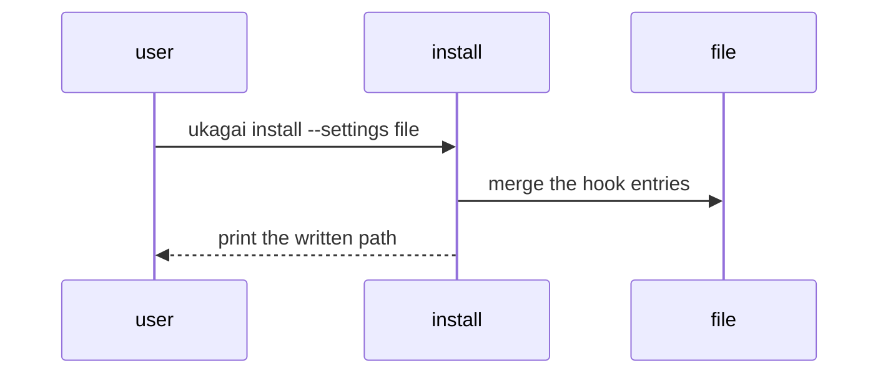

## Why this decision is needed now

We must decide where `ukagai install` writes. The default location decides whether users put the hook on their own sessions.

## Options

| Option | What happens if chosen | Risks and how to undo |
|---|---|---|
| User settings | Writes to `~/.claude/settings.json` and applies to all projects. | The hook applies to every session. Undo with `ukagai uninstall`. |
| Project settings | Writes to `.claude/settings.json` and stays within that repository. | Install is needed per project. Undo by deleting the file. |

## Recommendation

I recommend user settings. One install covers all projects. Project settings become the right choice if you want to confine the impact to one repository.

## Diagram

## What I checked

- `~/.claude/settings.json` has no ukagai hook yet (read the file).
