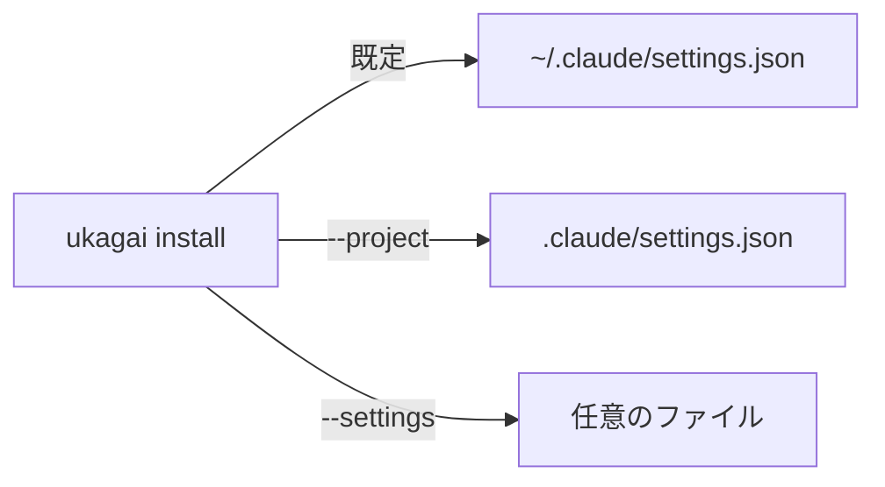

## なぜ今この判断が要るか

`ukagai install` が書く先を決める必要があります。既定の置き場で、利用者が自分のセッションに hook をかけるかどうかが変わります。

## 選択肢

| 選択肢 | 選ぶと起きること | リスクと戻し方 |
|---|---|---|
| ユーザー設定 | `~/.claude/settings.json` に書き、全プロジェクトで効く。 | 全セッションに hook がかかる。`ukagai uninstall` で戻せる。 |
| プロジェクト設定 | `.claude/settings.json` に書き、そのリポジトリに閉じる。 | プロジェクトごとに install が要る。ファイルを消せば戻せる。 |

## 推奨

ユーザー設定を推します。1 回の install で全プロジェクトに効きます。影響を 1 リポジトリに閉じたいならプロジェクト設定が正しくなります。

## 図

