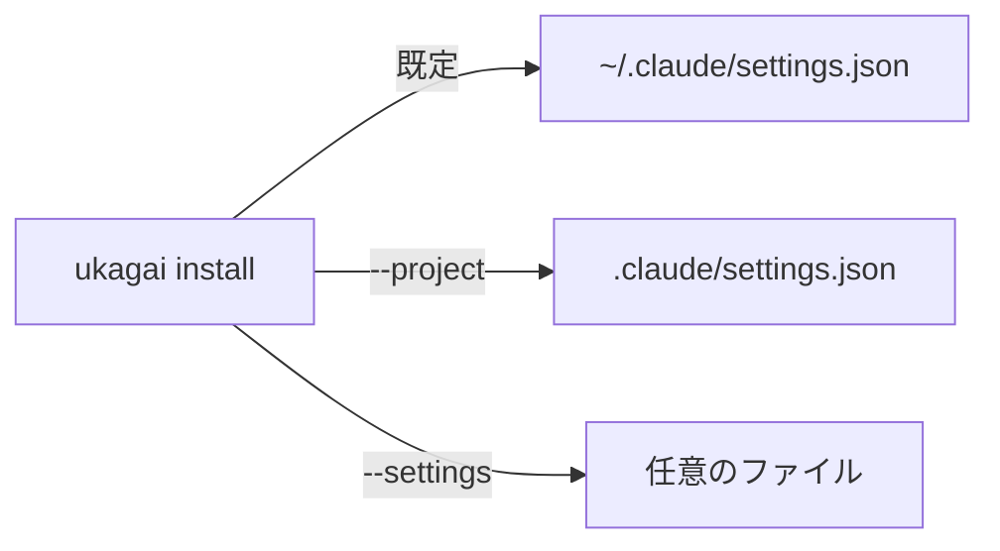

## なぜ今この判断が要るか

`ukagai install` が書く先を決める必要があります。既定の置き場で、利用者が自分のセッションに hook をかけるかどうかが変わります。

## 選択肢の比較

| 選択肢 | 利点 | 欠点 | コスト |
|---|---|---|---|
| ユーザー設定 `~/.claude/settings.json` | 全プロジェクトで効く | 全セッションに hook がかかる | 実装 0.5 日 |
| プロジェクト設定 `.claude/settings.json` | 影響がそのリポジトリに閉じる | プロジェクトごとに install が要る | 実装 0.5 日 |

## 図

