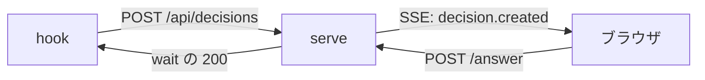

## なぜ今この判断が要るか

W3 の server が `/api/stream` を実装する前に、通知の方式を決める必要があります。方式によって server の配信コードと `public/` の受信コードの両方が変わり、後から替えると両方を直すことになります。通知の要件(GUI を誰が何秒で更新したいか)は私からは分からず、双方向の操作を将来足す予定があるかどうかは人にしか決められません。

## 選択肢

| 選択肢 | 選ぶと起きること | リスクと戻し方 |
|---|---|---|
| SSE | server から GUI への一方向配信になる。`EventSource` が自動再接続し、Hono で数十行で書ける。 | 双方向にしたくなったら WebSocket へ替える。配信と受信の両方を書き直す(約 1 日)。 |
| WebSocket | 双方向にできる。再接続と ping を自前で書く。 | 依存が増え、実装が約 1.5 日かかる。替えるときは配信と受信の両方を直す。 |

## 推奨

SSE を推します。通知は一方向で足ります。再接続は標準で任せられます。実装が小さく済みます。依存も増えません。テストも書きやすいです。運用も楽です。WebSocket は双方向が要るときに選びます。

## 図

## 確かめたこと

- `src/server/` に WebSocket の依存は無い(`package.json` を確認)。
