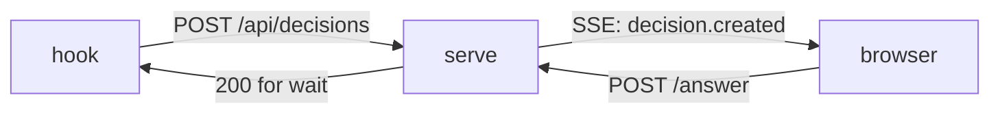

## Why this decision is needed now

As background, I list the investigation so far in order. As background, I list the investigation so far in order. As background, I list the investigation so far in order. As background, I list the investigation so far in order. As background, I list the investigation so far in order. As background, I list the investigation so far in order. As background, I list the investigation so far in order. As background, I list the investigation so far in order. As background, I list the investigation so far in order. As background, I list the investigation so far in order. As background, I list the investigation so far in order. As background, I list the investigation so far in order. The server must settle the notification mechanism before it implements `/api/stream`. The choice changes both the server's delivery code and the receiving code in `public/`, so switching later means rewriting both. I cannot tell the notification requirements (who wants the GUI updated, and within how many seconds), and only a human can say whether two-way operations are planned.

## Options

| Option | What happens if chosen | Risks and how to undo |
|---|---|---|
| SSE | One-way delivery from the server to the GUI. `EventSource` reconnects automatically, and Hono needs only a few dozen lines. | To undo, switch to WebSocket if two-way becomes necessary. Both delivery and receiving must be rewritten (about 1 day). |
| WebSocket | Two-way is possible. Reconnection and ping must be written by hand. | Adds a dependency and takes about 1.5 days. To undo, switch back, which means fixing both delivery and receiving. |

## Recommendation

I recommend SSE. One-way delivery from the server to the GUI is enough, and reconnection is handled by the standard, so the implementation stays small. WebSocket becomes the right choice if you add a feature where the GUI sends messages to the server continuously.

## Diagram

## What I checked

- `src/server/` has no WebSocket dependency (checked `package.json`).
