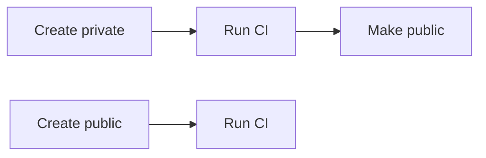

## Why this decision is needed now

The agent side of W-T2 is done except FT4, and the next gate G-T2 requires that the smoke test passes in the 3 CI modes and that the TM28 restore drill runs. Both need the GitHub repository (P-GH) to exist. Only a human can say who may see the history before it is cleaned.

## What only you know

- Whether the tracked files contain anything that must not be public yet.

## Options

| Option | What happens if chosen | Risks and how to undo |
|---|---|---|
| Private first | The repository is created private, CI runs, and it is made public after the check. | Costs one extra step. To undo, delete the repository and recreate it. |
| Public from the start | The repository is created public and CI runs right away. | Anyone can read the history at once. A leak cannot be undone once cloned. |

## Recommendation

I recommend Private first. It keeps the history hidden until the tracked files are checked, and CI works the same way. Public from the start is right if the files were already reviewed.

## Terms

- **P-GH** — the GitHub repository for this project, which every later step needs.
- **W-T2** — the second work package, the agent-side setup of CI and release.
- **FT4** — the last open check in that work package: the release workflow file.
- **G-T2** — the checkpoint before the release, which needs a passing smoke test.
- **TM28** — the test that restores the service from a backup on Cloud Run.

## Diagram

## What I checked

- `git ls-files` lists no `.env` file.
