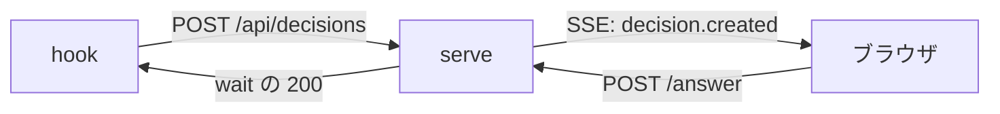

## なぜ今この判断が要るか

W3 の server が `/api/stream` を実装する前に、通知の方式を決める必要があります。方式によって server の配信コードと `public/` の受信コードの両方が変わり、後から替えると両方を直すことになります。通知は server から GUI への一方向で足ります。

## 選択肢の比較

| 選択肢 | 利点 | 欠点 | コスト |
|---|---|---|---|
| SSE | 一方向で足りる、`EventSource` が自動再接続する、Hono で数十行 | 双方向にはできない | 実装 0.5 日 |
| WebSocket | 双方向にできる | 再接続と ping を自前で書く、依存が増える | 実装 1.5 日 |

## 図

