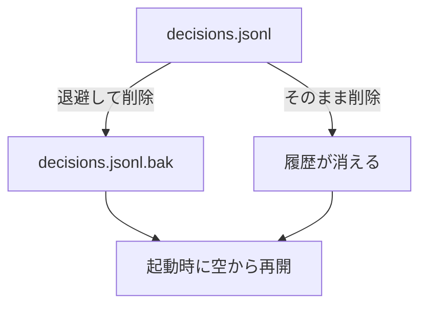

## なぜ今この判断が要るか

起動時の復元が、壊れた行を含む `decisions.jsonl` で失敗しています。ファイルを消せば起動できますが、これまでの判断の履歴(指標 (a')(b) の元データ)も消え、戻せません。リポジトリの外のファイルを変更する操作で、履歴を捨ててよいかは人にしか決められません。

## 選択肢

| 選択肢 | 選ぶと起きること | リスクと戻し方 |
|---|---|---|
| 退避してから削除 | 履歴が `.bak` に残り、起動時は空から再開する。 | ディスクを少し使う。壊れた行だけ直して `.bak` から戻せる。 |
| そのまま削除 | 履歴が消え、起動時は空から再開する。 | 履歴は戻せない。 |

## 推奨

退避してから削除を推します。手順が 1 つ増えるだけで、後から壊れた行だけ直して履歴を取り戻せます。履歴がもう要らないと分かっているなら、そのまま削除で足ります。

## 図



## 関係する差分

```diff
--- a/scripts/reset-log.sh
+++ b/scripts/reset-log.sh
@@ -1,3 +1,4 @@
 #!/bin/sh
 set -eu
-rm -f "$HOME/.ukagai/decisions.jsonl"
+mv "$HOME/.ukagai/decisions.jsonl" "$HOME/.ukagai/decisions.jsonl.bak"
+: > "$HOME/.ukagai/decisions.jsonl"
```
