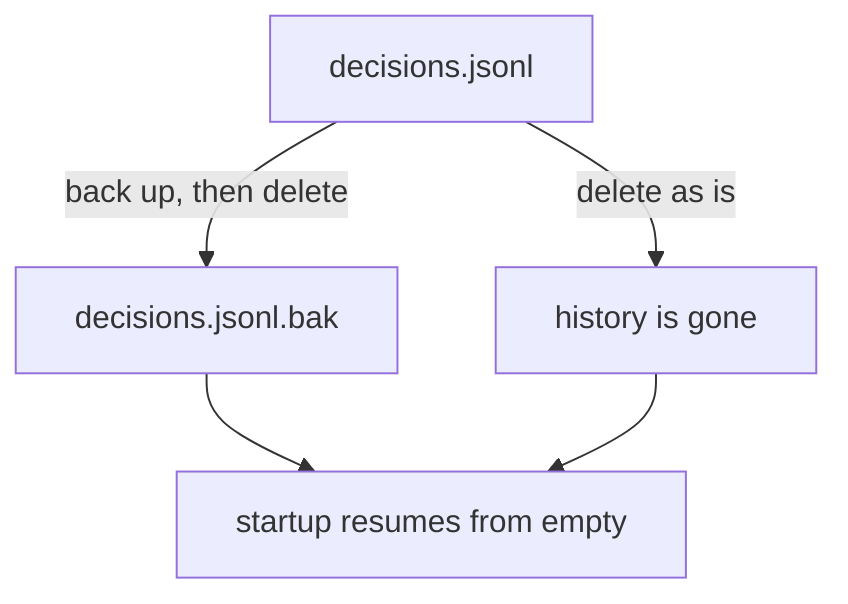

## Why this decision is needed now

Restoring at startup fails because `decisions.jsonl` contains a broken line. Deleting the file lets it start, but the history of past decisions (the source data for metrics (a') and (b)) is also lost and cannot be restored. This changes a file outside the repository, and only a human can decide whether to discard the history.

## Options

| Option | What happens if chosen | Risks and how to undo |
|---|---|---|
| Back up, then delete | The history stays in `.bak`, and startup resumes from empty. | Uses a little disk. Fix only the broken line and restore from `.bak`. |
| Delete as is | The history is gone, and startup resumes from empty. | The history cannot be restored. |

## Recommendation

I recommend "Back up, then delete". It adds only one step, and you can later fix just the broken line to recover the history. Deleting as is is enough if you already know the history is no longer needed.

## Diagram



## Related diff

```diff
--- a/scripts/reset-log.sh
+++ b/scripts/reset-log.sh
@@ -1,3 +1,4 @@
 #!/bin/sh
 set -eu
-rm -f "$HOME/.ukagai/decisions.jsonl"
+mv "$HOME/.ukagai/decisions.jsonl" "$HOME/.ukagai/decisions.jsonl.bak"
+: > "$HOME/.ukagai/decisions.jsonl"
```

## What I checked

- `decisions.jsonl` has one broken line at the end (read the file).
