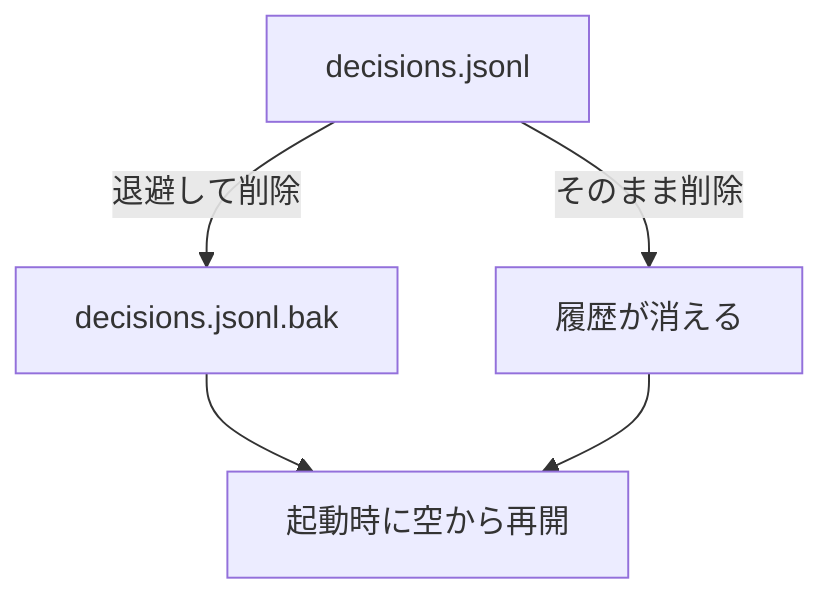

## なぜ今この判断が要るか

起動時の復元が、壊れた行を含む `decisions.jsonl` で失敗しています。ファイルを消せば起動できますが、これまでの判断の履歴(指標 (a')(b) の元データ)も消え、戻せません。リポジトリの外のファイルを変更する操作です。

## 選択肢の比較

| 選択肢 | 利点 | 欠点 | コスト |
|---|---|---|---|
| 退避してから削除 | 履歴が `.bak` に残り、後で壊れた行だけ直せる | ディスクを少し使う、手順が 1 つ増える | 1 分 |
| そのまま削除 | 最も単純 | 履歴が戻せない | 数秒 |

## 図



## 関係する差分

```diff
--- a/scripts/reset-log.sh
+++ b/scripts/reset-log.sh
@@ -1,3 +1,4 @@
 #!/bin/sh
 set -eu
-rm -f "$HOME/.ukagai/decisions.jsonl"
+mv "$HOME/.ukagai/decisions.jsonl" "$HOME/.ukagai/decisions.jsonl.bak"
+: > "$HOME/.ukagai/decisions.jsonl"
```
