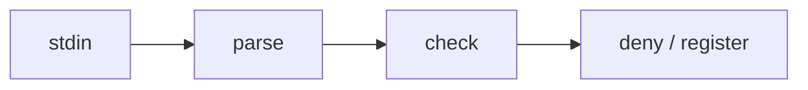

# Plan: implement the explanation file validation in src/hook/explain.ts

## Goal

Implement the rules of `docs/spec/explain.md` as hook validation.

## Steps

1. Write the parsers for front matter and headings.
2. Evaluate the `missing` codes of section 4 in order.
3. Write tests that check the fixtures in `test/explain-fixtures/` are judged as expected.

## Scope and reversibility of the change

Only two files change, `src/hook/explain.ts` and `test/hook/explain.test.ts`, and no new dependency is added. A git revert restores the original.

## Structure

