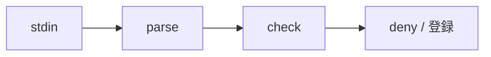

# 説明ファイルの検査を src/hook/explain.ts に実装する計画

## 目的

`docs/spec/explain.md` の規則を、hook の検査として実装する。

## 手順

1. front matter と見出しのパーサを書く。
2. 4 節の `missing` コードを順に評価する。
3. `test/explain-fixtures/` の 7 つが期待どおり判定されることをテストにする。

## 影響範囲・可逆性

変更するのは `src/hook/explain.ts` と `test/hook/explain.test.ts` の 2 ファイルだけで、新しい依存は足さない。git の revert で元に戻せる。

## 構成

