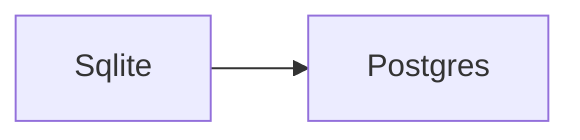
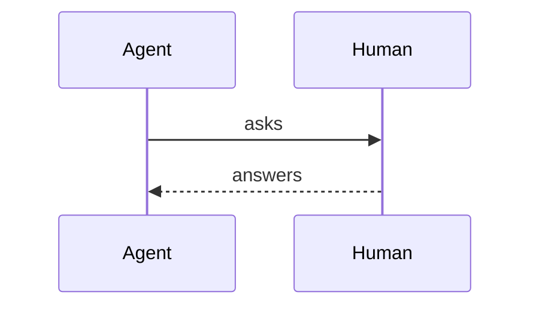
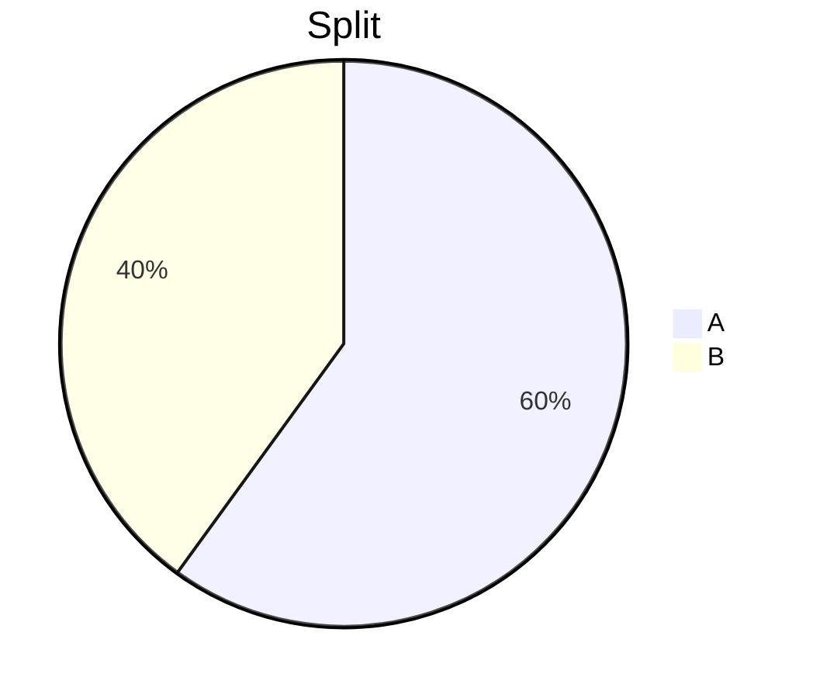

## Why this decision is needed now

The cache needs a home before the release, and both stores work[^1]. Remember ==must not miss== and `==kept as written==`.

## What I checked

- The reader lives at `src/store/read.ts:42`

[^1]: See `src/store/read.ts:42`.

## Callouts and lists

> [!NOTE] Context for the reader
> Body of the note.

> [!TIP]
> Take the easy path.

> [!IMPORTANT]
> A premise the reader must accept.

> [!WARNING]
> Costly to undo.

> [!CAUTION]
> Cannot be undone.

- [x] zod type
- [ ] docs
- [x] tests

1. first plain item
2. second plain item

<details>
<summary>Full log (3 lines)</summary>

```text
a
b
c
```

Text with <sub>sub</sub> and x<sup>2</sup> and <kbd>Ctrl</kbd> and a line<br>break.

</details>

<details open>
<summary>Open evidence</summary>

Shown by default.

</details>

## Code

```ts title="src/serve/store.ts"
export const db = sqlite();
```

```tsx
const b = <button onClick={go} disabled>go</button>;
```

```diff
-const db = files();
+const db = sqlite();
```

## Badges

- [done] schema
- [todo] docs
- [doing] wiring
- [blocked] review
- [risk] migration
- [skip] benchmark

| Step | Status |
|---|---|
| Wire | [risk] |
| Test | [done] |

Not highlights: ===== and a===b===c stay as written.

Prose like once=5 and only=true keeps its pairs.

Here a [done] token in a sentence stays as text. Code `not a path` and `npm test` are not chips.

## Compare

::: columns
**Before**

Reads go through a file.

---

**After**

Reads go through sqlite.
:::

<details open>
<summary>Columns in details</summary>

::: columns
Left in details

---

Right in details
:::

</details>

## Steps

1. **Add the schema** [done] — `src/contract.ts:12`
   - [x] zod type
   - [ ] docs
2. **Wire the route** [todo] — `public/app.js#L40-L60`

## Diagrams







## Images


## Raw HTML

<script>window.__pwn = 1</script>

<iframe src="about:blank"></iframe>


<b onclick="window.__pwn = 3">visible text of an unknown tag</b>

<form><button class="evil">go</button></form>

<a href="javascript:window.__pwn=4">js link</a>

[x1](&#106;avascript:window.__x=1)

<a href="javascript&colon;window.__x=2">x2</a>

<a href="jav&#x09;ascript:window.__x=3">x3</a>

<a href="java
script:window.__x=4">x4</a>

[fine](https://example.com/page) and [rel](docs/spec.md)

## Options

| Option | What happens if chosen | Risks and how to undo |
|---|---|---|
| A (Recommended) | Uses A | Revert the file |
| B | Uses B | Revert the file |

## Recommendation

I recommend **A** because it is simpler. Another option is right if B is already running.
