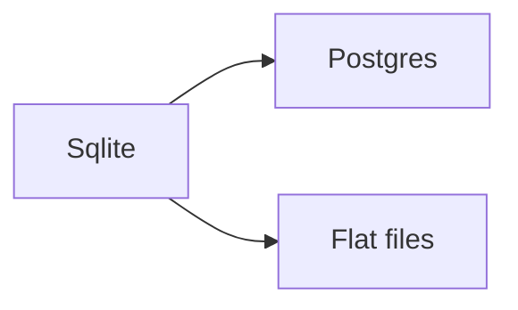

## Why this decision is needed now

The store holds 12 MB today and the cache layer needs a schema before the release. Latency is 40 ms per read[^1] with the file store, and Sqlite keeps it under 5 ms[^2]. Choosing Postgres means a server we have to run.

## What I checked

- The reader lives at `src/store/read.ts:42`
- Benchmarks were run with `npm run bench`

[^1]: Measured with `npm run bench` on 3 runs.
[^2]: See `src/store/read.ts:42`.

## Diagram



## Related diff

```diff
diff --git a/src/store.ts b/src/store.ts
--- a/src/store.ts
+++ b/src/store.ts
@@ -1,2 +1,2 @@
-const db = files();
+const db = sqlite();
```

## Terms

- **cache layer** — the module that keeps recent reads in memory
- **migration**: moving the existing data into the new store

## What only you know

- Whether the team will run a database server next quarter
- If the 12 MB figure includes the archive

## Assumptions

- The data stays under 1 GB
- One process writes at a time

## Counterargument

Postgres would scale further, so a later migration to it costs more than choosing it now.

## Affected

- src/store.ts
- the cache layer
- CI
- docs/spec
- staging
- prod
- on-call
- billing

## Options

| Option | What happens if chosen | Risks and how to undo | Cost |
|---|---|---|---|
| Sqlite (Recommended) | Reads go through one file | Revert by deleting the db file | 1 day |
| Postgres | Reads go through a server | The migration cannot be undone | 5 days |
| Flat files | Reads stay as they are | Restore from git | 0 days |

## Recommendation

I recommend **Sqlite** because it keeps reads fast without a server. It also fits the 12 MB of data we have today. Another option is right if the team already runs a database server.
